# 加入 Dialogflow

 

## Google Cloud

1. 加入 `Dialogflow API`

    

 

2. 啟用

    

 

3. 進入 [Dialogflow Essentials](https://dialogflow.cloud.google.com/#/getStarted) 並建立新的代理 `CREATE AGENT`

    

 

4. 輸入對應內容，最重要是選擇正確的專案

    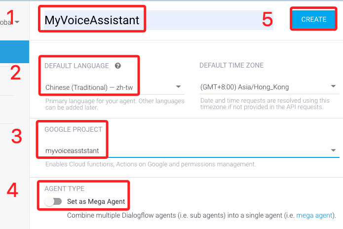

 

5. 在 `Intents` 中選取 `Default Fallback Intent` 後點選 `CREATE INTENT`

    

 

6. 向下滑到 `Responses` 可查看預設的回答

    

 

7. 可在右側 `try it now` 方框內輸入文字進行測試

    

 

8. 添加 `Intents`

    

 

9. 輸入 Intent 名稱

    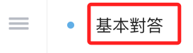

 
   
10. 在訓練語句輸入自訂的對話如 `今天是星期幾？`

    

 

11. 第一步，先選取關鍵字 `今天`

    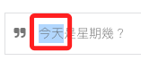

 

12. 在跳出來的視窗中輸入關鍵字 `@sys.date`，直接輸入 `date` 也可以。

    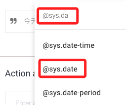

 

13. 完成後，關鍵字就會變色，下方會增加一列顯示關鍵字名稱、實體、解析文字。

    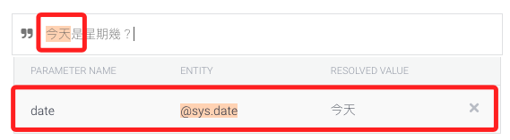

 

14. 先儲存，因為接下來要 `星期幾` ，但系統沒有這個關鍵字。

    

 

15. 點擊左側 `ENTITY +` 。

    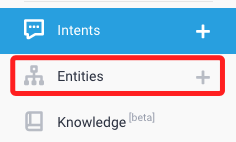

 

16. 自訂並輸入 `weekday` 這個實體的各種可能

    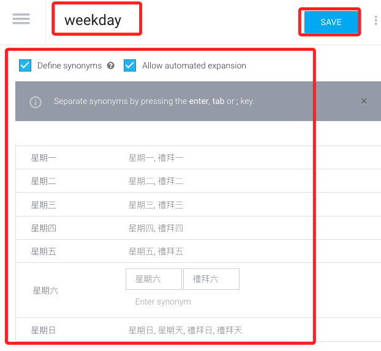

 

17. 再回到 Intent 的 `星期幾` 去設定，此時就有一個 `weekday` 的實體可以選擇。

    

 

18. 在下方的表格中，將 `REQUIRED` 以及 `IS LIST` 都勾選，因為這兩個實體都是必須且是列表。

    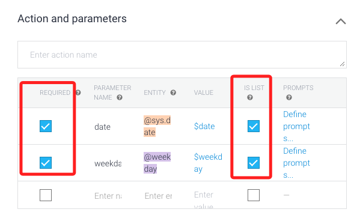

 

19. 接著點擊 `PROMPTS` ，這是遺漏關鍵字時的預設問句。

    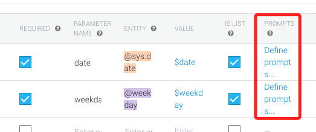

 

20.  首先關於 `date`，自定義兩個問句，然後 `CLOSE` 即可。

    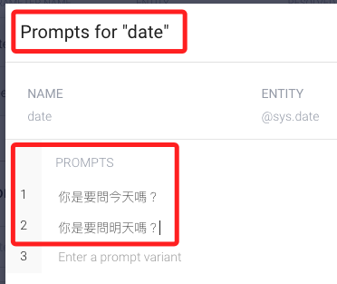

 

21. 對於 `weekday` 同樣給兩個預設的問題。

    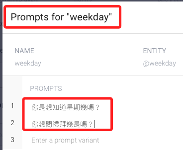

 

22. 記得儲存再進行測試。

    

 

23. 在同一個意圖中，也可以增添幾個問句表達式 `expression` 。

    

 

24. 設定最後的回覆，意圖完整或是意圖補全之後會從中挑選一個回覆。

    

 

25. 勾選

    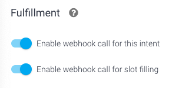

 

## 關於 Fulfillment

_兩個選項含義如下_

1. `Enable webhook call for this inten`：若勾選，表示這個特定的意圖被觸發時，系統將調用一個webhook，而 Webhook 是允許應用程式提供其他應用程式實時資訊的方式，在聊天機器人的情境下，webhook 通常用於將用戶的請求發送給後端服務如API，然後返回所需的資訊或動作給用戶。

2. `Enable webhook call for slot filling`：`slot filling` 是指收集完成一個意圖所需的所有必要資訊，如果勾選這個選項，系統會在收集這些資訊的過程中調用 webhook，這可用於動態引導用戶完成流程，比如根據先前的回答來決定接下來要問的問題。

3. 勾選這兩個選項是為了讓聊天機器人更加動態和智能、能夠處理複雜的查詢、提供個性化的回應，或者進行複雜的互動。不勾選的話，聊天機器人可能只能提供靜態回應或僅限於它已經預設的資訊。

 

---

_END：這個講義之後會再補充_