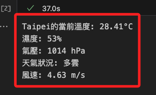

_課後概念性參考，故腳本未做優化_

# 整合 OpenWeather + Dialogflow

<br>

## OpenWeather

1. [官網] (https://openweathermap.org/) 選取 API Keys。

    

<br>

2. 任意添加或複製一組。

    

<br>

## 測試 OpenWeather 

1. 程式碼
    ```python
    # 引入requests模組
    import requests
    # API金鑰
    API_KEY = "輸入金鑰"
    # 定義API的URL
    BASE_URL = "http://api.openweathermap.org/data/2.5/weather?"
    # 輸入您想查詢的城市名
    city = input("請輸入城市名稱: ")
    # 組合URL以進行API請求
    url = BASE_URL + "appid=" + API_KEY + "&q=" + city + "&lang=zh_tw" + "&units=metric"
    # 發送請求並獲取響應
    response = requests.get(url)
    # 將響應轉化為JSON格式
    data = response.json()
    # 判斷響應的狀態碼是否為200（表示成功）
    if response.status_code == 200:
        # 解析數據
        main = data['main']
        temperature = main['temp']
        humidity = main['humidity']
        pressure = main['pressure']
        report = data['weather']
        wind = data['wind']
        print(f"{city}的當前溫度: {temperature}°C")
        print(f"濕度: {humidity}%")
        print(f"氣壓: {pressure} hPa")
        print(f"天氣狀況: {report[0]['description']}")
        print(f"風速: {wind['speed']} m/s")
    else:
        # 輸出錯誤資訊
        print("錯誤：無法獲取天氣資訊。")
    ```

<br>

2. 運行後輸入任意城市名稱如 Taipei。

    

<br>

3. 查看輸出。

    


<br>

## 整合 Dialogflow

1. 程式碼

    ```python
    import os
    import requests  # 確保導入 requests 模組
    from google.cloud import dialogflow_v2 as dialogflow
    from google.cloud import speech_v1p1beta1 as speech
    from google.cloud import texttospeech

    # OpenWeather API配置
    API_KEY = "07978967c803aa11f18cc1255d4b7275"
    BASE_URL = "http://api.openweathermap.org/data/2.5/weather?"

    # 城市名稱映射字典
    city_name_mapping = {
        # 因為可以查詢繁體中文城市名稱，所以這裡無需映射
        # "台北市": "Taipei",
        # "高雄市": "Kaohsung",
        # "台中市": "Taichung",
        # "紐約市": "New York",
    }

    # 取得 OpenWeather API 的氣候資訊
    def get_weather(city):
        """獲取城市的天氣數據"""
        # 
        url = f"{BASE_URL}appid={API_KEY}&q={city}&lang=zh_tw&units=metric"
        response = requests.get(url)
        data = response.json()
        if response.status_code == 200:
            main = data['main']
            description = data['weather'][0]['description']
            # 輸出查看一下
            print(f"{city}的天氣狀況為{description}，目前溫度為{main['temp']}度。")
            return f"{city}的天氣狀況為{description}，目前溫度為{main['temp']}度。"
        else:
            print(city)
            return "抱歉，我無法獲取天氣資訊。"

    # 初始化 Dialogflow
    session_client = dialogflow.SessionsClient()
    # 輸入專案 ID，並且任意自訂一個識別碼
    session = session_client.session_path("輸入自己的專案ID", "輸入任意識別碼")
    # 初始化 Google Text-to-Speech client
    tts_client = texttospeech.TextToSpeechClient()

    # 添加
    def text_to_speech(text):
        synthesis_input = texttospeech.SynthesisInput(text=text)

        # 建構語音請求，選擇語言和聲音
        voice = texttospeech.VoiceSelectionParams(
            language_code='cmn-Hant-TW',
            name='cmn-TW-Standard-A',  # 選擇一個支援中文的聲音
            ssml_gender=texttospeech.SsmlVoiceGender.NEUTRAL)

        # 選擇音訊檔案類型
        audio_config = texttospeech.AudioConfig(
            audio_encoding=texttospeech.AudioEncoding.MP3)

        # 發送請求
        response = tts_client.synthesize_speech(
            input=synthesis_input, voice=voice, audio_config=audio_config)

        # 將產生的音訊儲存為 MP3 文件
        with open('output.mp3', 'wb') as out:
            out.write(response.audio_content)
            print('音頻內容寫入檔案 "output.mp3"')

        return 'output.mp3'
    # 錄音
    def record_voice():
        # 這是錄音的指令，可以直接在終端機中進行測試
        os.system("arecord -D plughw:3,0 -d 3 -f S16_LE -r 8000 voice.wav")

    # Voice-to-text function
    def transcribe_voice():
        # 建立物件來透過 speech_v1p1beta1 的 speech 調用 SpeechClient
        client = speech.SpeechClient()
        # 將錄製的音頻打開
        with open("voice.wav", "rb") as audio_file:
            # 讀出內容給 content
            content = audio_file.read()
        # 將 content 進行辨識
        audio = speech.RecognitionAudio(content=content)
        # 指定為繁體中文
        config = speech.RecognitionConfig(
            encoding=speech.RecognitionConfig.AudioEncoding.LINEAR16,
            sample_rate_hertz=8000,
            language_code="cmn-Hant-TW",
        )

        response = client.recognize(config=config, audio=audio)
        return response.results[0].alternatives[0].transcript

    # 從Dialogflow獲取回應，如果是天氣意圖則調用天氣API
    def get_response(text):
        text_input = dialogflow.TextInput(text=text, language_code="zh-TW")
        query_input = dialogflow.QueryInput(text=text_input)
        response = session_client.detect_intent(session=session, query_input=query_input)
        intent = response.query_result.intent.display_name
        parameters = response.query_result.parameters

        # 如果檢測到的意圖是氣候查詢
        if intent == "氣候查詢":
            # 並且已經提取到城市名稱
            if "geo-city" in parameters:
                city = parameters["geo-city"]
                # 如果城市名稱在映射中，直接使用映射名稱
                city_english_name = city_name_mapping.get(city, city)
                # 調用天氣 API 獲取天氣訊息
                return get_weather(city_english_name)
            else:
                # 如果沒有提取到城市名稱，則返回預設回覆
                return response.query_result.fulfillment_text
        else:
            # 如果不是天氣查詢意圖，直接回傳Dialogflow的回覆
            return response.query_result.fulfillment_text

    # 主城市
    def main():
        try:
            input("請按下 Enter 鍵開始錄音，或輸入 '退出' 來結束程序。")
            while True:
                # 錄音
                record_voice()  
                print("錄音完成，正在進行語音辨識...")
                # 轉錄語音
                text = transcribe_voice()  
                print(f"辨識結果: {text}")
                # 確保有轉錄內容
                if text.strip() != "":  
                    print("正在獲取 Dialogflow 回應...")
                    # 獲取回應
                    response = get_response(text)  
                    print(f"Dialogflow 回應: {response}")
                    # 使用 espeak 進行語音輸出
                    # os.system(f"espeak '{response}'")  
                    # 將原本的 espeak 語音合成部分替換為 Google TTS
                    audio_file = text_to_speech(response)  
                    # 使用 mpg123 播放 MP3 文件
                    os.system(f"mpg123 {audio_file}")  
                    
                # 等待用户输入 Enter 才继续，或輸入 '退出' 來結束程序。
                user_input = input("按下 Enter 鍵以繼續，或輸入 '退出' 來結束程序。")
                if user_input.lower() == 'exit':
                    break
        except KeyboardInterrupt:
            # 用户按下 Ctrl+C
            print("程序已被用户中断")
        except Exception as e:
            # 其他異常處理
            print(f"程序發生錯誤: {e}")

    if __name__ == "__main__":
        main()
    ```

<br>

---

_END_