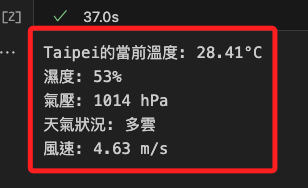

_課後概念性參考，故腳本未做優化_

# 整合 OpenWeather + Dialogflow

<br>

## OpenWeather

1. [官網] (https://openweathermap.org/) 選取 API Keys。

   

<br>

2. 任意添加或複製一組。

   

<br>

## 測試 OpenWeather

1. 切記檢查卡片編號

    ```bash
    arecord -l
    ```


<br>

2. 程式碼
   ```python
   # 引入requests模組
   import requests
   # API金鑰
   API_KEY = "輸入金鑰"
   # 定義API的URL
   BASE_URL = "http://api.openweathermap.org/data/2.5/weather?"
   # 輸入您想查詢的城市名
   city = input("請輸入城市名稱: ")
   # 組合URL以進行API請求
   url = BASE_URL + "appid=" + API_KEY + "&q=" + city + "&lang=zh_tw" + "&units=metric"
   # 發送請求並取得響應
   response = requests.get(url)
   # 將響應轉化為JSON格式
   data = response.json()
   # 判斷響應的狀態碼是否為200（表示成功）
   if response.status_code == 200:
       # 解析數據
       main = data['main']
       temperature = main['temp']
       humidity = main['humidity']
       pressure = main['pressure']
       report = data['weather']
       wind = data['wind']
       print(f"{city}的當前溫度: {temperature}°C")
       print(f"濕度: {humidity}%")
       print(f"氣壓: {pressure} hPa")
       print(f"天氣狀況: {report[0]['description']}")
       print(f"風速: {wind['speed']} m/s")
   else:
       # 輸出錯誤資訊
       print("錯誤：無法取得天氣資訊。")
   ```

<br>

2. 運行後輸入任意城市名稱如 Taipei。

   

<br>

3. 查看輸出。

   

<br>

## 整合 Dialogflow

1. 務必記得替換以下程式碼中的 OpenWeather API Key、專案ID、輸入任意識別碼。

<br>

2. 程式碼

   ```python
   import os
   import requests  # 確保導入 requests 模組
   from google.cloud import dialogflow_v2 as dialogflow
   from google.cloud import speech_v1p1beta1 as speech
   from google.cloud import texttospeech

   # OpenWeather API 配置
   API_KEY = "輸入自己的 OpenWeather API Key"
   BASE_URL = "http://api.openweathermap.org/data/2.5/weather?"

   # 城市名稱映射字典
   city_name_mapping = {
       # 因為可以查詢繁體中文城市名稱，所以這裡無需映射
       # "台北市": "Taipei",
       # "高雄市": "Kaohsung",
       # "台中市": "Taichung",
       # "紐約市": "New York",
   }

   # 取得 OpenWeather API 的氣候資訊
   def get_weather(city):
       # 
       url = f"{BASE_URL}appid={API_KEY}&q={city}&lang=zh_tw&units=metric"
       response = requests.get(url)
       data = response.json()
       if response.status_code == 200:
           main = data['main']
           description = data['weather'][0]['description']
           # 輸出查看一下
           print(f"{city}的天氣狀況為{description}，目前溫度為{main['temp']}度。")
           return f"{city}的天氣狀況為{description}，目前溫度為{main['temp']}度。"
       else:
           print(city)
           return "抱歉，我無法取得天氣資訊。"

   # 初始化 Dialogflow
   session_client = dialogflow.SessionsClient()
   # 輸入專案 ID，並且任意自訂一個識別碼
   session = session_client.session_path("輸入自己的專案ID", "輸入任意識別碼")
   # 初始化 Google Text-to-Speech client
   tts_client = texttospeech.TextToSpeechClient()

   # 添加
   def text_to_speech(text):
       synthesis_input = texttospeech.SynthesisInput(text=text)

       # 建構語音請求，選擇語言和聲音
       voice = texttospeech.VoiceSelectionParams(
           language_code='cmn-Hant-TW',
           name='cmn-TW-Standard-A',  # 選擇一個支援中文的聲音
           ssml_gender=texttospeech.SsmlVoiceGender.NEUTRAL)

       # 選擇音訊檔案類型
       audio_config = texttospeech.AudioConfig(
           audio_encoding=texttospeech.AudioEncoding.MP3)

       # 發送請求
       response = tts_client.synthesize_speech(
           input=synthesis_input, voice=voice, audio_config=audio_config)

       # 將產生的音訊儲存為 MP3 文件
       with open('output.mp3', 'wb') as out:
           out.write(response.audio_content)
           print('音頻內容寫入檔案 "output.mp3"')

       return 'output.mp3'
   # 錄音
   def record_voice():
       # 這是錄音的指令，可以直接在終端機中進行測試
       os.system("arecord -D plughw:3,0 -d 3 -f S16_LE -r 8000 voice.wav")

   # Voice-to-text function
   def transcribe_voice():
       # 建立物件來透過 speech_v1p1beta1 的 speech 調用 SpeechClient
       client = speech.SpeechClient()
       # 將錄製的音頻打開
       with open("voice.wav", "rb") as audio_file:
           # 讀出內容給 content
           content = audio_file.read()
       # 將 content 進行辨識
       audio = speech.RecognitionAudio(content=content)
       # 指定為繁體中文
       config = speech.RecognitionConfig(
           encoding=speech.RecognitionConfig.AudioEncoding.LINEAR16,
           sample_rate_hertz=8000,
           language_code="cmn-Hant-TW",
       )

       response = client.recognize(config=config, audio=audio)
       return response.results[0].alternatives[0].transcript

   # 從Dialogflow取得回應，如果是天氣意圖則調用天氣API
   def get_response(text):
       text_input = dialogflow.TextInput(text=text, language_code="zh-TW")
       query_input = dialogflow.QueryInput(text=text_input)
       response = session_client.detect_intent(session=session, query_input=query_input)
       intent = response.query_result.intent.display_name
       parameters = response.query_result.parameters

       # 如果檢測到的意圖是氣候查詢
       if intent == "氣候查詢":
           # 並且已經提取到城市名稱
           if "geo-city" in parameters:
               city = parameters["geo-city"]
               # 如果城市名稱在映射中，直接使用映射名稱
               city_english_name = city_name_mapping.get(city, city)
               # 調用天氣 API 取得天氣訊息
               return get_weather(city_english_name)
           else:
               # 如果沒有提取到城市名稱，則返回預設回覆
               return response.query_result.fulfillment_text
       else:
           # 如果不是天氣查詢意圖，直接回傳Dialogflow的回覆
           return response.query_result.fulfillment_text

   # 主城市
   def main():
       try:
           input("請按下 Enter 鍵開始錄音，或輸入 '退出' 來結束程序。")
           while True:
               # 錄音
               record_voice()  
               print("錄音完成，正在進行語音辨識...")
               # 轉錄語音
               text = transcribe_voice()  
               print(f"辨識結果: {text}")
               # 確保有轉錄內容
               if text.strip() != "":  
                   print("正在取得 Dialogflow 回應...")
                   # 取得回應
                   response = get_response(text)  
                   print(f"Dialogflow 回應: {response}")
                   # 使用 espeak 進行語音輸出
                   # os.system(f"espeak '{response}'")  
                   # 將原本的 espeak 語音合成部分替換為 Google TTS
                   audio_file = text_to_speech(response)  
                   # 使用 mpg123 播放 MP3 文件
                   os.system(f"mpg123 {audio_file}")  

               # 等待用户输入 Enter 才继续，或輸入 '退出' 來結束程序。
               user_input = input("按下 Enter 鍵以繼續，或輸入 '退出' 來結束程序。")
               if user_input.lower() == 'exit':
                   break
       except KeyboardInterrupt:
           # 用户按下 Ctrl+C
           print("程序已被用户中断")
       except Exception as e:
           # 其他異常處理
           print(f"程序發生錯誤: {e}")

   if __name__ == "__main__":
       main()
   ```

<br>

---

_END_
