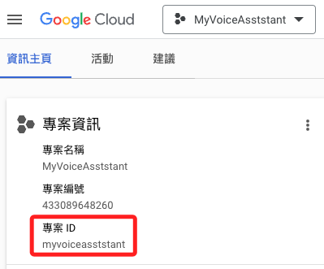
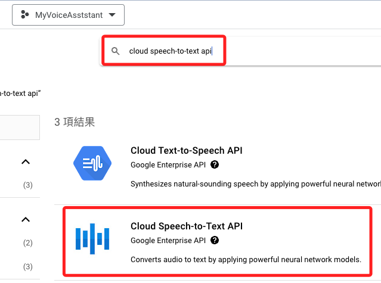
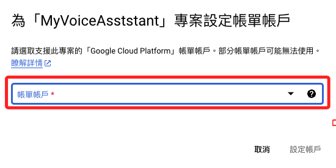

# 語音輸入辨識

_語音輸入透過辨識後轉為文字輸出_

    

<br>

## 硬體

1. 將 USB 設備如喇叭、攝像頭等插入樹莓派後，可透過指令查詢設備狀態，這裡主要觀察的是麥克風是否接好了。

   ```bash
   lsusb
   ```

   _列出所有的 USB 設備_
   

<br>

2. 要確定 Audio 設備有麥克風功能，可再透過錄音設備的查詢指令檢查，並確定卡片編號。

   ```bash
   arecord -l
   ```
    
    _卡片 3、設備 0_
   
   

<br>

3. 確認設備在 card 3，可使用以下指令進行錄音測試。

   ```bash
   arecord -D plughw:3,0 -d 3 voice.wav
   ```

   - `arecord`：是一個錄音程式，用於Linux系統中。
   - `-D plughw:3,0`：指定聲音錄製時使用的硬體設備。這裡表示使用卡片3，設備0。
   - `-d 3`：錄音的持續時間為3秒。
   - `voice.wav`：錄音儲存的檔案名稱，格式為WAV。

<br>

4. 這是腳本中正式使用的指令。

   ```bash
   arecord -D plughw:3,0 -d 3 -f S16_LE -r 8000 voice.wav
   ```

   - -f S16_LE	指定音訊的格式。 S16_LE 表示16位元取樣深度的有符號線性PCM數據，LE 代表小端格式（Little-Endian）。
   - -r 8000	設定音訊的取樣率為每秒8000次。

<br>

5. 查詢當前播放設備

   ```bash
   aplay -l
   ```

   

<br>

## 建立 Firebase 專案

_必須有專案才能在 Google Cloud 開啟相關功能，建立步驟參考之前課程講義。_

_已經有專案的話無需再添加新專案無妨。_

<br>

## 設置 Google Cloud

1. 進入 [主控台](https://cloud.google.com/?hl=zh-TW)

   

<br>

2. 選取專案

   

<br>

3. 記下 ID 之後授權時需要使用

   

<br>

4. 設定 API

   

<br>

5. 新增

   

<br>

6. 搜尋並添加語音轉文字 `speech-to-text`

   ```txt
   cloud speech-to-text api
   ```

   

<br>

7. 啟用

   

<br>

8. 要啟用計費功能

   

<br>

9. 選取帳號

   

<br>

10. 再次啟用即可

    

<br>

## 進行樹莓派設置

1. 以專案 ID 在樹莓派上進行授權

   ```bash
   gcloud auth application-default set-quota-project myvoiceasststant
   ```

<br>

2. 完成時會顯示儲存路徑

   

<br>

## 建立專案

1. 程式碼

   ```python
   import os
   from google.cloud import speech_v1p1beta1 as speech

   # 初始化语音客户端
   client = speech.SpeechClient()

   # 錄音
   def record_voice():
       # 這是錄音的指令，可以直接在終端機中進行測試
       os.system("arecord -D plughw:3,0 -d 3 -f S16_LE -r 8000 voice.wav")

   # Voice-to-text function
   def transcribe_voice():
       # 将录制的音频打开
       with open("voice.wav", "rb") as audio_file:
           content = audio_file.read()  # 读出内容给 content

       # 将 content 进行辨识
       audio = speech.RecognitionAudio(content=content)
       config = speech.RecognitionConfig(
           encoding=speech.RecognitionConfig.AudioEncoding.LINEAR16,
           sample_rate_hertz=8000,
           language_code="cmn-Hant-TW",
       )

       response = client.recognize(config=config, audio=audio)
       if response.results:
           return response.results[0].alternatives[0].transcript
       else:
           return "未能辨识"

   # 主程序
   def main():
       try:
           while True:
               record_voice()  # 錄音
               print("錄音完成，正在進行語音辨識...")
               text = transcribe_voice()  # 转录语音
               print(f"辨識結果: {text}")

               # 语音输出结果，这里使用了 espeak，但需要确保系统上安装了 espeak
               os.system(f"espeak '{text}'")  # 使用 espeak 进行语音输出

               # 等待用户输入 Enter 才继续，或输入 '退出' 来结束程序。
               user_input = input("按下 Enter 鍵以繼續，或輸入 '退出' 來結束程序。")
               if user_input.lower() == 'exit':
                   break
       except KeyboardInterrupt:
           # 用户按下 Ctrl+C
           print("程序已被用户中断")
       except Exception as e:
           # 其他异常处理
           print(f"程序发生错误: {e}")

   if __name__ == "__main__":
       main()
   ```

<br>

2. 可透過修改秒數來改變錄音時間

   

<br>

3. 執行後會新增一個音檔

   

<br>

4. 會輸出辨識結果

   

<br>

---

_END_
