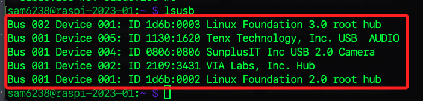
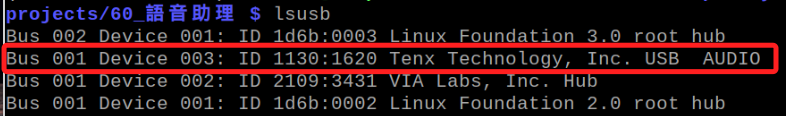
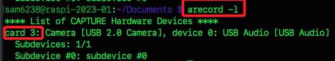
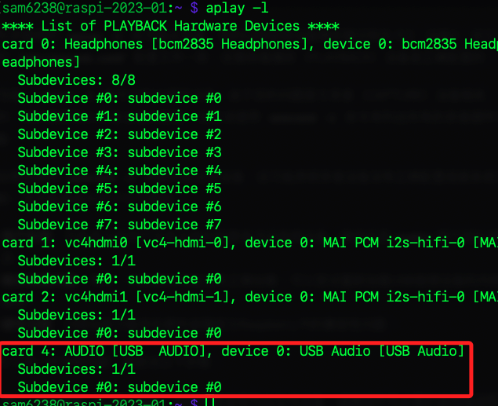

# 簡介

<br>

## 說明

_在這個主題中，我們將依序建立以下專案_

1. 文字轉語音。
2. 語音轉文字。
3. 使用文字查詢維基百科，並輸出為文字。
4. 使用語音查詢維基百科，並輸出為文字與語音。
5. 使用 Google Cloud 服務進行語音與文字的轉換與互動。

<br>

## 硬體設置

_以上各專案涉及多種硬體設置、套件安裝以及雲端設置，這裡對硬體部分彙整說明_

<br>

1. 將 USB 設備如喇叭、攝像頭等插入樹莓派後，可透過指令查詢設備狀態，這裡主要觀察的是麥克風與喇叭是否可以運作。

   ```bash
   lsusb
   ```

   _列出所有的 USB 設備_
   

<br>

2. 其中的 USB AUDIO 就是音頻設備。

    

<br>

3. 必須確定 Audio 設備具有麥克風的功能，所以透過以下指令檢查，並確定卡片編號，編號將作為錄音指令的參數使用。

   ```bash
   arecord -l
   ```

   _卡片 3、設備 0_

   

<br>

4. 依據查詢結果，使用以下指令進行錄音測試，這裡假設麥克風在卡片 3。

   ```bash
   arecord -D plughw:3,0 -d 3 voice.wav
   ```

   - `arecord`：是一個錄音程式，用於Linux系統中。
   - `-D plughw:3,0`：指定聲音錄製時使用的硬體設備。這裡表示使用卡片3，設備0。
   - `-d 3`：錄音的持續時間為3秒。
   - `voice.wav`：錄音儲存的檔案名稱，格式為WAV。

<br>

5. 在腳本中正式使用的指令比較複雜，這裡也可以先做測試。

   ```bash
   arecord -D plughw:3,0 -d 3 -f S16_LE -r 8000 voice.wav
   ```

   - -f S16_LE	指定音訊的格式。 S16_LE 表示16位元取樣深度的有符號線性PCM數據，LE 代表小端格式（Little-Endian）。
   - -r 8000	設定音訊的取樣率為每秒8000次。

<br>

6. 查詢播放設備，這個卡片編號將用來編輯設定檔案使用。

   ```bash
   aplay -l
   ```

   

<br>

## 編輯播放設備的設定文件

1. 編輯音訊設置檔

    ```bash
    sudo nano /etc/asound.conf
    ```

<br>

2. 依據查詢的內容寫入卡片編號以及設備編號。

    _尖頭括號只是用來標注，不用寫入_

    ```ini
    pcm.!default {
        type hw 
        card <卡片編號> 
        device <設備編號>
    }

    ctl.!default {
        type hw 
        card <卡片編號> 
    }
    ```

<br>

3. 要重新開機讓設定生效。

    ```bash
    sudo reboot
    ```

<br>

## 授權設定

_關於 Google Cloud 服務的授權詳後續講義_

<br>

---

_END_