# 加入 Dialogflow

<br>

## Google Cloud

1. 加入 `Dialogflow API`

    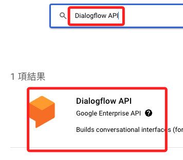

<br>

2. 啟用

    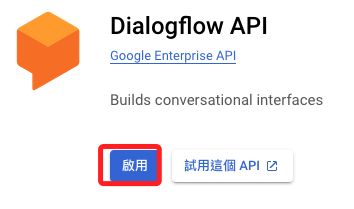

<br>

3. 進入 [Dialogflow Essentials](https://dialogflow.cloud.google.com/#/getStarted) 並建立新的代理 `CREATE AGENT`

    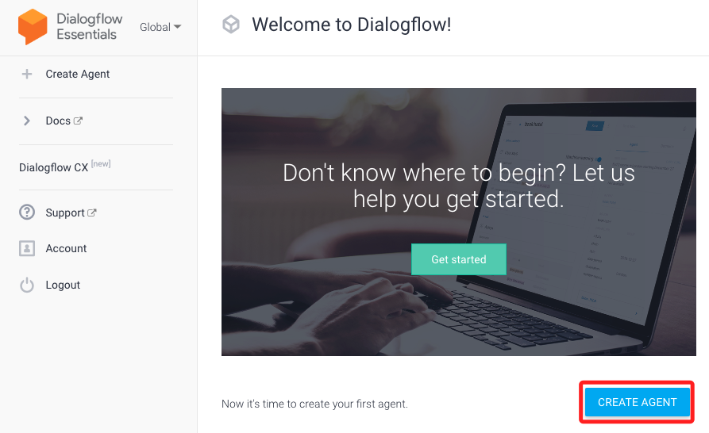

<br>

4. 輸入對應內容，最重要是選擇正確的專案

    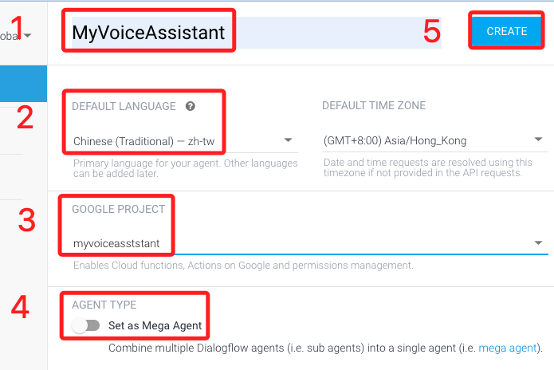

<br>

5. 在 `Intents` 中選取 `Default Fallback Intent` 後點選 `CREATE INTENT`

    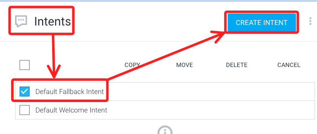

<br>

6. 向下滑到 `Responses` 可查看預設的回答

    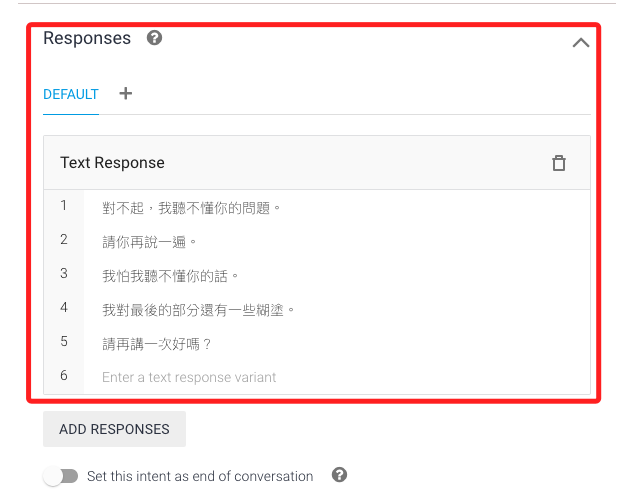

<br>

7. 可在右側 `try it now` 方框內輸入文字進行測試

    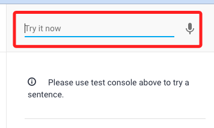

<br>

8. 添加 `Intents`

    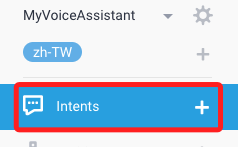

<br>

9. 輸入 Intent 名稱

    

<br>
   
10. 在訓練語句輸入自訂的對話如 `今天是星期幾？`

    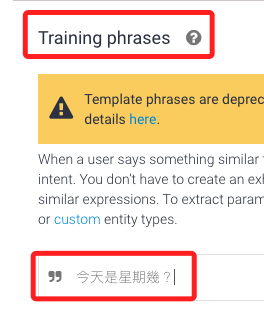

<br>

11. 第一步，先選取關鍵字 `今天`

    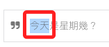

<br>

12. 在跳出來的視窗中輸入關鍵字 `@sys.date`，直接輸入 `date` 也可以。

    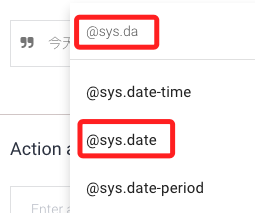

<br>

13. 完成後，關鍵字就會變色，下方會增加一列顯示關鍵字名稱、實體、解析文字。

    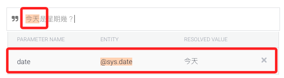

<br>

14. 先儲存，因為接下來要 `星期幾` ，但系統沒有這個關鍵字。

    

<br>

15. 點擊左側 `ENTITY +` 。

    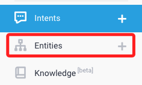

<br>

16. 自訂並輸入 `weekday` 這個實體的各種可能

    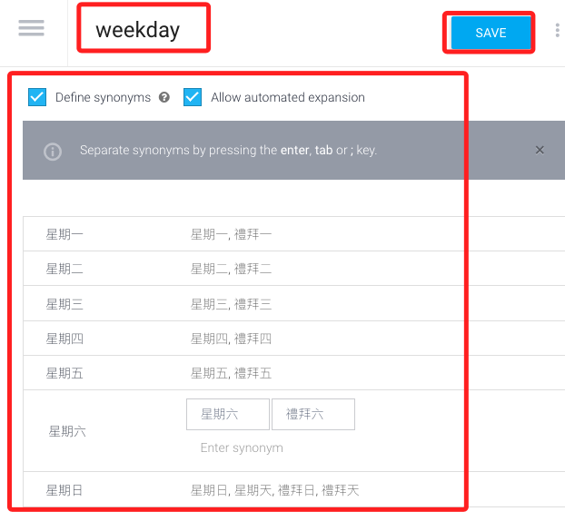

<br>

17. 再回到 Intent 的 `星期幾` 去設定，此時就有一個 `weekday` 的實體可以選擇。

    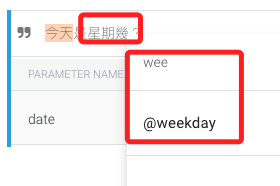

<br>

18. 在下方的表格中，將 `REQUIRED` 以及 `IS LIST` 都勾選，因為這兩個實體都是必須且是列表。

    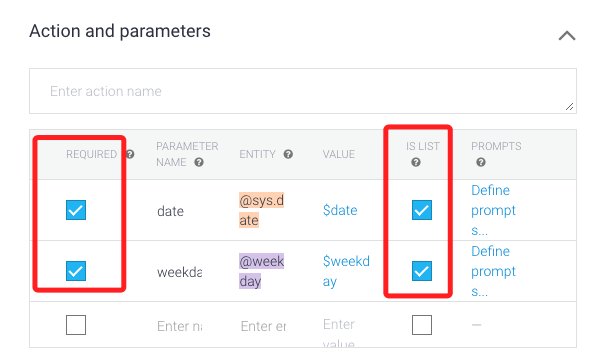

<br>

19. 接著點擊 `PROMPTS` ，這是遺漏關鍵字時的預設問句。

    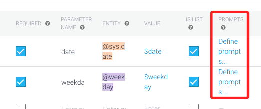

<br>

20.  首先關於 `date`，自定義兩個問句，然後 `CLOSE` 即可。

    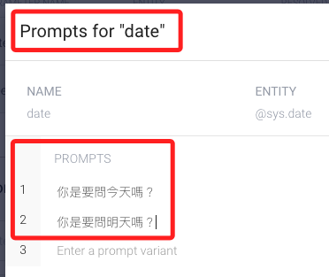

<br>

21. 對於 `weekday` 同樣給兩個預設的問題。

    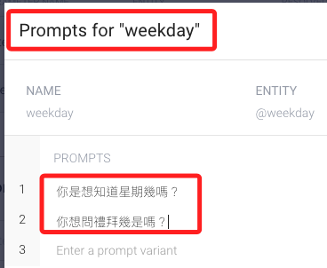

<br>

22. 記得儲存再進行測試。

    

<br>

23. 在同一個意圖中，也可以增添幾個問句表達式 `expression` 。

    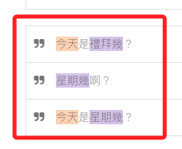

<br>

24. 設定最後的回覆，意圖完整或是意圖補全之後會從中挑選一個回覆。

    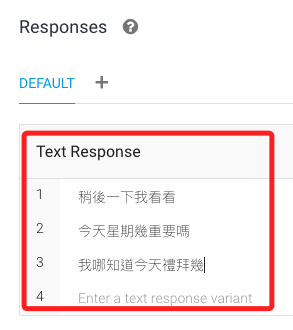

<br>

25. 勾選

    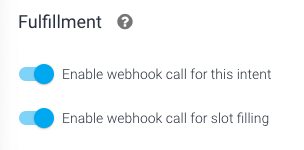

<br>

## 範例

1. 程式碼

    ```python
    import os
    from google.cloud import dialogflow_v2 as dialogflow
    from google.cloud import speech_v1p1beta1 as speech
    from google.cloud import texttospeech

    # 初始化 Dialogflow
    session_client = dialogflow.SessionsClient()
    # 輸入專案 ID，並且任意自訂一個識別碼
    session = session_client.session_path("myvoiceasststant", "myvoiceasststant-01")
    # 初始化 Google Text-to-Speech client
    tts_client = texttospeech.TextToSpeechClient()

    # 添加
    def text_to_speech(text):
        synthesis_input = texttospeech.SynthesisInput(text=text)

        # 建構語音請求，選擇語言和聲音
        voice = texttospeech.VoiceSelectionParams(
            language_code='cmn-Hant-TW',
            name='cmn-TW-Standard-A',  # 選擇一個支援中文的聲音
            ssml_gender=texttospeech.SsmlVoiceGender.NEUTRAL)

        # 選擇音訊檔案類型
        audio_config = texttospeech.AudioConfig(
            audio_encoding=texttospeech.AudioEncoding.MP3)

        # 發送請求
        response = tts_client.synthesize_speech(
            input=synthesis_input, voice=voice, audio_config=audio_config)

        # 將產生的音訊儲存為 MP3 文件
        with open('output.mp3', 'wb') as out:
            out.write(response.audio_content)
            print('音頻內容寫入檔案 "output.mp3"')

        return 'output.mp3'
    # 錄音
    def record_voice():
        # 這是錄音的指令，可以直接在終端機中進行測試
        os.system("arecord -D plughw:3,0 -d 3 -f S16_LE -r 8000 voice.wav")

    # Voice-to-text function
    def transcribe_voice():
        # 建立物件來透過 speech_v1p1beta1 的 speech 調用 SpeechClient
        client = speech.SpeechClient()
        # 將錄製的音頻打開
        with open("voice.wav", "rb") as audio_file:
            # 讀出內容給 content
            content = audio_file.read()
        # 將 content 進行辨識
        audio = speech.RecognitionAudio(content=content)
        # 指定為繁體中文
        config = speech.RecognitionConfig(
            encoding=speech.RecognitionConfig.AudioEncoding.LINEAR16,
            sample_rate_hertz=8000,
            language_code="cmn-Hant-TW",
        )

        response = client.recognize(config=config, audio=audio)
        return response.results[0].alternatives[0].transcript

    # Dialogflow response function
    def get_response(text):
        text_input = dialogflow.TextInput(text=text, language_code="zh-TW")
        query_input = dialogflow.QueryInput(text=text_input)
        response = session_client.detect_intent(session=session, query_input=query_input)
        return response.query_result.fulfillment_text

    # Main program
    def main():
        try:
            input("請按下 Enter 鍵開始錄音，或輸入 '退出' 來結束程序。")
            while True:
                record_voice()  # 錄音
                print("錄音完成，正在進行語音辨識...")
                text = transcribe_voice()  # 轉錄語音
                print(f"辨識結果: {text}")
                
                if text.strip() != "":  # 確保有轉錄內容
                    print("正在獲取 Dialogflow 回應...")
                    response = get_response(text)  # 獲取回應
                    print(f"Dialogflow 回應: {response}")
                    # os.system(f"espeak '{response}'")  # 使用 espeak 進行語音輸出
                    # 將原本的 espeak 語音合成部分替換為 Google TTS
                    audio_file = text_to_speech(response)  
                    os.system(f"mpg123 {audio_file}")  # 使用 mpg123 播放 MP3 文件
                    
                # 等待用户输入 Enter 才继续，或輸入 '退出' 來結束程序。
                user_input = input("按下 Enter 鍵以繼續，或輸入 '退出' 來結束程序。")
                if user_input.lower() == 'exit':
                    break
        except KeyboardInterrupt:
            # 用户按下 Ctrl+C
            print("程序已被用户中断")
        except Exception as e:
            # 其他異常處理
            print(f"程序發生錯誤: {e}")

    if __name__ == "__main__":
        main()
    ```

<br>

## 關於 Fulfillment

_兩個選項含義如下_

1. `Enable webhook call for this inten`：若勾選，表示這個特定的意圖被觸發時，系統將調用一個webhook，而 Webhook 是允許應用程式提供其他應用程式實時資訊的方式，在聊天機器人的情境下，webhook 通常用於將用戶的請求發送給後端服務如API，然後返回所需的資訊或動作給用戶。

2. `Enable webhook call for slot filling`：`slot filling` 是指收集完成一個意圖所需的所有必要資訊，如果勾選這個選項，系統會在收集這些資訊的過程中調用 webhook，這可用於動態引導用戶完成流程，比如根據先前的回答來決定接下來要問的問題。

3. 勾選這兩個選項是為了讓聊天機器人更加動態和智能、能夠處理複雜的查詢、提供個性化的回應，或者進行複雜的互動。不勾選的話，聊天機器人可能只能提供靜態回應或僅限於它已經預設的資訊。


<br>

---

_END：這個講義之後會再補充_