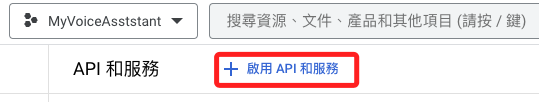
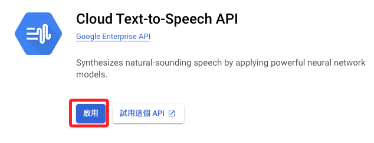
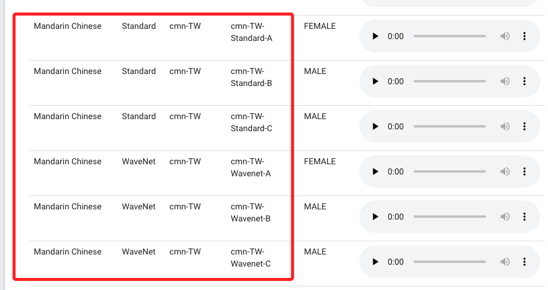

# Cloud Text-to-Speech API

<br>

## 開啟 Google Cloud

1. 搜尋 API `Text-to-Speech`

    ```bash
    Clous Text-to-Speech API
    ```

    

<br>

2. 添加

    

<br>

3. 查詢語音助理的類型，之後要在程式碼中設定。

    


<br>


## 範例

1. GC 所需套件

    ```bash
    pip install google-cloud-texttospeech
    ```

<br>

2. 程式碼

    ```python
    import os
    from google.cloud import dialogflow_v2 as dialogflow
    from google.cloud import speech_v1p1beta1 as speech
    from google.cloud import texttospeech

    # 初始化 Dialogflow
    session_client = dialogflow.SessionsClient()
    # 輸入專案 ID，並且任意自訂一個識別碼
    session = session_client.session_path("myvoiceasststant", "myvoiceasststant-01")
    # 初始化 Google Text-to-Speech client
    tts_client = texttospeech.TextToSpeechClient()

    # 添加
    def text_to_speech(text):
        synthesis_input = texttospeech.SynthesisInput(text=text)

        # 建構語音請求，選擇語言和聲音
        voice = texttospeech.VoiceSelectionParams(
            language_code='cmn-Hant-TW',
            name='cmn-TW-Standard-A',  # 選擇一個支援中文的聲音
            ssml_gender=texttospeech.SsmlVoiceGender.NEUTRAL)

        # 選擇音訊檔案類型
        audio_config = texttospeech.AudioConfig(
            audio_encoding=texttospeech.AudioEncoding.MP3)

        # 發送請求
        response = tts_client.synthesize_speech(
            input=synthesis_input, voice=voice, audio_config=audio_config)

        # 將產生的音訊儲存為 MP3 文件
        with open('output.mp3', 'wb') as out:
            out.write(response.audio_content)
            print('Audio content written to file "output.mp3"')

        return 'output.mp3'
    # 錄音
    def record_voice():
        # 這是錄音的指令，可以直接在終端機中進行測試
        os.system("arecord -D plughw:3,0 -d 3 -f S16_LE -r 8000 voice.wav")

    # Voice-to-text function
    def transcribe_voice():
        # 建立物件來透過 speech_v1p1beta1 的 speech 調用 SpeechClient
        client = speech.SpeechClient()
        # 將錄製的音頻打開
        with open("voice.wav", "rb") as audio_file:
            # 讀出內容給 content
            content = audio_file.read()
        # 將 content 進行辨識
        audio = speech.RecognitionAudio(content=content)
        # 指定為繁體中文
        config = speech.RecognitionConfig(
            encoding=speech.RecognitionConfig.AudioEncoding.LINEAR16,
            sample_rate_hertz=8000,
            language_code="cmn-Hant-TW",
        )

        response = client.recognize(config=config, audio=audio)
        return response.results[0].alternatives[0].transcript

    # Dialogflow response function
    def get_response(text):
        text_input = dialogflow.TextInput(text=text, language_code="zh-TW")
        query_input = dialogflow.QueryInput(text=text_input)
        response = session_client.detect_intent(session=session, query_input=query_input)
        return response.query_result.fulfillment_text

    # Main program
    def main():
        try:
            while True:
                record_voice()  # 錄音
                print("錄音完成，正在進行語音辨識...")
                text = transcribe_voice()  # 轉錄語音
                print(f"辨識結果: {text}")
                
                if text.strip() != "":  # 確保有轉錄內容
                    print("正在獲取 Dialogflow 回應...")
                    response = get_response(text)  # 獲取回應
                    print(f"Dialogflow 回應: {response}")
                    # os.system(f"espeak '{response}'")  # 使用 espeak 進行語音輸出
                    # 將原本的 espeak 語音合成部分替換為 Google TTS
                    audio_file = text_to_speech(response)  
                    os.system(f"mpg123 {audio_file}")  # 使用 mpg123 播放 MP3 文件
                    
                # 等待用户输入 Enter 才继续，或輸入 '退出' 來結束程序。
                user_input = input("按下 Enter 鍵以繼續，或輸入 '退出' 來結束程序。")
                if user_input.lower() == 'exit':
                    break
        except KeyboardInterrupt:
            # 用户按下 Ctrl+C
            print("程序已被用户中断")
        except Exception as e:
            # 其他異常處理
            print(f"程序發生錯誤: {e}")

    if __name__ == "__main__":
        main()
    ```

<br>

---

_END_