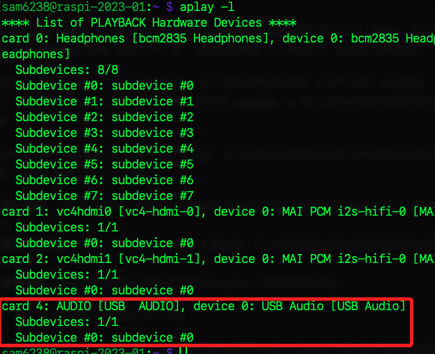
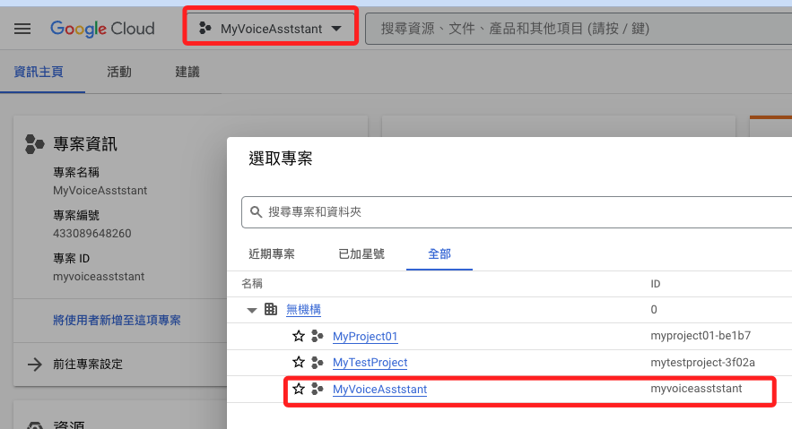

# 硬體錄音

_先記錄簡易步驟_

<br>

## 硬體

1. 將 USB 設備如喇叭或攝像頭插入樹莓派，查詢設備。

    ```bash
    lsusb
    ```
    _列出所有的 USB 設備_
    

<br>

2. 查詢當前錄音設備。

    ```bash
    arecord -l
    ```
    

<br>

3. 確認設備在 card 3，可使用以下指令錄音進行測試。
   
    ```bash
    arecord -D plughw:3,0 -d 3 voice.wav
    ```
   - `arecord`：是一個錄音程式，用於Linux系統中。
   - `-D plughw:3,0`：指定聲音錄製時使用的硬體設備。這裡表示使用卡片3，設備0。
   - `-d 3`：錄音的持續時間為3秒。
   - `voice.wav`：錄音儲存的檔案名稱，格式為WAV。

<br>

4. 這是腳本中正式使用的指令。

    ```bash
    arecord -D plughw:3,0 -d 3 -f S16_LE -r 8000 voice.wav
    ```
   
   - -f S16_LE	指定音訊的格式。 S16_LE 表示16位元取樣深度的有符號線性PCM數據，LE 代表小端格式（Little-Endian）。
   - -r 8000	設定音訊的取樣率為每秒8000次。

<br>

5. 查詢當前播放設備

    ```bash
    aplay -l
    ```
    


<br>

## 建立 Firebase 專案

_依照之前建立步驟_


<br>

## 開啟 Google Cloud

1. 進入 [主控台](https://cloud.google.com/?hl=zh-TW)

    

<br>

2. 選取專案

    

<br>

3. 記下 ID 之後授權時需要使用

    

<br>

4. 設定 API

    

<br>

5. 新增

    

<br>

6. 搜尋並添加

    ```txt
    cloud speech-to-text api
    ```

    

<br>

7. 啟用

    

8. 要啟用計費功能

    

<br>

9. 選取帳號

    

10. 再次啟用即可

    


<br>

## 進入樹莓派設置

1. 以專案 ID 在樹莓派上進行授權

    ```bash
    gcloud auth application-default set-quota-project myvoiceasststant
    ```

<br>

2. 完成時會顯示儲存路徑

    


<br>

## 建立專案

1. 程式碼

    ```python
    import os
    from google.cloud import speech_v1p1beta1 as speech

    # 初始化语音客户端
    client = speech.SpeechClient()

    # 錄音
    def record_voice():
        # 這是錄音的指令，可以直接在終端機中進行測試
        os.system("arecord -D plughw:3,0 -d 3 -f S16_LE -r 8000 voice.wav")

    # Voice-to-text function
    def transcribe_voice():
        # 将录制的音频打开
        with open("voice.wav", "rb") as audio_file:
            content = audio_file.read()  # 读出内容给 content

        # 将 content 进行辨识
        audio = speech.RecognitionAudio(content=content)
        config = speech.RecognitionConfig(
            encoding=speech.RecognitionConfig.AudioEncoding.LINEAR16,
            sample_rate_hertz=8000,
            language_code="cmn-Hant-TW",
        )

        response = client.recognize(config=config, audio=audio)
        if response.results:
            return response.results[0].alternatives[0].transcript
        else:
            return "未能辨识"

    # 主程序
    def main():
        try:
            while True:
                record_voice()  # 錄音
                print("錄音完成，正在進行語音辨識...")
                text = transcribe_voice()  # 转录语音
                print(f"辨識結果: {text}")
                
                # 语音输出结果，这里使用了 espeak，但需要确保系统上安装了 espeak
                os.system(f"espeak '{text}'")  # 使用 espeak 进行语音输出
                    
                # 等待用户输入 Enter 才继续，或输入 '退出' 来结束程序。
                user_input = input("按下 Enter 鍵以繼續，或輸入 '退出' 來結束程序。")
                if user_input.lower() == 'exit':
                    break
        except KeyboardInterrupt:
            # 用户按下 Ctrl+C
            print("程序已被用户中断")
        except Exception as e:
            # 其他异常处理
            print(f"程序发生错误: {e}")

    if __name__ == "__main__":
        main()
    ```

<br>

2. 可透過修改秒數來改變錄音時間

    

<br>

3. 執行後會新增一個音檔

    

<br>

4. 會輸出辨識結果

    


<br>

---

_END_