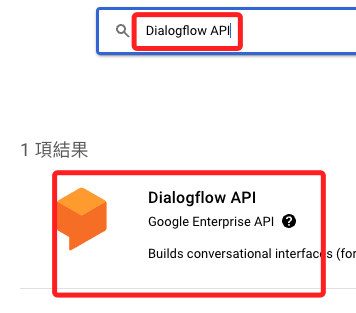
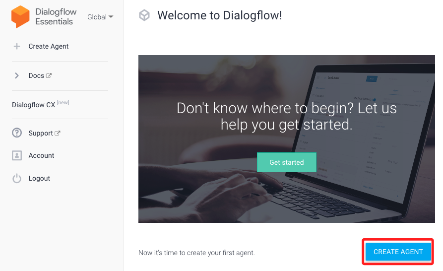
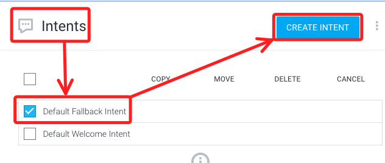
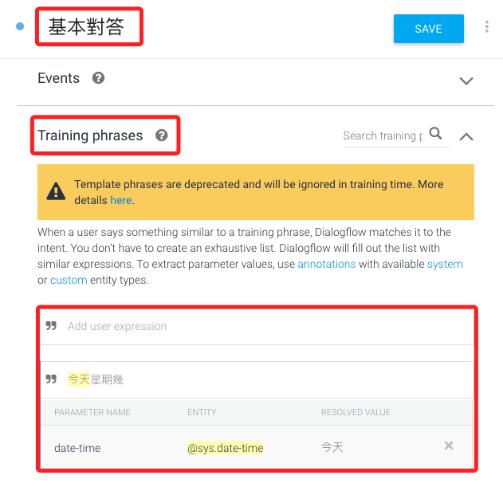
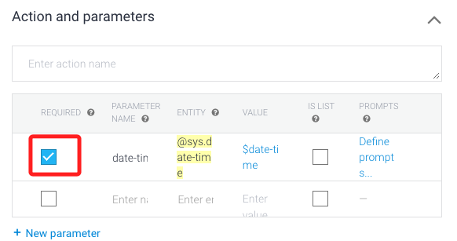

# 加入 Dialogflow

## Google Cloud

1. 加入 `Dialogflow API`

2. 啟用

3. 進入 [Dialogflow Essentials](https://dialogflow.cloud.google.com/#/getStarted) 並建立新的代理 `CREATE AGENT`

4. 輸入對應內容，最重要是選擇正確的專案

5. 在 `Intents` 中選取 `Default Fallback Intent` 後點選 `CREATE INTENT`

6. 向下滑到 `Responses` 可查看預設的回答

7. 可在右側 `try it now` 方框內輸入文字進行測試

8. 添加 `Intents`

9. 記得打勾

   
