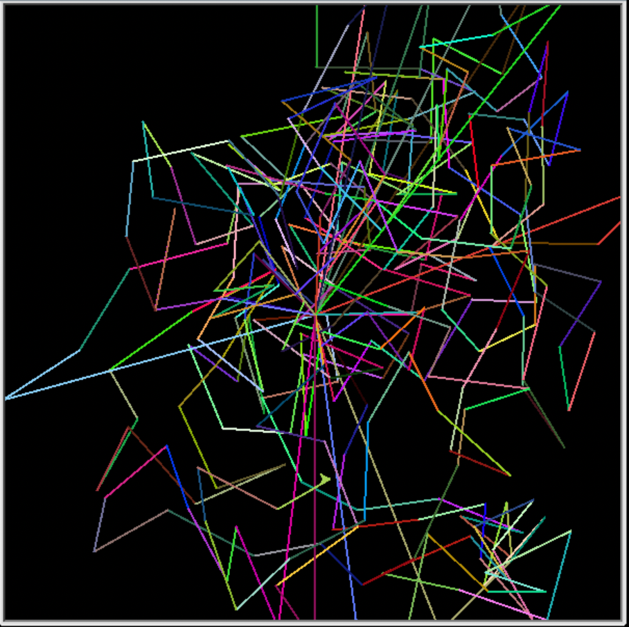
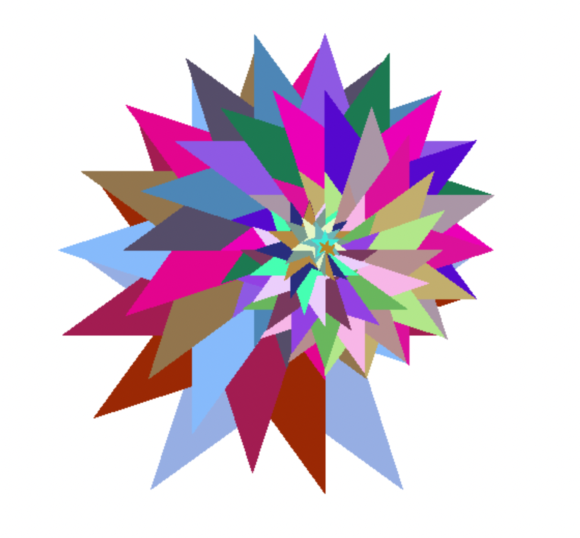
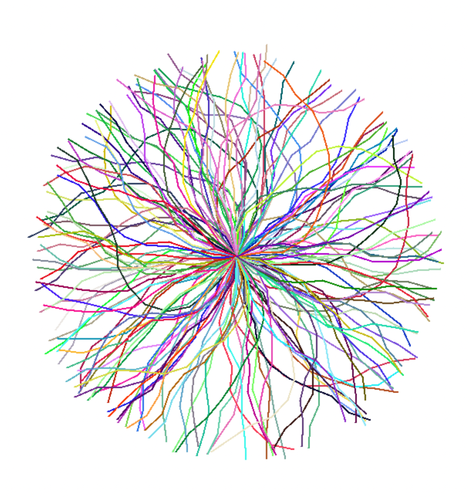
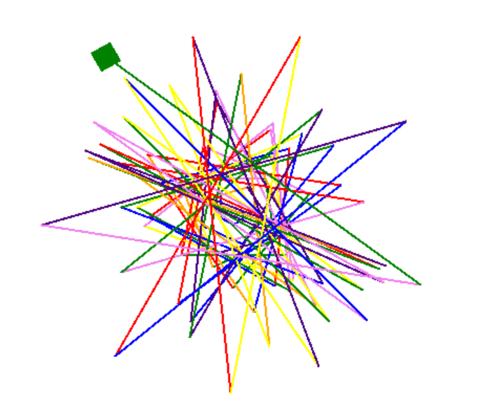
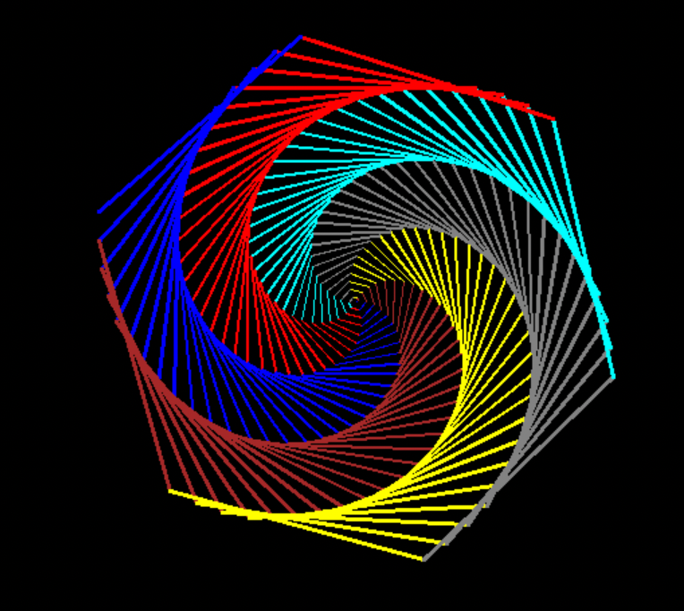
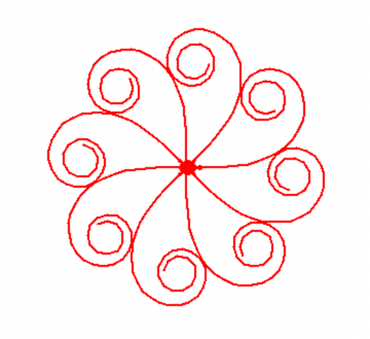
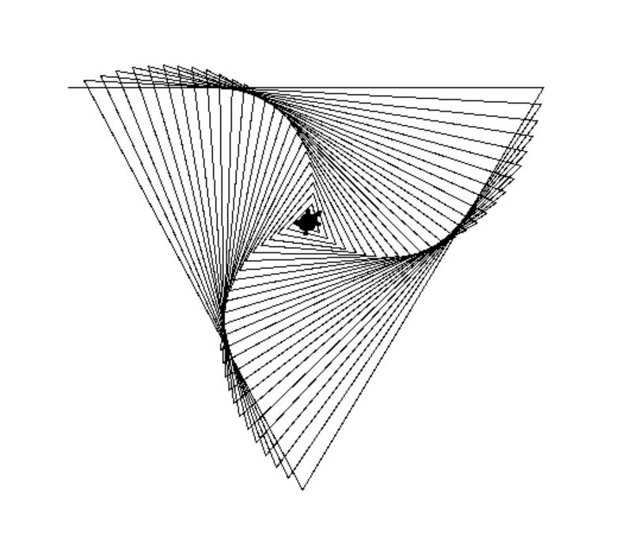
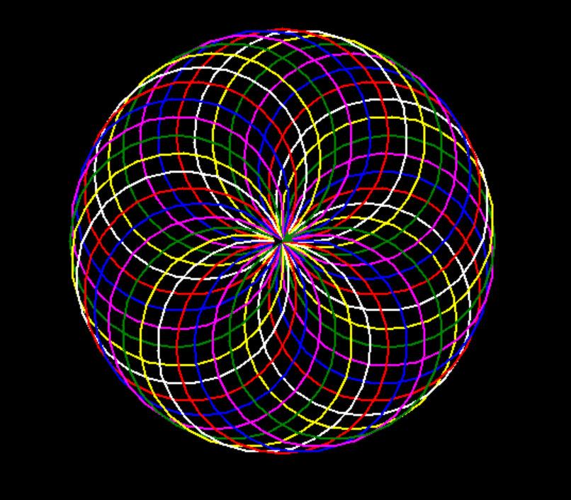

# 進階繪圖

<br>


## 範例

1. 隨機直線

    

    ```python
    '''
    隨機直線
    '''
    import turtle
    import random

    # 初始化 Turtle
    t = turtle.Turtle()
    # 設置繪製速度為最快
    t.speed(5)
    # 設置背景顏色為黑色
    turtle.bgcolor("black")
    # 設置畫筆的寬度 2
    t.width(2)

    # 設置畫布大小
    screen = turtle.Screen()
    screen.setup(width=600, height=600)

    # 生成隨機顏色
    def random_color():
        return (
            random.random(), 
            random.random(), 
            random.random()
        )

    # 檢查是否超出邊界
    def is_out_of_bounds(turtle, screen):
        # 取得座標
        x, y = turtle.position()
        # 計算畫布的邊界範圍
        half_width = screen.window_width() / 2
        half_height = screen.window_height() / 2
        
        # 檢查烏龜的 x 座標是否超出水平邊界
        out_of_x_bounds = x < -half_width or x > half_width
        # 檢查烏龜的 y 座標是否超出垂直邊界
        out_of_y_bounds = y < -half_height or y > half_height
        # 如果烏龜的任何一個座標超出邊界，則返回 True
        return out_of_x_bounds or out_of_y_bounds


    # 繪製隨機圖形
    def draw_random_art():
        for i in range(300):
            # 設置畫筆顏色為隨機顏色
            t.color(random_color())
            # 前進一個隨機距離
            t.forward(random.randint(50, 100))
            # 隨機轉一個角度
            t.right(random.randint(0, 360))
            # 如果超越邊界，就回到中心並跳出當前迴圈
            if is_out_of_bounds(t, screen):
                t.goto(0, 0)
                # 回到原點繼續繪圖

    # 開始繪製
    draw_random_art()

    # 完成繪製
    turtle.done()
    ```

<br>

2. 彩色星幾何

    

    ```python
    '''
    畫很多個不同色的星星
    '''
    import turtle 
    import random

    # 繪製的函數
    def draw(n, x, angle):
        # 畫幾個星星
        for i in range(n):
            # 顏色模式
            turtle.colormode(255)

            # 隨機數
            a = random.randint(0, 255)
            b = random.randint(0, 255)
            c = random.randint(0, 255)

            # 以隨機數設定顏色
            # 筆畫顏色
            turtle.pencolor(a, b, c)
            # 填充顏色
            turtle.fillcolor(a, b, c)

            # 開始填充
            turtle.begin_fill()

            # 開始畫星星
            for j in range(5):
                turtle.forward(5 * n-5 * i)
                turtle.right(x)
                turtle.forward(5 * n-5 * i)
                turtle.right(72 - x)

            # 結束填充
            turtle.end_fill()

            # 旋轉
            turtle.rt(angle)

    if __name__ == '__main__':
        
        # 繪製速度
        turtle.speed(speed='fastest')
        # setting the parameters
        # 星星的數量
        n = 30    
        # 每繪製一條線後向右旋轉的角度
        # 在五角星中，每個內角是 36 度，而外角是 144 度。
        # 可自行試試其他任意角度
        x = 144   
        # 旋轉角度
        angle = 18    
        screen = turtle.Screen()
        draw(n, x, angle)
        # 保持在畫面上
        screen.mainloop()
    ```

<br>

3. 發散彩線幾何

    

    ```python
    '''
    生成藝術
    發散彩線幾何
    '''
    # 隨機數
    from random import randrange
    # 畫布
    from turtle import Turtle, Screen

    # 最大角度
    MAX_ANGLE = 30
    # 最大距離
    MAX_DISTANCE = 250

    # 畫線
    def jaggedLine(turtle, pieceLength):
        # 隨機顏色
        randomColor(turtle)
        # 當海龜距離原點小於最大距離時，繼續畫線
        while turtle.distance(0, 0) < MAX_DISTANCE:
            # 隨機生成一個角度
            angle = randrange(-MAX_ANGLE, MAX_ANGLE + 1)
            # 右轉該角度
            turtle.right(angle)
            # 向前移動指定的片段長度
            turtle.forward(pieceLength)

    # 跳到中心
    def jumpToCenter(turtle):
        # 提起筆
        turtle.penup()
        # 回到原點
        turtle.home()
        # 放下筆
        turtle.pendown()

    # 隨機顏色
    def randomColor(turtle):
        r = randrange(255)
        g = randrange(255)
        b = randrange(255) 
        # 筆畫顏色
        turtle.pencolor(r, g, b)

    # 主程式
    def main():
        # 建立畫布
        s = Screen()
        # 顏色模式為 255
        s.colormode(255)
        # 建立海龜
        t = Turtle()
        # 畫筆大小
        t.pensize(2)
        # 速度
        t.speed('fastest')
        # 從0-360度，每2度畫一次
        for angle in range(0, 360, 2):
            # 跳到中心
            jumpToCenter(t)
            # 設定海龜的方向
            t.setheading(angle)
            # 繪製鋸齒線
            jaggedLine(t, 30)
        # 隱藏海龜
        t.hideturtle()
        # 保持畫布開啟狀態
        s.mainloop()

    if __name__ == "__main__":
        main()
    ```

4. 隨機

    

    ```python
    from turtle import * 
    import random

    # 視窗
    drawing_area = Screen() 
    # 視窗大小
    drawing_area.setup(width=750, height=500)
    # 形狀
    shape('square') 
    # 寬度
    width(2) 
    colors = [
        'red', 
        'orange', 
        'yellow', 
        'green', 
        'blue', 
        'indigo', 
        'violet'
    ]

    # 循環
    for i in range(75): 
        # 隨機選取顏色
        color(random.choice(colors)) 
        # 向右轉
        right(20 + i) 
        # 向前畫
        forward(1 + (i * 5)) 
        # 再向右轉
        right(40 + i)

    done() 
    ```
<br>

5. 彩色幾何圖形

    

    ```python
    from turtle import *

    # 顏色
    colors = [
        'red', 
        'blue', 
        'brown', 
        'yellow', 
        'grey', 
        'cyan'
    ]
    # 背景色
    bgcolor("black")

    # 快速
    speed(0)

    for x in range(200):
        # 以下兩種方式皆可
        # pencolor(colors[x % 6])
        color(colors[x % 6])
        width(x / 100 + 1)
        forward(x)
        left(59)

    # 隱藏箭頭
    hideturtle()
    # 完成停駐
    done()
    ```

<br>

6. 幾何線條

    

    ```python
    '''
    幾何線條
    '''
    import turtle
    from turtle import Screen

    t = turtle.Turtle()
    t.shape("turtle")
    t.color("red")
    t.speed(0)
    t.width(2)
    t.left(0)

    t.penup()
    size = 10

    def petal():
        t.pendown()
        for i in range(40):
            t.forward(size)
            t.left(i)
        t.penup()

    left_d = -15


    # 建立畫布
    s = Screen()
    # 顏色模式為 255
    s.colormode(255)
    for pet in range(8):
        petal()
        t.goto(0,0)
        t.left(-15)

    # 保持畫布開啟狀態
    s.mainloop()
    ```

<br>

7. 幾何線條
    
    

    ```python
    # 導入 turtle 模組
    import turtle

    # 定義一個遞迴函數 Cppsecrets，用於繪製圖形
    def Cppsecrets(_count, _cplusplus):
        # 如果 _count 參數大於 0，則繼續繪圖
        if _count > 0:  
            # 根據 _count 參數的值向前移動
            turtle.forward(_count)  
            # 向右轉動 _cplusplus 參數指定的角度
            turtle.right(_cplusplus)  
            # 遞迴調用，每次將 _count 參數減少 5
            Cppsecrets(_count - 5, _cplusplus)  


    # 設置烏龜的形狀為 'turtle'
    turtle.shape('turtle')
    # 重置烏龜的狀態
    turtle.reset()
    # 設置烏龜繪圖的速度為 1
    turtle.pen(speed=1)
    # 設置烏龜繪圖的延遲為 0
    turtle.delay(0)
    # 定義繪圖的初始長度為 400
    length = 400
    # 定義烏龜轉動的角度為 121 度
    turn_by = 121
    # 提起畫筆，以便移動烏龜時不留下痕跡
    turtle.penup()
    # 設置烏龜的初始位置
    turtle.setpos(-length / 2, length / 2)
    # 放下畫筆，準備開始繪圖
    turtle.pendown()
    # 調用 Cppsecrets 函數開始繪圖
    Cppsecrets(length, turn_by)
    # 繪圖完成後保持視窗開啟
    turtle.done()
    ```

<br>

8. 彩色圓圈

    

    ```python
    import turtle  
    # Creating turtle  
    t = turtle.Turtle()  
    
    turtle.bgcolor("black")  
    turtle.pensize(2)  
    turtle.speed(0)  
    
    while (True):  
        for i in range(6):  
            for colors in [
                "red", 
                "blue", 
                "magenta", 
                "green", 
                "yellow", 
                "white"
            ]:  
                turtle.color(colors)  
                turtle.circle(100)  
                turtle.left(10)  
    
    
    turtle.hideturtle()  
    turtle.mainloop()  
    ```

<br>

---

_END_