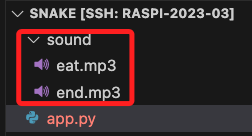
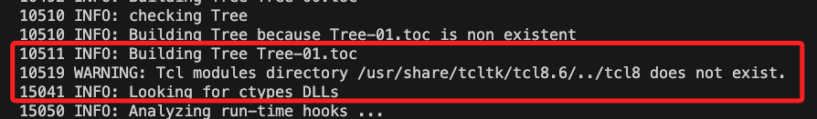
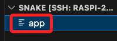

# 打包腳本

_這裡可使用撰寫好的吞食蛇腳本來示範，請先進行腳本複製_

<br>

##
1. 安裝

    ```python
    python -m pip install pyinstaller
    ```

<br>

2. 打包指令。 

    ```python
    python -m PyInstaller -F <檔案.py> -i <圖片.ico>
    ```

<br>

3. 假如要加入 .ico，將圖檔放在目錄內並加上參數即可。

    ```python
    python -m PyInstaller -F <檔案.py> -i <圖片.ico>
    ```
    - Linux 系統通常不使用文件圖標來表示可執行文件，文件圖標主要是在Windows 和 MacOS 系統中使用的。


<br>

4. 完成時會顯示成功。

    

<br>

5. 原本的資料夾會多出幾個子資料夾與檔案。

    

<br>

6. 主要的腳本在 `dist` 資料夾下，其餘都可以刪除。

    

<br>

7. 刪除後僅保留主檔案。

    

<br>

8. 確保權限可進行授權。

    ```bash
    chmod +x snake
    ```

<br>

9. 在所在路徑執行以下指令即可啟動腳本。

    ```bash
    ./snake
    ```

    _啟動_
    
    


<br>

## 打包＋包含音樂檔案

_特別說明，透過參數 `--add-data` 會將資源檔案一起打包，執行時會自動解壓縮到臨時資料夾，所以要修改腳本來讀取_

<br>

1. 將音頻加入資料夾 `sound` 中。

    _關於加入音頻後的第一次腳本修改，請參考吞食蛇範例中的 `加入音頻`_

    

2. 再次修改腳本，在 `Game` 類中添加一個靜態的路徑轉換函數。
    
    ```python
    # 在這個部分需要使用到這兩個庫，假如原本沒有要新增
    import os
    import sys

    # 以吞食蛇範例為例，在 Game 類中添加函數
    class Game:
        # 其他方法 ...
        
        '''添加的部分'''
        # 讀取打包腳本臨時解壓縮路徑的函數
        # 設定為靜態方法使函數成為類的公共輔助函數
        @staticmethod
        def resource_path(relative_path):
            try:
                # PyInstaller 創建的臨時資料夾路徑
                base_path = sys._MEIPASS
            except Exception:
                # 正常執行時的路徑
                base_path = os.path.abspath(".")
            # 假如沒有聲音，可添加這兩行進行測試
            final_path = os.path.join(base_path, relative_path)
            # 打印路徑以進行檢查
            print("Resource path:", final_path)  
            return os.path.join(base_path, relative_path)
    ```


3. 然後
    ```python
    class Game:
        # 其他方法 ...

        # 在加入音效的函數中
        def play_sound(self, sound_file):
            '''添加的部分：使用靜態方法來轉換路徑'''
            sound_file = Game.resource_path(sound_file)
            
            # 其他程序不變 ...
    ```


4. 打包指令
    
    _關於打包後取得主檔案的程序請參考前面步驟_
    
    ```bash
    python -m PyInstaller --add-data 'sound/:.' -F app.py
    ```

5. 打包時可以觀察輸出，會提示找不到某些模組，假如不重要的可不予理會。

    

6. 第一次打包後，開啟 `app.spec` 檔案。
```ini
datas=[('sound/', '.')]
```

1. 修改為。
```ini
datas=[('sound/*.mp3', 'sound')]
```

1. 再次打包。

```bash
pyinstaller app.spec
```

8. 打包後保留這個檔案即可，其餘刪除，該檔案位置請參考前面的說明。

    

9. 授權

    ```bash
    sudo chmod +x app
    ```
