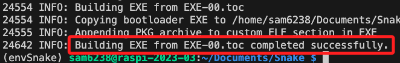
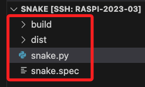
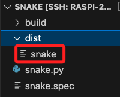
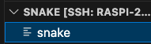

# 打包腳本

_這裡可使用撰寫好的吞食蛇腳本來示範，請先進行腳本複製_

<br>

##
1. 安裝

    ```python
    python -m pip install pyinstaller
    ```

<br>

2. 打包指令。 

    ```python
    python -m PyInstaller -F <檔案.py> -i <圖片.ico>
    ```

<br>

3. 假如要加入 .ico，將圖檔放在目錄內並加上參數即可。

    ```python
    python -m PyInstaller -F <檔案.py> -i <圖片.ico>
    ```
    - Linux 系統通常不使用文件圖標來表示可執行文件，文件圖標主要是在Windows 和 MacOS 系統中使用的。


<br>

4. 完成時會顯示成功。

    

<br>

5. 原本的資料夾會多出幾個子資料夾與檔案。

    

<br>

6. 主要的腳本在 `dist` 資料夾下，其餘都可以刪除。

    

<br>

7. 刪除後僅保留主檔案。

    

<br>

8. 確保權限可進行授權。

    ```bash
    chmod +x snake
    ```

<br>

9. 在所在路徑執行以下指令即可啟動腳本。

    ```bash
    ./snake
    ```

    _啟動_
    
    


<br>

## 包含音樂檔案

```bash
pyinstaller --add-data 'path/to/music.mp3:.' myscript.py
```