# 安裝 Firebase CLI

<br>

## 官方文件對 Nodejs 的安裝指引

_以下紀錄如何從官方文件中逐步找到安裝指南並完成安裝，特別注意，這不是唯一的途徑，僅記錄 `這次的步驟` 。_

<br>

1. 在首頁中，點擊右上角的 `Go to docs` 可查看官方文件。

    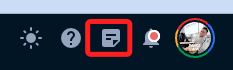

<br>

2. 各版本的 Nodejs 在相容性上的差異，可知 Node 16x 是相對相容性最好的。

    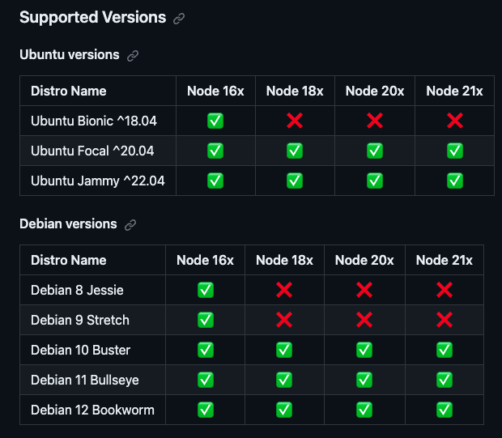

<br>

3. 展開 `Build` 頁籤，並點擊 `Hosting` 。

    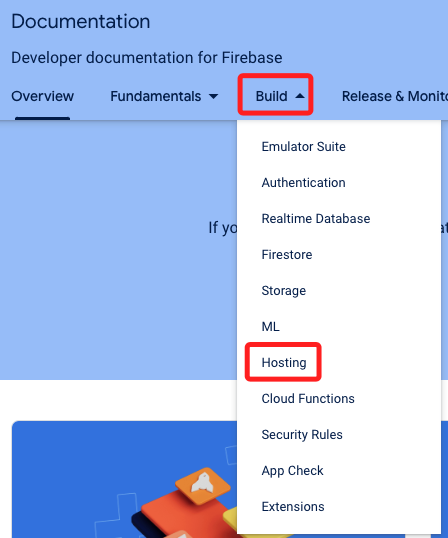

<br>

4. 從 `Get started` 可看到 `install the CLI` 並點擊。

    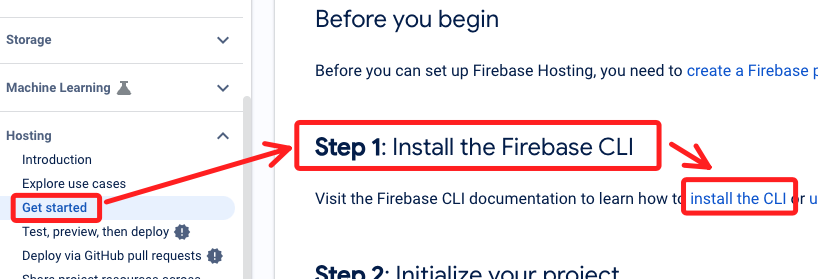

<br>

5. 選取 `Linux` 系統，使用 `npm` 安裝，然後點擊 `Node.js` 。

    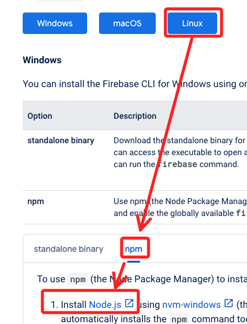

<br>

6. 選取 `Other Downloads` 。

    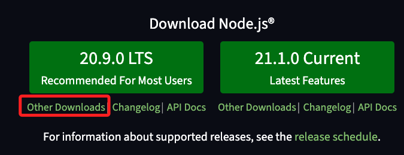

<br>

7. 滾到下方，點擊 `Installing Node.js via package manager` 。

    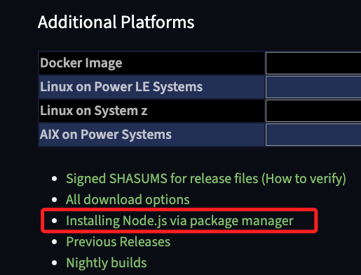

<br>

8. 選取 `Debian and Ubuntu based Linux distributions` 。

    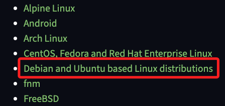

<br>

9. 再到 `Node.js binary distributions`，就會看到安裝指南，接著在下個步驟說明。

    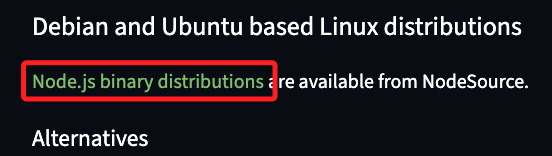


<br>

## 安裝 Node.js 與 NPM

1. 更新。

    ```bash
    sudo apt-get update
    ```

<br>

2. 安裝相關工具。

    ```bash
    sudo apt-get install -y ca-certificates curl gnupg
    ```

   - `ca-certificates` 套件包含一系列的公共機構證書，用做建立網路服務的驗證。
   
   - `curl` 是用於發送和接收數據的命令列工具。
   
   - `gnupg` 的全名是 `GNU Privacy Guard`，這是一個加密軟體，實現 OpenPGP 標準，用於驗證簽名以確保它們的完整性和來源。

<br>

3. 建立資料夾用來存放 Key。

    ```bash
    sudo mkdir -p /etc/apt/keyrings
    ```

<br>

4. 下載並安裝 `GPG key` 。

    ```bash
    curl -fsSL https://deb.nodesource.com/gpgkey/nodesource-repo.gpg.key | sudo gpg --dearmor -o /etc/apt/keyrings/nodesource.gpg
    ```

<br>

5. 決定要安裝的版本，以下指令是安裝 20x，若要安裝其他版本則替換其中的數值。

    ```bash
    NODE_MAJOR=20
    ```

<br>

6. 寫入清單，會自動套入版本。

    ```bash
    echo "deb [signed-by=/etc/apt/keyrings/nodesource.gpg] https://deb.nodesource.com/node_$NODE_MAJOR.x nodistro main" | sudo tee /etc/apt/sources.list.d/nodesource.list
    ```

<br>

7. 更新並安裝。

    ```bash
    sudo apt-get update && sudo apt-get install nodejs -y
    ```

<br>

8. 安裝完畢可以查詢版本。

    ```bash
    npm --version
    nodejs --version
    ```
    
    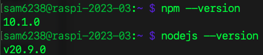

<br>

## 安裝 firebase-tools

1. 參考 Firebase 官網 [說明文件](https://firebase.google.com/docs/cli?authuser=0&hl=en#install-cli-mac-linux) 。


    ```bash
    sudo npm install -g firebase-tools
    ```

<br>

2. 切記要添加 `sudo` 。

    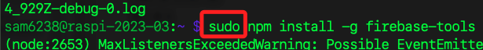

<br>

3. 這個步驟可能會很久，真的很久，要耐心等候，別以為是當機。

    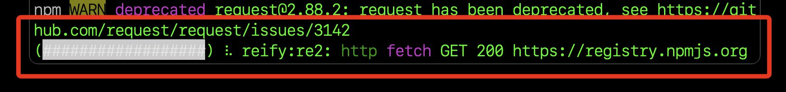

<br>

4. 可依據建議進行更新。

    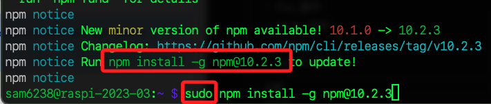

<br>

4. 檢查版本。

    ```bash
    firebase --version
    ```
    
    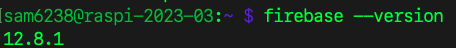


<br>

## 完整解除安裝

_依照官網指引_

1. 解除安裝。

    ```bash
    apt-get purge nodejs
    ```

2. 徹底刪除指向 NodeSource 存儲庫的信息以及存儲庫公鑰的文件。

    ```bash
    rm -r /etc/apt/sources.list.d/nodesource.list &&\
    rm -r /etc/apt/keyrings/nodesource.gpg
    ```

<br>

---

_END：以上可完成安裝程序_