# 計算機

_簡易的計算機實作範例指引_

<br>

## 完成示意圖

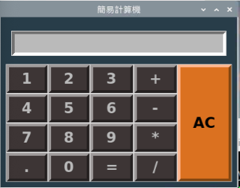

<br>

## 特別說明事項

1. _程序式編程在運行時是由上而下執行，所以變數及函數的撰寫要在物件生成之前_，但其中有個例外是 `控件變數` 必須在 `Tk 物件` 建立之後，以下是個排序範例，可先將此複製貼上在腳本之上再開始撰寫程序。

    ```python
    '''導入函數'''
    # from tkinter import *

    '''全局變數'''
    # 變數 ...

    '''實作函數'''
    # 函數 ...

    '''建立 Tk 物件'''
    # Tk() ...

    '''控件變數（widget variable)'''
    # 如 StringVar ...
    
    '''建立控件物件'''
    # 控件如 Button ...
    
    '''主循環'''
    # mainloop()
    ```

<br>

2. 補充說明前面一項的摘要，通常導入模組的時候，不建議使用 `from 模組 import *` 這樣的寫法來導入全部的類或函數，除了不符合 `可讀性` 的要求，還有降低性能以及污染命名空間等疑慮。不過，這個範例是針對 Tkinter 來寫的練習，希望以簡化的步驟來完成初體驗，所以使用這樣的寫法無妨，同學在熟悉之後，未來則依下方的方式來撰寫。

    _這裡只是示意，還沒開始喔_

    ```python
    import tkinter as tk

    # 然後再透過 tk 調用部件的類
    window = tk.Tk()
    label = tk.Label(window, text="Hello, Tkinter!")
    label.pack()
    window.mainloop()
    ```

<br>

3. 可參考這個 [影片](https://www.youtube.com/watch?v=X7N9_EIEo3Q) 來感受透過 `無限循環` 建立視覺介面的概念。

    

<br>

## 基本 UI 配置

1. 建立一個基礎的 Tkinter 視窗，特別注意，務必確保 `mainloop()` 函數要 `保持` 在最後一行，請手動將以下腳本分別放入三個對應的程式碼區塊。

    ```python
    '''導入函數'''
    # 導入 tkinter
    from tkinter import *

    '''建立 Tk 物件'''
    # 初始化Tkinter視窗
    tk_calc = Tk()
    # 設定背景顏色和邊界寬度
    tk_calc.configure(
        bg="#293C4A",
        bd=10
    )  
    # 設定標題
    tk_calc.title("簡易計算機")

    '''主循環'''  
    # 主循環（無限循環）
    tk_calc.mainloop()
    ```

    _顯示_

    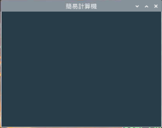

<br>

2. 建立一個 `全局變數`：設定按鍵樣式參數的字典。

    ```python
    # 設定按鍵樣式
    button_params_main = {
        'bd': 5,        # boader 邊界
        'fg': '#000',   # frontground 前景色，字的顏色
        'bg': '#BBB',   # background 背景色，按鍵本體的顏色
        'font': ('sans-serif', 20, 'bold')  # 字體
    }
    ```

<br>

3. 建立物件：`0-9` 的數字鍵，並且套用前一步驟所設定的顏色等參數，特別注意，程序的索引 `index` 都是以 `0` 作為起始，但以下腳本中的 `row` 是從 `1` 開始，這代表程序保留了 `row 0`，而這正是要給計算機的 `結果顯示欄位` 使用。

    ```python
    # 建立數字按鈕
    for i in range(9):
        Button(
            # 父容器
            tk_calc,
            # 樣式參數
            button_params_main,
            # 顯示的內容，依序由 1~9
            text=str(i + 1),
            # 註冊函數
            command=lambda num=i + 1: button_click(str(num))).grid(
            # 從第一個 row 開始
            row=(i // 3) + 1, 
            # 縱向的 column，由左至右每個 row 有三個
            column=i % 3,
            # 這個元件 widget 會向四個方向（北N、南S、東E、西W）拓展
            sticky="nsew"
        )
    ```

    _顯示_
    
    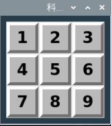

    _特別注意，所有的物件都必須添加在主循環 `tk_calc.mainloop()` 之前_

<br>

4. 建立物件：使用 grid 佈局，依據加入加減乘除四顆按鈕，參數 text 依序為 `+-*/`，`row` 則依序為 `1~4`。

    ```python
    # 加 +
    Button(
        # 父容器
        tk_calc,
        button_params_main, 
        text='+', 
        # 直接傳一個字串加號 '+' 給函數 button_click()
        command=lambda: button_click('+')).grid(
            row=1, 
            column=3, 
            sticky="nsew"
        )
    # 減 -
    Button(
        tk_calc, 
        button_params_main, 
        text='-', 
        command=lambda: button_click('-')).grid(
            row=2,
            column=3, 
            sticky="nsew"
        )
    # 乘 *
    Button(
        tk_calc, 
        button_params_main, 
        text='*', 
        command=lambda: button_click('*')).grid(
            row=3, 
            column=3, 
            sticky="nsew"
        )
    # 除 /
    Button(
        tk_calc, 
        button_params_main, 
        text='/', 
        command=lambda: button_click('/')).grid(
            row=4, 
            column=3, 
            sticky="nsew"
        )
    ```

    _顯示_
    
    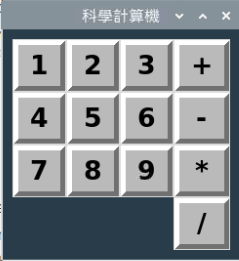

<br>

5. 建立物件：在左下角加入一個小數點 `.` 的按鍵。

    ```python
    # 建立小數點按鈕
    Button(
        tk_calc, 
        button_params_main, 
        text='.', 
        command=lambda: button_click('.')
    ).grid(
        row=4, 
        column=0, 
        sticky="nsew"
    )
    ```

    _顯示_
    
    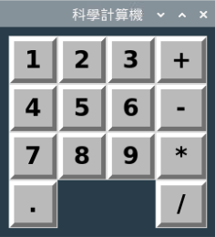

<br>

6. 建立 `等號 =` 按鍵。

    ```python
    # 建立等於按鈕
    Button(
        tk_calc, 
        button_params_main, 
        text='=', 
        # 跟其他部件不同，等號要調用另一個專用的函數
        command=button_equal
    ).grid(
        row=4, 
        column=2, 
        sticky="nsew"
    )
    ```

<br>

7. 注意，這時若直接去運行，會出現找不到 `button_equal` 這個函數，因為這個函數還沒寫。

    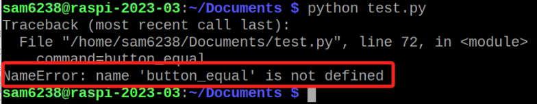

<br>

8. 這裡注意，雖然 `等號` 的函數 `button_equal` 沒實作會造成程序崩潰，但其他按鍵的 `Lambda` 函數 `button_click` 沒實作卻不會出錯，可參考下方 `補充說明` 詳解。

    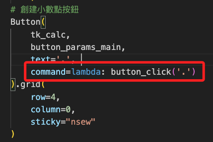

<br>

9. 先建立一個函數，內容先空著無妨。

   ```python
   # 自定義函數
   def button_equal():
       pass
   ```

<br>

10. 運行看看，每個按鈕也可以按按看。

    _顯示_
    
    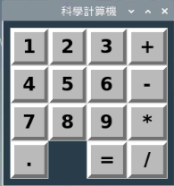

<br>

11. 最後來補上按鍵 `0` 。

    ```python
    Button(
        tk_calc, 
        button_params_main, 
        text='0', 
        command=lambda: button_click('0')
    ).grid(
        row=4, 
        column=1, 
        sticky="nsew"
    )
    ```
    _顯示_
    
    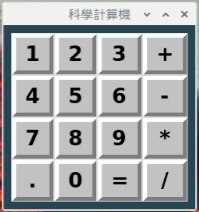

<br>

12. 假如想要更改色系，可以直接調整 `button_params_main` 的值，這裡提供一個暗色系的設置。

    ```python
    {
        'bd': 5, 
        'fg': '#BBB', 
        'bg': '#3C3636', 
        'font': ('sans-serif', 20, 'bold')
    }
    ```
    _顯示_
    
    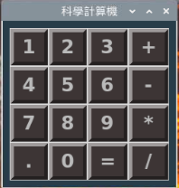

<br>

13. 接著加入 `結果顯示框` ，這裡有個重點要注意，在結果運算部分會使用到參數 `textvariable` 來綁定 UI 元件，這個機制可實現計算結果的 `動態更新`，_此部分將在最下方做補充說明_；另外，跟函數設置一樣，若不設置會報錯。

    ```python
    # 設定輸入框
    Entry(
        tk_calc, 
        font=('sans-serif', 20, 'bold'), 
        textvariable=text_input,
        bd=5, 
        insertwidth=5, 
        bg='#BBB', 
        justify='right'
    ).grid(
        row=0,
        column=0,
        columnspan=4, 
        padx=10, 
        pady=15
    )
    ```

<br>

14. 在 tk 物件建立之後的區塊，添加一個 StringVar 類型的控件變數，然後運行看看。_特別注意_，因為這類型的變數必須在 Tkinter 的主循環和內部機制來運作，所以一定要在物件建立之後才可進行建立，跟一般的變數建立時機有所不同。

    ```python
    # 建立一個 StringVar 類型的字串變數來儲存結果運算框的文本
    text_input = StringVar() 
    ```
    _結果_
    
    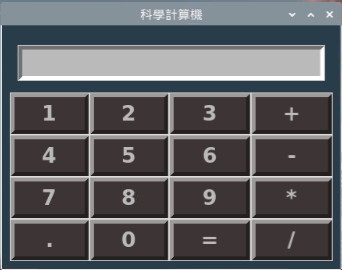

<br>

15. 做到這裡才發現忘記做 `AC` 鍵，首先建立一個 AC 按鍵，顏色稍微跟其他數字鍵不一樣。

    ```python
    # AC
    Button(
        tk_calc, 
        bd=5, 
        fg='#000', 
        bg='#db701f', 
        font=('sans-serif', 20, 'bold'),
        text='AC', 
        # 暫時先用 button_click，這部分之後要改寫
        command=lambda: button_click('ac')
    ).grid(
        row=1, 
        column=4,
        sticky="nsew"
    )
    ```
    _結果_
    
    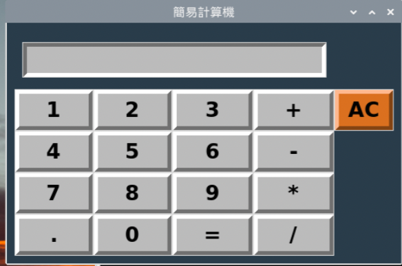

<br>

16. 因為要上下展開四個 `row` 的高度，所以要設置 `rowspan=4` 。

    ```python
    # AC
    Button(
        tk_calc, 
        bd=5, 
        fg='#000', 
        bg='#db701f', 
        font=('sans-serif', 20, 'bold'),
        text='AC', 
        command=button_clear_all
    ).grid(
        row=1, 
        column=4, 
        rowspan=4,
        sticky="nsew"
    )
    ```
    _結果_
    
    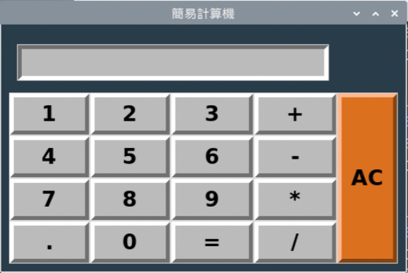

<br>

17. 因為添加了一個欄位 `column`，假如先前程式碼中有設定 Column 的部分要進行檢查，這裡在結果屏幕有設置一個 `columnspan=4`，所以也要改為 `5` 。

    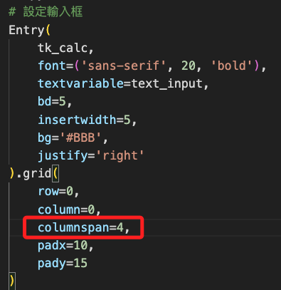
   
<br>
 
18. 將 `columnspan` 改為 `5` 。

    ```python
    # 設定輸入框
    Entry(
        tk_calc, 
        font=('sans-serif', 20, 'bold'), 
        textvariable=text_input,
        bd=5, 
        insertwidth=5, 
        bg='#BBB', 
        justify='right'
    ).grid(
        row=0, 
        column=0,
        columnspan=5,
        padx=10, 
        pady=15
    )
    ```
    _結果_

    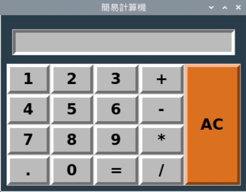
   

<br>

19. 假如要將其中的樣式與其他按鍵相同設為參數形式傳入，可去 `全局變數` 的區塊添加一個 `AC` Button 的顏色參數 `button_params_AC`，並設置內容如下，記得原本的等號要改寫為字典形式的冒號，參數名稱要改寫為用引號標注的字串，而不再是直接寫成變數。

    ```python
    # AC 按鍵的樣式字典
    button_params_AC = {
        'bd': 5, 
        'fg': '#000', 
        'bg': '#db701f', 
        'font': ('sans-serif', 20, 'bold')
    }
    ```

<br>

20. 接著再去改寫 AC Button，將參數以字典變數傳入即可。

    ```python
    # AC
    Button(
        tk_calc, 
        button_params_AC,
        text='AC', 
        command=button_clear_all
    ).grid(
        row=1, 
        column=4, 
        rowspan=4,
        sticky="nsew"
    )
    ```


<br>

_以上完成 UI 配置_

<br>

## 加入各按鍵的函數

1. 初始化一個全局的字串變數，這將用在顯示後續的計算結果上。

    ```python
    # 初始化計算符號為空字串
    calc_operator = ""  
    ```
    
    - 特別說明一下為何要建立一個中介的變數 `calc_operator` ，而不是直接改變 `text_input` 。因為控件變數會透過 `set` 函數改變數值並且連動控件，很適用在 `需要即時反映變數值到用戶界面上` 的情況。然而在計算機的應用中，最終結果需要進行一系列的輸入、計算然後顯示，使用中介變數 calc_operator 可實現先處理輸入再進行必要的運算，然後在適當的時機一次性更新 text_input，如此除可更有效控制數據流和界面的更新外，同時保持代碼結構清晰和易於維護。此外，這樣的分離機制能使錯誤處理和擴展功能變得更加容易。

<br>

2. 實作數字 `1-9` 的 `Lambda` 函數 `button_click`，在這個函數中，還會調用一個全局的變數 `calc_operator`。

    ```python
    # 按鈕點擊事件：將字符加入到結果顯示屏幕中
    # 點擊的時候會傳入一個參數 char，就是這個按鍵的數字
    def button_click(char):
        # 這個結果會改變全局變數 calc_operator
        global calc_operator
        # 在原本的值之後加上新的值
        calc_operator += str(char)
        # 透過控件變數調用 set 來動態改變 calc_operator
        text_input.set(calc_operator)
    ```

<br>

3. 任意輸入數字後會顯示在計算機的結果屏幕上。

    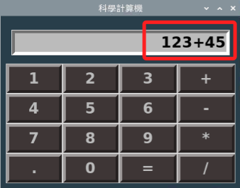

<br>

4. 修改清除鍵 `AC` 的函數。

    ```python
    # 清除顯示屏所有內容
    def button_clear_all():
        # 除了清除屏幕顯示內容，更要記得清除變數
        global calc_operator
        calc_operator = ""
        # 清除屏幕
        text_input.set("")
    ```
    - 特別說明，關於 `AC` 按鍵，當然還是可以沿用原本 `button_click` 函數，先判斷參數 `char` 是否傳入 `ac`，假如是的話，就把當前這段 `button_clear_all` 區塊邏輯寫入，但這樣會讓 `button_click` 的易讀性降低，基於不同功能程式碼的低耦合與易讀性需求，將 `AC` 按鍵的函數區隔開會是更建議的模式。

<br>

5. 改寫後記得替換 `AC` 控件裡面 `command` 參數所綁定函數為 `button_clear_all` 。

    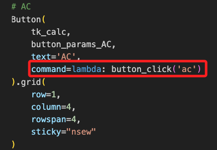

<br>


6. 替換為 `button_clear_all` 函數後的內容如下，先測試 `AC` 功能是否正常。
    
    ```python
    # AC
    Button(
        tk_calc,
        button_params_AC, 
        text='AC', 
        command=button_clear_all
    ).grid(
        row=1, 
        column=4,
        rowspan=4,
        sticky="nsew"
    )
    ```

<br>

7. 實作之前以 `pass` 跳過的 `等號` 函數。

    ```python
    # 計算結果：等號
    def button_equal():
        # 同樣是要使用全局的運算結果變數
        global calc_operator
        try:
            # 透過評估運算式並返回結果
            calc_operator = str(eval(calc_operator))  
        # 處理除以零的錯誤
        except ZeroDivisionError:  
            calc_operator = "錯誤：除以零"
        # 處理其他所有錯誤
        except Exception:  
            calc_operator = "錯誤：無效輸入"
        # 更新所顯示內容
        text_input.set(calc_operator)
    ```
    - 特別注意，Python 中的 `eval` 函數可用於執行一個 `字符串表達式`，並返回表達式運算的結果，在這個範例中，eval 可計算用戶輸入的數學表達式的結果，也就是計算機操作的結果。

<br>

___

## 📌 補充說明

_Lambda 函數與一般函數的調用時機_

<br>

### Labda 函數 `button_click` 未定義或實現但不會導致崩潰

<br>

1. 範例中的 `button_click` 函數是通過 `lambda 表達式` 間接參考的，這表示在建立按鈕時，將 `command` 參數設置為 `lambda: button_click('+')` 表達式；這樣的設置實際上是在指定一個 `回調函數`，該回調函數會在按鈕被點擊時才執行。`lambda 表達式` 建立的匿名函數不會立即調用 `button_click`，而是將 `button_click` 函數與按鈕點擊事件 `進行綁定`，這樣的設計不需要在初始化時調用函數，而其優勢是允許在設置回調函數時 `傳遞參數`。

    ```python
    button = tk.Button(
        root,
        text="Click me",
        command=lambda: button_click('+')
    )
    ```

<br>

2. 由於 `lambda 表達式` 僅在按鈕被點擊時才會被調用，所以即使 `button_click` 函數 `未被定義` 或 `存在錯誤`，在 `初始化界面` 時也不會 `引發錯誤`，這是因為 `lambda 表達式` 本身並不會立即執行，它只是將調用行為 `綁定` 到按鈕的 `點擊事件` 上。因此，只有當按鈕被點擊時，`lambda 表達式` 才會試圖調用 `button_click 函數`，如果此時 `button_click 函數` 不存在或定義錯誤，則會引發 `NameError 錯誤`；需要特別注意的是，這種錯誤不會導致應用程序崩潰，而是會在控制台顯示錯誤訊息，這是因為大多數的 `GUI 框架` 都會捕捉這類錯誤，並將錯誤的影響範圍限制在當前的回調函數執行中，也就是這樣的錯誤只會導致特定的回調函數失敗並顯示錯誤訊息。

    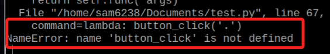

<br>

3. 另外，根據軟體工程的常見定義，函數在不同程式設計階段有不同的詮釋。通常 `實現（Implementation）` 指的是將函數從無形的概念或有形的命名轉化為具體程式碼的過程，例如從調用 `button_click` 到編寫 `def button_click` 的過程可以被視為 `函數的實現`。而 `實作（Realization）` 則是指在函數被定義後，完成其具體的內部邏輯和執行細節的過程，如一個函數已被定義但內部邏輯尚未完善，則這個函數可以被認為是 `尚未實作` 的。

<br>

### 一般函數 `button_equal` 未實現會導致崩潰

<br>

1. 範例中將 `button_equal` 函數設置為按鈕的 `command` 參數 `command=button_equal`，這表示當按鈕被建立時，Tkinter 會立即搜尋並引用 `button_equal 函數`，在這種情況下，`Tkinter` 需要確認 `button_equal 函數` 已經被定義並且可以被正確引用，這與使用 `lambda 表達式` 設置 `回調函數` 不同，這裡是直接指定了一個 `函數引用`，這需要函數在按鈕初始化時已經存在於 `命名空間` 中。

    ```python
    # 按鈕設置為直接引用 button_equal 函數
    button = tk.Button(
        root,
        text="=",
        command=button_equal
    )
    ```

<br>

2. 在初始化界面時，如果 `button_equal 函數` 未被實現，即函數 `尚未定義` 或者 `定義錯誤`，這將導致 Tkinter 嘗試訪問一個不存在的 `函數引用`，由於 Tkinter 需要在建立按鈕時立即找到並引用 `button_equal 函數`，這會導致 Python 拋出 `NameError` 或 `AttributeError` 等錯誤，這些錯誤在初始化階段發生，會阻止整個界面的正常加載，從而導致應用程序在啟動時崩潰。

    ```python
    # 假設 button_equal 未定義
    button = tk.Button(root, text="=", command=button_equal)
    # 此行會導致 NameError: name 'button_equal' is not defined
    ```

<br>

3. 這種錯誤的根本原因是 `Tkinter` 在初始化按鈕時會立即 `解析 command 參數` 所指定的函數，並嘗試 `建立對這個函數的引用`；如果函數未定義，Python 會在這個過程中 `檢查命名空間`，並在找不到指定函數時 `拋出錯誤`，這種錯誤在 `GUI 應用程序` 中是致命的，因為它會阻止用戶界面的正常初始化和顯示，這與使用 `lambda 表達式` 設置回調函數的 `延遲執行機制` 不同，後者只會在事件觸發時才檢查函數是否存在，從而避免了初始化階段的潛在錯誤。

<br>

4. 建議在建立按鈕前，確保所有回調函數已經正確定義和實現。如果函數尚未定義，可以考慮使用 lambda 表達式或其他延遲執行的方式來避免初始化階段的錯誤，這可以提高應用程序的穩定性，防止在界面加載過程中出現未定義函數引起的崩潰。

    ```python
    # 正確定義 button_equal 函數以避免初始化錯誤
    def button_equal():
        print("Button '=' clicked")

    button = tk.Button(root, text="=", command=button_equal)
    ```

___

## 補充說明 Tkinter 中的 `textvariable` 

1. 在 Tkinter 中，`textvariable` 是一種特殊的變數，用於實現 Tkinter 界面元素(如標籤、按鈕、文本框等)和 Python 程式之間的 `數據綁定`，它可以被視為一種 `監聽` 機制，因為它會監視其值的變化，並自動更新綁定到它的界面元素的顯示內容。這種機制實現了數據和視圖的分離，有助於代碼的管理和維護。

<br>

2. 通過使用 `textvariable`，可在不直接操作界面元素的情況下更新顯示的內容，透過 `監聽機制`，當 `textvariable` 所 `綁定` 的數據變化時，相關的界面元素會自動更新其顯示內容。

<br>

3. `textvariable` 搭配 `StringVar` 可以用於 `Label`, `Entry`, `Button` 等多種 Tkinter 控件，除此 Tkinter 還提供了其他類型的變數，如 `IntVar`, `DoubleVar`, `BooleanVar` 等，用於儲存不同類型的數據，以下是個簡易的程式碼範例。


    ```python
    import tkinter as tk

    # 建立主視窗
    root = tk.Tk()
    root.title("textvariable 示範")

    # 建立一個 StringVar 實體
    text_var = tk.StringVar()

    # 設置 StringVar 的值
    text_var.set("初始文本")

    # 建立一個標籤 Label，textvariable 則指向前面建立的 StringVar 類型的變數 text_var
    label = tk.Label(root, textvariable=text_var)
    label.pack()

    # 更改 StringVar 的值，標籤的文本也會跟著更改
    def update_text():
        text_var.set("文本已更改")
    # 重置 StringVar 的值為初始狀態
    def reset_text():
        text_var.set("初始文本")
    # 建立一個按鈕，點擊後會調用 update_text 函數
    button = tk.Button(root, text="更改文本", command=update_text)
    button.pack()
    # 建立另一個按鈕，點擊後會調用 reset_text 函數
    reset_button = tk.Button(root, text="重置文本", command=reset_text)
    reset_button.pack()

    # 運行主循環
    root.mainloop()
    ```

<br>

4. 成果示意圖

    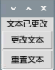


<br>

___

_END_