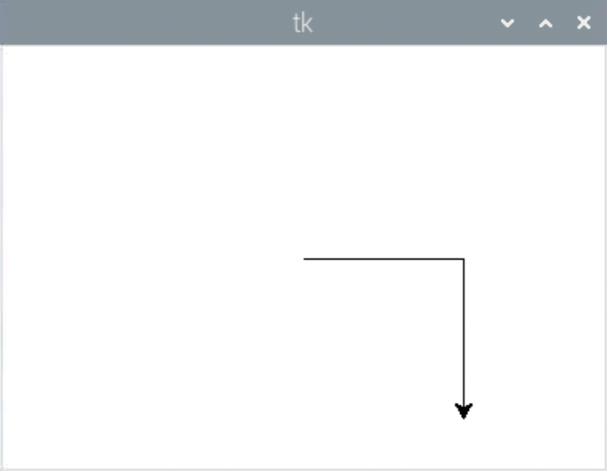
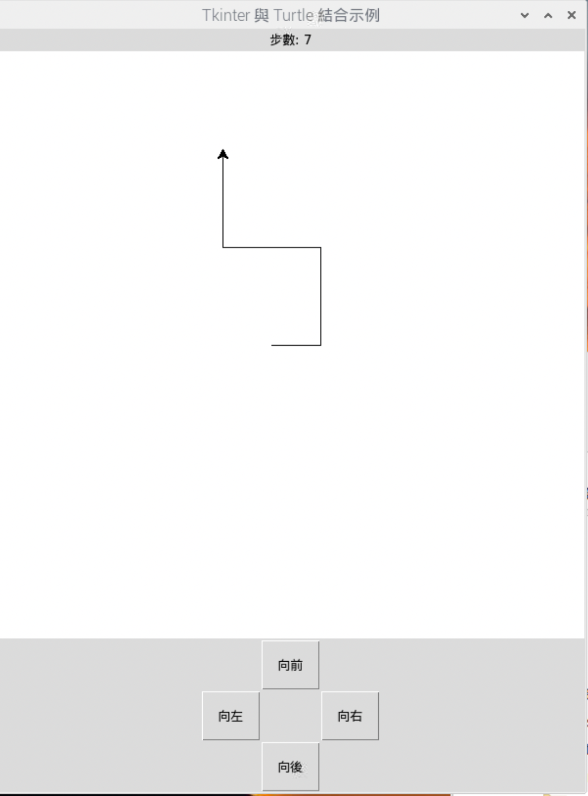

# Puzzle

_以下是一個完整的逐步指引以及逐行註解說明教學_

<br>

## 完成示意圖


<br>


## 準備工作

1. 準備圖片，從講義中的 `images` 中下載 `images.zip` 這個檔案然後解壓縮，內容包含`號碼 0~15`、`空白圖片`、`打亂按鈕` 等共 18 張，其中 `打亂按鈕` 像素 58x24，其餘像素是 90x90。

    

<br>

2. 建立專案資料夾，比如說 `MyPuzzleGame`。

    ```bash
    mkdir MyPuzzleGame && cd MyPuzzleGame
    ```

<br>

3. 建立兩個資料夾，用來存放圖片，`0~15 數字圖片` 以及 `空白圖片 `放入 `number-images`，打亂按鈕的圖片 `scramble.GIF` 放入 `images` 資料夾。

    ```bash
    mkdir number-images && mkdir images
    ```

<br>

## 專案架構

1. 建立專案主檔案，任意命名，這裡舉例為 `app.py` 。

    ```bash
    touch app.py
    ```

<br>

2. 基本架構：可複製後在主檔案中貼上。

    ```python
    '''導入必要模組'''

    '''定義常數'''

    '''自訂函數'''

    '''1. 導入與註冊圖片'''

    '''2. 建立圖塊'''

    '''3. 添加混亂按鈕'''

    '''4. 繪製棋盤'''

    '''5. 定義空方塊位置和亂序邏輯'''

    '''6. 建立交換邏輯'''

    '''7. 檢查勝利條件'''

    '''8. 主函數'''

    '''9. 執行腳本'''
    ```

<br>

## 開始撰寫腳本

1. 導入必要模組

    ```python
    '''導入必要模組'''
    # 繪圖和建立圖形界面的模組
    import turtle
    # 建立和控制圖形界面部件的模組
    import tkinter as tk
    import tkinter.messagebox
    # 生成隨機數
    import random
    ```
    - Tkinter 是 Python 的標準 GUI (圖形使用者介面) 程式庫，它封裝了 Tk GUI 工具集的 Python 接口。主要用於建立和管理視窗、按鈕、標籤、文字框、選單、滾動條等等的 GUI 元件。
    - Turtle 模組則是一個使用了 Tkinter 作為實現圖形繪製的庫，所以在使用 Turtle 時，實際上是在一個 Tkinter 視窗中建立了一個畫布，並在該畫布上進行繪圖。
    


<br>

1. 定義常數

    ```python
    '''定義常數'''
    # 四欄四列
    NUM_ROWS = 4  
    NUM_COLS = 4
    # 每一塊磚的寬與高  
    TILE_WIDTH = 90  
    TILE_HEIGHT = 90
    # 字形字體
    FONT_SIZE = 24
    FONT = ('Helvetica', FONT_SIZE, 'normal')
    # 打亂的次數，也就是打亂的程度
    SCRAMBLE_DEPTH = 100
    ```

<br>

3. 導入與註冊圖片

    ```python
    # 導入圖片
    def load_images():
        images = []
        # 數字圖片1~15共15張
        for i in range(NUM_ROWS * NUM_COLS - 1):
            file = f"number-images/{i+1}.gif"
            images.append(file)
        # 空的圖片一張
        images.append("number-images/empty.gif")
        return images

    # 註冊圖片
    def register_images(image_list):
        # 全局變數 screen
        global screen
        # 逐一取出圖片透過 addshape 函數進行註冊
        for image_file in image_list:
            screen.addshape(image_file)
    ```

    - 使用 Python 的 turtle 模組開發應用時，如果要使用自定義的圖片作為 turtle 的形狀，需要先將這些圖像 `註冊` 到 turtle 圖形視窗中，如此 turtle 才能識別並處理這些圖像。

    - 特別注意，在主函數 `main()` 中必須先對全局變數 `screen` 進行初始化，然後再調用 `register_images()` 函數，不然會報錯。

<br>

## 建立界面

1. 自訂函數：建立圖塊

    ```python
    # 建立磚塊並排列在棋盤上
    def create_tiles(_images):
        # 調用標轉函式庫 random 的函數 shuffle，對傳入的序列物件進行隨機打亂
        random.shuffle(_images)
        # 建立一個二維列表，並且暫時用字串 # 號填入值
        board = [["#" for _ in range(NUM_COLS)] for _ in range(NUM_ROWS)]
        # 遍歷二維陣列，然後填入註冊的圖塊
        for i in range(NUM_ROWS):
            for j in range(NUM_COLS):
                tile_num = NUM_COLS * i + j
                tile = turtle.Turtle(_images[tile_num])
                tile.penup()
                board[i][j] = tile
                # 在嵌套的迴圈中定義一個函數，如此便可確保每個圖塊都有獨立的響應函數
                def click_callback(x, y, tile=tile):
                    return swap_tile(tile)
                # 每個磚塊都註冊獨立的函數
                tile.onclick(click_callback)
        # 完成時將整個圖板傳回
        return board
    ```

<br>

2. 自訂函數：添加混亂按鈕

    ```python
    # 使用 Tkinter 建立一個按鈕，用於打亂拼圖
    # 擊時將調用 scramble_board 函數
    def create_scramble_button_tkinter():
        global screen
        # 建立畫布
        canvas = screen.getcanvas()
        # 建立上方的打亂按鈕
        button = tk.Button(
            # 父容器
            canvas.master, 
            text="Scramble", 
            background="cadetblue", 
            foreground="white", 
            bd=0,
            # 註冊的函數是 scramble_board()
            command=scramble_board
        )
        # 使用 Tkinter 在 Turtle 的畫布上建立一個新視窗，用於放置一個按鈕。
        # (0, -240) 也就是水平置中、垂直向下偏移 240 像素。
        canvas.create_window(0, -240, window=button)
    ```

    - 特別注意，在 Turtle 繪圖環境中，canvas 本身是一個 Tkinter 的畫布（Canvas），所以可以在上面使用 Tkinter 的功能。

    - 換句話說，canvas 是 Turtle 畫布的 Tkinter 界面對象。

<br>

3. 自訂函數：繪製棋盤

    ```python
    # 在 Turtle 繪圖視窗中繪製及更新拼圖板
    def draw_board():
        # screen 是繪圖視窗、board 是拼圖板的二維列表
        global screen, board
        # 關閉 turtle 的動畫效果
        screen.tracer(0)
        # 使用嵌套循環遍歷拼圖板，裡面的每塊磚tile都會在程序一開始的時候進行註冊
        for i in range(NUM_ROWS):
            for j in range(NUM_COLS):
                tile = board[i][j]
                tile.showturtle()
                tile.goto(
                    -138 + j * (TILE_WIDTH + 2), 
                    138 - i * (TILE_HEIGHT + 2)
                )
        # 重新啟動動畫效果
        screen.tracer(1)
    ```

<br>

## 定義核心功能


1. 自訂函數：定義空方塊位置和亂序邏輯

    ```python
    # 搜尋空方塊的位置
    def find_empty_square_pos():
        global board
        # 同樣使用嵌套迴圈
        for row in board:
            for candidate in row:
                # 一但找到這個空的磚塊
                if candidate.shape() == "number-images/empty.gif":
                    # 
                    empty_square = candidate
        # 調用自訂函數 index_2d，並將 board 與 empty_square 作為參數傳入
        return index_2d(board, empty_square)

    # 打亂棋盤
    def scramble_board():
        global board, screen
        # 打亂的次數在一開始就寫入常數，預設是 100
        for i in range(SCRAMBLE_DEPTH):
            # 找到空的磚塊
            empty_i, empty_j = find_empty_square_pos()
            # 建立一個可移動方向的列表
            directions = ["up", "down", "left", "right"]
            # 根據空方塊的位置，從上方列表中刪除不可能的移動方向
            if empty_i == 0: directions.remove("up")
            if empty_i >= NUM_ROWS - 1: directions.remove("down")
            if empty_j == 0: directions.remove("left")
            if empty_j >= NUM_COLS - 1: directions.remove("right")
            # 從剩餘的可能方向中隨機選擇一個方向
            direction = random.choice(directions)
            # 根據隨機選擇的方向，調用 swap_tile 函數來交換空方塊與鄰近方塊的位置
            if direction == "up": swap_tile(board[empty_i - 1][empty_j])
            if direction == "down": swap_tile(board[empty_i + 1][empty_j])
            if direction == "left": swap_tile(board[empty_i][empty_j - 1])
            if direction == "right": swap_tile(board[empty_i][empty_j + 1])
    ```

<br>

2. 自訂函數：建立交換邏輯

    ```python
    # 用於找出某個元素在二維列表中的位置
    def index_2d(my_list, v):
        # 透過 enumerate 取得傳入列表的索引與值
        # enumerate 傳出的是一個枚舉 enum 物件 
        for i, x in enumerate(my_list):
            if v in x:
                # 假如找到，會傳出外層列表的索引，以及在子列表中的索引
                return (i, x.index(v))
    
    # 自訂函數檢查兩個圖塊是否相鄰
    def is_adjacent(el1, el2):
        if abs(el2[1] - el1[1]) == 1 and abs(el2[0] - el1[0]) == 0:
            return True
        if abs(el2[0] - el1[0]) == 1 and abs(el2[1] - el1[1]) == 0:
            return True
        return False
    
    # 交換圖塊
    def swap_tile(tile):
        global screen
        # 調用自訂函數 index_2d 傳入圖板以及圖塊，會取得當前的位置
        current_i, current_j = index_2d(board, tile)
        # 然後找到空白圖塊的位置
        empty_i, empty_j = find_empty_square_pos()
        # 把空白圖塊傳給變數 empty_square
        empty_square = board[empty_i][empty_j]
        # 檢查是否相鄰
        if is_adjacent([current_i, current_j], [empty_i, empty_j]):
            temp = board[empty_i][empty_j]
            board[empty_i][empty_j] = tile
            board[current_i][current_j] = temp
            draw_board()
            if check_win():
                show_congratulations()
    ```

<br>


## 添加勝利條件

1. 自訂函數：檢查勝利條件

    ```python
    # 檢查拼圖是否已被正確解開
    def check_win():
        global board
        count = 1
        for row in board:
            for tile in row:
                if tile.shape() != "number-images/empty.gif":
                    if int(tile.shape().split('/')[-1].split('.')[0]) != count:
                        return False
                count += 1
        return True
    ```


<br>

## 組合所有元素

1. 自訂函數：主函數

    ```python
    # 組合各功能為主函數
    def main():
        # 全局變數
        global screen, board
        
        # 建立並設定螢幕
        screen = turtle.Screen()
        screen.setup(600, 600)
        screen.title("15 Puzzle")
        screen.bgcolor("aliceblue")
        screen.tracer(0)

        # 加載並註冊圖片
        images = load_images()
        register_images(images)
        # 建立拼圖
        board = create_tiles(images)
        # 透過點擊按鈕打亂拼圖
        create_scramble_button_tkinter()
        # 遊戲開始的時候，無需點擊按鈕直接打亂棋盤
        scramble_board()
        # 繪製棋盤
        draw_board()
        # 啟動動畫
        screen.tracer(1)
    ```

<br>

2. 執行腳本

    ```python
    # 判斷是否為模組或執行腳本
    if __name__ == '__main__':
        # 調用自訂的主函數
        main()
        # 確保圖形界面按預期持續運行和顯示
        turtle.done()
    ```


<br>

## 補充說明

_在同一個界面中結合使用 Tkinter 和 Turtle。_

<br>

1. 說明：簡單示範在 Tkinter 程式中直接使用 Turtle 模組，並將 Turtle 的畫布（Canvas）整合到 Tkinter 的視窗中，這樣便可在 Tkinter 應用程序中利用 Turtle 的繪圖功能。

<br>

2. 程式碼
    
    

    ```python
    import tkinter as tk
    import turtle

    # 建立 Tkinter 的主視窗
    root = tk.Tk()

    # 建立一個 Tkinter Canvas 控件
    canvas = tk.Canvas(root)
    # 填滿並且拓展
    canvas.pack(fill=tk.BOTH, expand=True)

    # 建立一個 Turtle 畫筆，並將其與 Tkinter Canvas 關聯
    t = turtle.RawTurtle(canvas)

    # 使用 Turtle 畫筆進行繪圖
    t.forward(100)
    t.right(90)
    t.forward(100)

    # 啟動 Tkinter 的事件循環
    root.mainloop()
    ```

<br>

## 進階應用

_結合 Tkinter 與 Turtle_

1. 完成圖

    

<br>

2. 程式碼

    ```python
    import tkinter as tk
    import turtle

    # 初始化步數為 0
    steps = 0

    # 定義函數：更新步數顯示
    def update_steps():
        label_steps.config(text=f"步數: {steps}")

    # 定義函數：向前移動並增加步數
    def move_forward():
        global steps
        t.forward(50)
        steps += 1
        update_steps()

    # 定義函數：向後移動並增加步數
    def move_backward():
        global steps
        t.backward(50)
        steps += 1
        update_steps()

    # 定義函數：向左轉
    def turn_left():
        t.left(90)

    # 定義函數：向右轉
    def turn_right():
        t.right(90)

    # 建立 Tkinter 的主視窗
    root = tk.Tk()
    root.title("Tkinter + Turtle")

    # 按鈕樣式的配置字典
    button_config = {
        'padx': 5,  # X 軸填充
        'pady': 5,  # Y 軸填充
        'width': 5,  # 按鈕寬度
        'height': 2  # 按鈕高度
    }

    # 建立 Frame： 放置按鈕
    frame = tk.Frame(root)
    frame.pack(side=tk.BOTTOM)

    # 建立四個按鈕
    button_forward = tk.Button(
        frame, text="向前", 
        command=move_forward, 
        **button_config
    )
    button_backward = tk.Button(
        frame, 
        text="向後", 
        command=move_backward, 
        **button_config
    )
    button_left = tk.Button(
        frame, 
        text="向左", 
        command=turn_left, 
        **button_config
    )
    button_right = tk.Button(
        frame, text="向右", 
        command=turn_right, 
        **button_config
    )

    # 將按鈕透過 grid 佈局方式放置到 Frame 上
    button_forward.grid(row=0, column=1)
    button_backward.grid(row=2, column=1)
    button_left.grid(row=1, column=0)
    button_right.grid(row=1, column=2)

    # 建立標籤：顯示步數
    label_steps = tk.Label(root, text="步數: 0")
    label_steps.pack(side=tk.TOP)

    # 建立 Canvas 控件
    canvas = tk.Canvas(root, width=600, height=600)
    canvas.pack()

    # 建立一個 Turtle 畫筆，並將其與 Tkinter Canvas 關聯
    t = turtle.RawTurtle(canvas)

    # 設置 Turtle 的初始位置
    t.penup()
    t.goto(-20, 0)
    t.pendown()

    # 啟動 Tkinter 的事件循環
    root.mainloop()
    ```
<br>

## 關於樣式參數的表示

1. 上面範例使用雙星號 `**` 將一個字典的鍵值對展開成關鍵字參數，這是一個語法糖用法。至於在計算機範例中，樣式參數並未使用字典展開，而是直接轉入字典。

2. 因為 Tkinter 控件的構造函數允許直接傳遞字典作為配置選項，所以兩種寫法效果是一致的，這裡只是使用不同方式來進行語法變化的展示。

3. 特別注意，不是每一個模組的構造函數都允許這樣的用法。

<br>

---

_END_