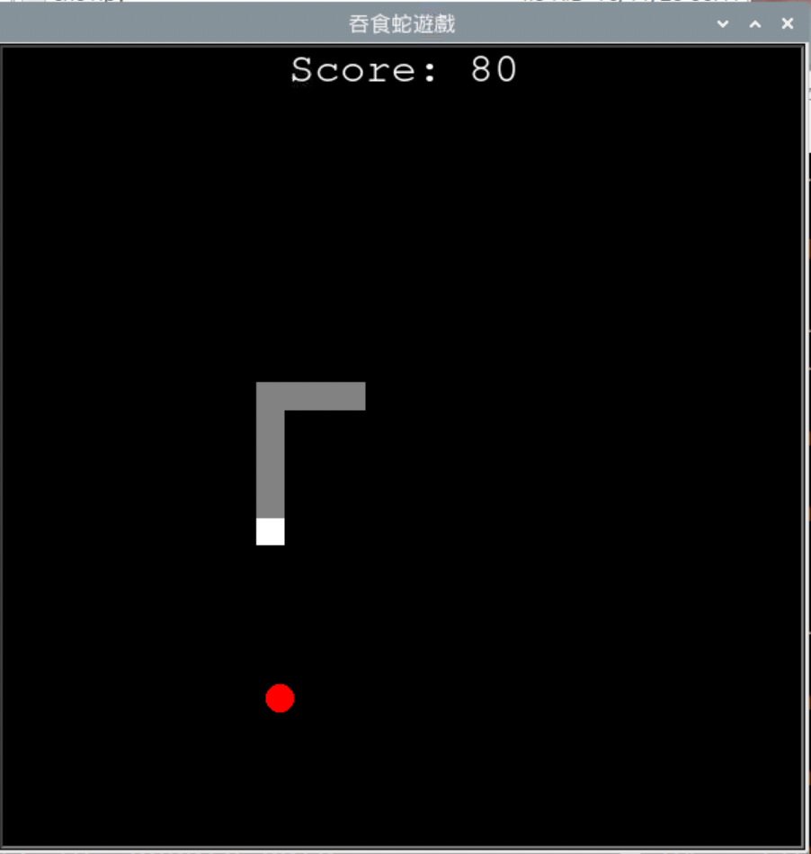

# 吞食蛇

_使用程序導向方式撰寫_

<br>

## 成果示意圖



<br>

## 範例

1. 說明：這個章節主要是展示全部程式碼內容，若要實作請由第三小節的 `改寫步驟` 開始。


<br>

2. 程式碼：可直接進行複製貼上運行測試。

   ```python
   '''
   基本吞食蛇+計分
   採程序式編程
   '''
   # 導入庫
   import turtle
   import time
   import random

   # 每次 loop 間隔時間
   delay = 0.1
   # 分數
   score = 0

   # 遊戲暫停
   is_paused = False

   # 設定螢幕
   screen = turtle.Screen()
   screen.title("吞食蛇遊戲")
   screen.bgcolor("black")
   screen.setup(width=600, height=600)
   # 關閉螢幕更新，提高繪圖效率
   screen.tracer(0)  

   # 建立吞食蛇的頭部
   head = turtle.Turtle()
   # 快速
   head.speed(0)   
   head.shape("square")
   head.color("white")
   # 提起畫筆，也就是說當移動到新的位置時不會畫出軌跡線條
   head.penup()
   # 以螢幕中心點為原點
   head.goto(0,0)
   # 在遊戲一開始的時候是停止狀態
   head.direction = "stop"

   # 吞食蛇的食物
   food = turtle.Turtle()
   # 速度由慢到快分別是 1-10，10 是最快且會顯示動畫
   # 而 0 也可視為最快速度，但實質上是關閉動畫效果
   food.speed(0)
   food.shape("circle")
   food.color("red")
   food.penup()
   # 食物預設出現的位置
   food.goto(0,100)

   # 用來儲存和追踪吞食蛇身體各個部分。
   # 每當吃到一個食物，蛇的身體就會增長一個段落。
   # 這個列表就是用來追踪這些新增的段落，每一個段落都是一個 Turtle 物件
   segments = []

   # 分數顯示
   score_display = turtle.Turtle()
   score_display.speed(0)
   score_display.shape("square")
   score_display.color("white")
   score_display.penup()
   score_display.hideturtle()
   score_display.goto(0, 260)
   score_display.write("Score: 0", align="center", font=("Courier", 24, "normal"))

   # 設定分數
   # 更新分數顯示的函數
   def update_score_display():
       score_display.clear()
       score_display.write("Score: {}".format(score), align="center", font=("Courier", 24, "normal"))


   # 函式定義
   def go_up():
       # 避免自我碰撞，所以執行向上的時候，必須確保當前方向不是往下
       if head.direction != "down":
           head.direction = "up"

   def go_down():
       # 避免自我碰撞
       if head.direction != "up":
           head.direction = "down"

   def go_left():
       # 避免自我碰撞
       if head.direction != "right":
           head.direction = "left"

   def go_right():
       # 避免自我碰撞
       if head.direction != "left":
           head.direction = "right"

   def move():
       if head.direction == "up":
           # 獲取當前 Y 軸座標值
           y = head.ycor()
           # 每次 + 20
           head.sety(y + 20)

       if head.direction == "down":
           y = head.ycor()
           head.sety(y - 20)

       if head.direction == "left":
           # 或許當前 X 軸座標值
           x = head.xcor()
           # 每次 - 20
           head.setx(x - 20)

       if head.direction == "right":
           x = head.xcor()
           head.setx(x + 20)

   # 暫停和繼續遊戲的函數
   def toggle_pause():
       global is_paused
       if is_paused:
           is_paused = False
       else:
           is_paused = True


   # 鍵盤綁定 WSAD、P
   # Turtle 可以透過 listen() 函數來監聽並指定鍵盤事件
   screen.listen()
   screen.onkeypress(go_up, "w")
   screen.onkeypress(go_down, "s")
   screen.onkeypress(go_left, "a")
   screen.onkeypress(go_right, "d")
   # 按下 'p' 鍵來暫停或繼續遊戲
   screen.onkeypress(toggle_pause, "p")  


   # 主遊戲循環
   # 使用 while True 手動控制流程，比使用 screen.mainloop() 適合
   while True:
       # 更新螢幕
       screen.update()

       # 如果遊戲暫停，則跳過循環中的其他步驟
       if is_paused:
           continue

       # 檢查是否撞牆（總寬 600、每次移動 20，所以用 290 可運算）
       if head.xcor()>290 or head.xcor()<-290 or head.ycor()>290 or head.ycor()<-290:
           time.sleep(1)
           head.goto(0,0)
           head.direction = "stop"

           # 隱藏段
           for segment in segments:
                # 移出螢幕
               segment.goto(1000, 1000)  
           segments.clear()

           # 重置分數
           score = 0
           update_score_display()

       # 檢查是否碰到食物
       if head.distance(food) < 20:
           # 移動食物到隨機位置
           x = random.randint(-290, 290)
           y = random.randint(-290, 290)
           food.goto(x,y)

           # 添加段落
           new_segment = turtle.Turtle()
           new_segment.speed(0)
           new_segment.shape("square")
           new_segment.color("grey")
           new_segment.penup()
           segments.append(new_segment)

           # 增加分數
           score += 10
           update_score_display()

       # 移動蛇身體的段
       for index in range(len(segments)-1, 0, -1):
           x = segments[index-1].xcor()
           y = segments[index-1].ycor()
           segments[index].goto(x, y)

       # 移動第0段到頭部
       if len(segments) > 0:
           x = head.xcor()
           y = head.ycor()
           segments[0].goto(x,y)

       move()

       # 檢查頭部與身體碰撞
       for segment in segments:
           if segment.distance(head) < 20:
               time.sleep(1)
               head.goto(0,0)
               head.direction = "stop"

               # 隱藏段
               for segment in segments:
                   segment.goto(1000, 1000)
               segments.clear()

               # 重置分數
               score = 0
               update_score_display()

       time.sleep(delay)
   ```

<br>

___

_END_
