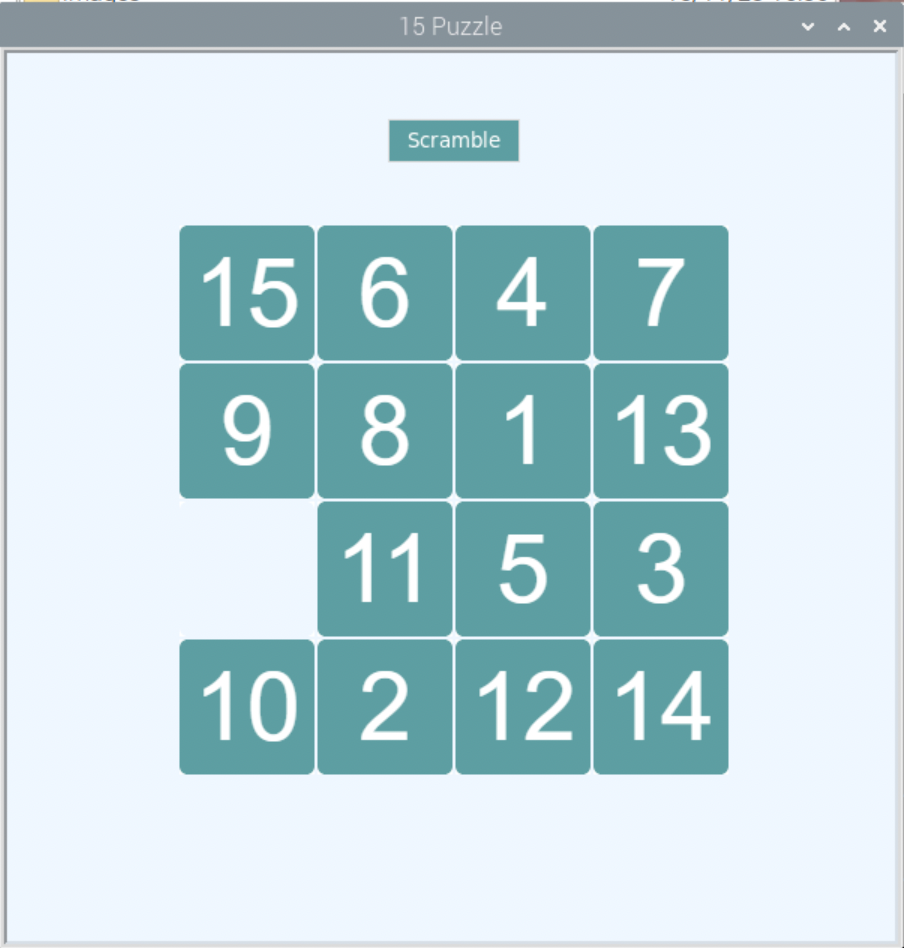

# Puzzle

<br>

## 完成示意圖



<br>

## 建立專案架構

1. 準備圖片，包含號碼 0~15、空白圖片、打亂按鈕等共 18 張。

<br>

2. 建立專案資料夾，比如說 `MyPuzzleGame`。

    ```bash
    mkdir MyPuzzleGame && cd MyPuzzleGame
    ```

<br>

2. 建立兩個資料夾，用來存放圖片，0~15數字圖片以及空白圖片放入 `number-images`，打亂按鈕的圖片 `scramble.GIF` 放入 `images` 資料夾。

    ```bash
    mkdir number-images && mkdir images
    ```

<br>

## 開始撰寫腳本

1. 導入必要的模塊

    ```python
    '''導入必要的模塊'''
    # 用於繪圖和創建圖形界面
    import turtle
    #  tkinter 用於創建和控制圖形使用者界面元素
    import tkinter as tk
    import tkinter.messagebox
    # 生成隨機數
    import random
    ```

<br>

2. 定義常數

    ```python
    '''定義常數'''
    NUM_ROWS = 4  
    NUM_COLS = 4  
    TILE_WIDTH = 90  
    TILE_HEIGHT = 90
    FONT_SIZE = 24
    FONT = ('Helvetica', FONT_SIZE, 'normal')
    SCRAMBLE_DEPTH = 100
    ```

<br>

3. 導入與註冊圖片

    ```python
    '''自訂函數'''
    # 導入圖片
    def load_images():
        images = []
        for i in range(NUM_ROWS * NUM_COLS - 1):
            file = f"number-images/{i+1}.gif"
            images.append(file)
        images.append("number-images/empty.gif")
        return images

    # 註冊圖片
    def register_images(image_list):
        global screen
        for image_file in image_list:
            screen.addshape(image_file)
    ```

<br>

## 定義核心功能

1. 建立交換邏輯

    ```python
    # 用於找出某個元素在二維列表中的位置
    def index_2d(my_list, v):
        for i, x in enumerate(my_list):
            if v in x:
                return (i, x.index(v))

    def swap_tile(tile):
        global screen
        current_i, current_j = index_2d(board, tile)
        empty_i, empty_j = find_empty_square_pos()
        empty_square = board[empty_i][empty_j]
        if is_adjacent([current_i, current_j], [empty_i, empty_j]):
            temp = board[empty_i][empty_j]
            board[empty_i][empty_j] = tile
            board[current_i][current_j] = temp
            draw_board()
            if check_win():
                show_congratulations()
    # 檢查兩個圖塊是否相鄰
    def is_adjacent(el1, el2):
        if abs(el2[1] - el1[1]) == 1 and abs(el2[0] - el1[0]) == 0:
            return True
        if abs(el2[0] - el1[0]) == 1 and abs(el2[1] - el1[1]) == 0:
            return True
        return False
    ```


<br>

2. 定義空方塊位置和亂序邏輯

    ```python
    # 查找空方塊的位置
    def find_empty_square_pos():
        global board
        for row in board:
            for candidate in row:
                if candidate.shape() == "number-images/empty.gif":
                    empty_square = candidate

        return index_2d(board, empty_square)

    # 打亂棋盤
    def scramble_board():
        global board, screen

        for i in range(SCRAMBLE_DEPTH):
            empty_i, empty_j = find_empty_square_pos()
            directions = ["up", "down", "left", "right"]

            if empty_i == 0: directions.remove("up")
            if empty_i >= NUM_ROWS - 1: directions.remove("down")
            if empty_j == 0: directions.remove("left")
            if empty_j >= NUM_COLS - 1: directions.remove("right")

            direction = random.choice(directions)

            if direction == "up": swap_tile(board[empty_i - 1][empty_j])
            if direction == "down": swap_tile(board[empty_i + 1][empty_j])
            if direction == "left": swap_tile(board[empty_i][empty_j - 1])
            if direction == "right": swap_tile(board[empty_i][empty_j + 1])
    ```


<br>

3. 繪製棋盤

    ```python
    # 在 Turtle 畫布上繪製拼圖的圖塊
    def draw_board():
        global screen, board

        screen.tracer(0)

        for i in range(NUM_ROWS):
            for j in range(NUM_COLS):
                tile = board[i][j]
                tile.showturtle()
                tile.goto(-138 + j * (TILE_WIDTH + 2), 138 - i * (TILE_HEIGHT + 2))

        screen.tracer(1)
    ```


<br>

## 創建界面和互動

1. 創建圖塊

    ```python
    # 創建拼圖的圖塊並將它們排列在棋盤上
    def create_tiles():
        random.shuffle(images)

        board = [["#" for _ in range(NUM_COLS)] for _ in range(NUM_ROWS)]

        for i in range(NUM_ROWS):
            for j in range(NUM_COLS):
                tile_num = NUM_COLS * i + j
                tile = turtle.Turtle(images[tile_num])
                tile.penup()
                board[i][j] = tile

                def click_callback(x, y, tile=tile):
                    return swap_tile(tile)

                tile.onclick(click_callback)

        return board
    ```


<br>

2. 添加混亂按鈕

    ```python
    # 使用 Tkinter 創建一個按鈕，用於打亂拼圖
    # 擊時將調用 scramble_board 函數
    def create_scramble_button_tkinter():
        global screen
        canvas = screen.getcanvas()
        button = tk.Button(canvas.master, text="Scramble", background="cadetblue", foreground="white", bd=0, command=scramble_board)
        canvas.create_window(0, -240, window=button)
    ```


<br>

## 添加勝利條件

1. 檢查勝利條件

    ```python
    # 檢查拼圖是否已被正確解開
    def check_win():
        global board
        count = 1
        for row in board:
            for tile in row:
                if tile.shape() != "number-images/empty.gif":
                    if int(tile.shape().split('/')[-1].split('.')[0]) != count:
                        return False
                count += 1
        return True
    ```


<br>

## 組合所有元素

1. 主函數

    ```python
    # 組合各功能為主函數
    def main():
        # 全局變數
        global screen, board
        
        # 建立並設定螢幕
        screen = turtle.Screen()
        screen.setup(600, 600)
        screen.title("15 Puzzle")
        screen.bgcolor("aliceblue")
        screen.tracer(0)

        # 加載並註冊圖片
        images = load_images()
        register_images(images)
        # 建立拼圖
        board = create_tiles()
        # 透過點擊按鈕打亂拼圖
        create_scramble_button_tkinter()
        # 遊戲開始的時候，無需點擊按鈕直接打亂棋盤
        scramble_board()
        # 繪製棋盤
        draw_board()
        # 啟動動畫
        screen.tracer(1)
    ```

<br>

2. 執行腳本

    ```python
    # 判斷是否為模組或執行腳本
    if __name__ == '__main__':
        # 調用自訂的主函數
        main()
        # 確保圖形界面按預期持續運行和顯示
        turtle.done()
    ```


<br>

---

_END_