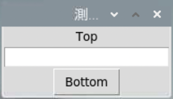

# Tkinter  黑白棋

_由於 tkinter 非常適合使用物件導向的 Paragiam，所以這裡補充簡單的黑白棋範例來說明 Python 的物件導向_

<br>

## 範例一

1. 說明：以函數式編程建立 8x8 黑白棋盤範例。

   

<br>

2. 程式碼

    ```python
    import tkinter as tk

    # 建立棋盤
    def create_board(root):
        # 外層迴圈
        for i in range(8):
            # 內層迴圈
            for j in range(8):
                # 建立棋盤格子
                cell = tk.Frame(
                    # 父容器
                    root, 
                    # 邏輯運算決定背景色
                    bg="black" if (i + j) % 2 == 0 else "white", 
                    width=50, 
                    height=50
                )
                # 設定格子位置
                cell.grid(row=i, column=j)
                # 取消縮放
                cell.pack_propagate(False)

    # 主函數
    def main():
        # 建立視窗
        root = tk.Tk()
        # 標題
        root.title("黑白棋棋盤")
        # 調用自訂函數
        create_board(root)
        # 主循環
        root.mainloop()


    if __name__ == "__main__":
        main()
    ```

<br>

## 範例二

1. 說明：以物件導向方式建構 5x5 黑白棋盤附帶文字範例。

   

<br>

2. 程式碼

    ```python
    import tkinter as tk

    # 棋子
    class ChessPiece:
        def __init__(self, color, text):
            self.color = color
            self.text = text

    # 白色棋子
    class WhitePiece(ChessPiece):
        def __init__(self):
            super().__init__('white', '白')

    # 黑色棋子
    class BlackPiece(ChessPiece):
        def __init__(self):
            super().__init__('black', '黑')

    # 棋盤
    class ChessBoard(tk.Tk):
        # 初始化棋盤
        def __init__(self):
            super().__init__()
            self.title("5x5 棋盤")
            self.geometry("250x250")

            # 不可調整大小
            self.resizable(False, False)

            # 建立 5x5 黑白棋盤
            for row in range(5):
                for col in range(5):
                    color = "white" if (row + col) % 2 == 0 else "black"
                    # 每一格都是一個 frame
                    frame = tk.Frame(self, width=50, height=50, bg=color)
                    # 把每個 frame 依照網格方式佈局
                    frame.grid(row=row, column=col)
                    # 防止框架調整大小
                    frame.grid_propagate(False)

                    # 以下是在黑白棋盤中加入黑白棋子
                    # 白色放黑棋子、黑色放白棋子
                    # 這是一個三元運算式，詳補充說明
                    piece = WhitePiece() if color == 'black' else BlackPiece()
                    label = tk.Label(frame, text=piece.text,
                                    fg=piece.color, bg=color, font=("Helvetica", 16))
                    # 把文字標籤放置在每一格的中央
                    label.place(relx=0.5, rely=0.5, anchor='c')


    if __name__ == "__main__":
        app = ChessBoard()
        app.mainloop()
    ```

<br>

3. 關於 `三元運算式` ，以下兩個邏輯是等價的。

    _這是一個三元運算式_
    ```python
    piece = WhitePiece() if color == 'black' else BlackPiece()
    ```
    _邏輯程序上等價於以下的 `if-else` 判斷式_
    ```python
    if color == 'black': 
        piece = WhitePiece() 
    else: 
        piece = BlackPiece()
    ```

<br>

## 範例三

_補充：透過私有性的設定來優化物件導向。_

<br>

1. 結果展示

    

<br>

2. 程式碼

    ```python
    # 透過這個範例來理解私有性
    import tkinter as tk

    class App:
        def __init__(self, root):
            # 將root標記為私有屬性
            self._root = root
            self._set_window()
            self._create_top()
            self._create_body()
            self._create_bottom()

        # 將方法標記為私有方法
        def _set_window(self):
            self._root.title("測試")
            self._root.resizable(False, False)

        # 將方法標記為私有方法
        def _create_top(self):
            self._label = tk.Label(self._root, text="Top")
            self._label.pack()
        
        # 將方法標記為私有方法
        def _create_body(self):
            self._input = tk.StringVar()
            self._entry = tk.Entry(self._root, textvariable=self._input)
            self._entry.pack()
        
        # 將方法標記為私有方法
        def _create_bottom(self):  
            self._button = tk.Button(
                self._root, text="Bottom", command=self._on_click)
            self._button.pack()

        # 將方法標記為私有方法
        def _on_click(self):  
            self.change_label_text(self._input.get())
            print(self._input.get())

        #
        def change_label_text(self, new_text):
            self._label.config(text=new_text)


    if __name__ == "__main__":
        root = tk.Tk()
        # 將app實例存為變量，以便於未來可能的使用
        app = App(root)  
        root.mainloop()
    ```
    
<br>

3. 說明

    - 私有性的使用有助於將 App 類的實現細節從其接口中分離出來，從而提高代碼的模組化和封裝性。

    - 透過私有性可使類的使用者更清晰了解哪些方法是供外部調用的（如 change_label_text），哪些是類內部實現的一部分（如 _create_top 和 _create_body）。

<br>

---

_END_
