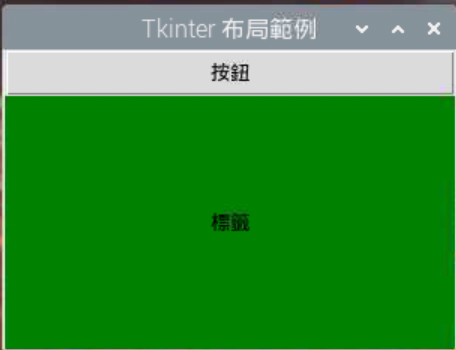

# pack

_Tkinter 佈局管理器，以下分別針對 Pack 的參數與函數進行說明_

<br>

## pack 的參數

_說明以下六個項目_

<br>

1. expand

2. fill

3. side

4. ipadx、ipady

5. padx、pady

6. anchor

<br>

### expand

1. 說明：

   - 決定控制元件是否在所在容器的空間內拓展，當設置為 YES 時，控制元件會在其父容器中的可用空間內擴展。

   - 預設為不展開。

   - 當設定為 YES 時，side 參數將失效。

   - 如果沒有 fill，即便 expand=YES，組件只會顯示在父容器中心位置。

   - 若 fill 選項為 BOTH，則填充父組件的剩餘空間。

<br>

2. 取值

   - YES（1）：元件會在父容器的可用空間內擴展。

   - NO（0）：元件不會擴展，保持其原始大小。

<br>

3. 範例：

    ```python
    # 讓元件在父容器的可用空間內擴展
    widget.pack(expand=tk.YES)
    ```

<br>

4. 其他說明合併 fill 一起。

<br>

### fill

1. 說明：決定組件在分配的空間內如何填充，這個參數控制元件在其父容器中的展開方式。

<br>

2. 取值。

   - `X`：元件在水平方向填滿其分配的空間。

   - `Y`：元件在垂直方向填滿其分配的空間。

   - `BOTH`：元件在水平和垂直方向都填滿其分配的空間。

   - `NONE`：元件不填滿其分配的空間，保持原始大小。

<br>

3. 範例。

    ```python
    # 水平填滿
    widget.pack(fill=tk.X)

    # 垂直填滿
    widget.pack(fill=tk.Y)

    # 雙向填滿
    widget.pack(fill=tk.BOTH)

    # 不填滿
    widget.pack(fill=tk.NONE)
    ```

<br>

4. 與 `expand` 的互動。

   - 當 `fill` 與 `expand=tk.YES` 結合使用時，組件會擴展以填滿額外的空間。

   - 如果 `expand=tk.NO`（預設值），即使設置了 `fill`，元件也只會在指定方向上填滿，而不會擴展到額外空間。

   - 若 `fill=BOTH` 且 `expand=YES`，元件將在兩個方向上擴展並填滿所有可用空間。

<br>

5. 具體例子。

    - 假設有一個按鈕和一個標籤，預期使按鈕水平填滿，而標籤則在兩個方向上都填滿。

    - 以下配置將使按鈕在水平方向上填滿其所在行，而標籤則在兩個方向上擴展以填滿剩餘空間。

    ```python
    button = tk.Button(root, text="按鈕")
    label = tk.Label(root, text="標籤", bg="green")

    button.pack(fill=tk.X)
    label.pack(fill=tk.BOTH, expand=tk.YES)
    ```

<br>

6. 完整範例

    ```python
    import tkinter as tk

    # 初始化 Tkinter
    root = tk.Tk()
    root.title("布局範例")

    # 為主視窗設置較大的初始尺寸
    root.geometry("300x200")

    # 創建一個按鈕，並在水平方向填滿
    button = tk.Button(root, text="按鈕")
    button.pack(fill=tk.X)

    # 創建一個標籤，背景為綠色，在水平和垂直方向都填滿並擴展
    label = tk.Label(root, text="標籤", bg="green")
    label.pack(
        fill=tk.BOTH, 
        expand=tk.YES
    )

    # 主循環
    root.mainloop()
    ```

    

<br>

### side

1. 說明：設置組件的對齊方式。

2. 取值：LEFT、TOP、RIGHT、BOTTOM。

3. 範例。

    ```python
    # 將元件放置在容器的左側
    widget.pack(side=tk.LEFT)

    # 將元件放置在容器的頂部
    widget.pack(side=tk.TOP)

    # 將元件放置在容器的右側
    widget.pack(side=tk.RIGHT)

    # 將元件放置在容器的底部
    widget.pack(side=tk.BOTTOM)
    ```

<br>

4. 具體舉例

    - 在這個範例中，每個新建的按鈕都被放置在前一個按鈕的右側，從而創建了一個水平排列的按鈕序列。

    ```python
    for text in ["按鈕1", "按鈕2", "按鈕3"]:
        button = tk.Button(root, text=text)
        button.pack(side=tk.LEFT)
    ```

<br>

### ipadx、ipady

1. 說明：設置 x、y 方向的內部間隙（子組件之間的間隔）。

2. 取值：可設置數值，預設是 0。

3. 範例。

    ```python
    widget.pack(ipadx=10, ipady=10)
    ```

<br>

### padx、pady

1. 說明：設置 x、y 方向的外部間隙（與之並列的組件之間的間隔）。

2. 取值：可設置數值，預設是 0。

3. 範例：

    ```python
    widget.pack(padx=10, pady=10)
    ```

<br>

### anchor

1. 說明：當可用空間大於所需求的尺寸時，決定組件被放置於容器的何處。

2. 取值：N、E、S、W、NW、NE、SW、SE、CENTER

3. 範例。

    ```python
    widget.pack(anchor=tk.N)
    ```

<br>

## pack 的函數

_說明以下五個函數_

<br>

1. `pack_slaves()`

- 說明：此函數返回一個列表，包含了使用 `pack` 佈局管理器添加到父控制元件中的所有子控制元件。

- 範例。

    ```python
    import tkinter as tk

    root = tk.Tk()
    label1 = tk.Label(root, text="標籤1")
    label1.pack()
    label2 = tk.Label(root, text="標籤2")
    label2.pack()

    # 獲取使用 pack 佈局的子組件
    slaves = root.pack_slaves()
    print("使用 pack 的子組件:", slaves)
    ```

<br>

2. `pack_configure(option=value)`

- 說明：用於設置或更新已使用 `pack` 佈局的控制元件的配置選項。

- 範例。

    ```python
    label = tk.Label(root, text="範例標籤")
    label.pack()

    # 後續更新配置
    label.pack_configure(bg='yellow')
    ```

<br>

3. `propagate(boolean)`

- 說明：設置父控制元件是否應根據其子控制元件的大小自動調整大小。預設值為 True。

- 範例。

    ```python
    frame = tk.Frame(root, height=100, width=200)
    frame.pack_propagate(False) # 不讓尺寸隨子組件變化
    frame.pack()
    ```

<br>

4. `pack_info()`

- 說明：返回有關使用 `pack` 佈局的控制元件的信息，例如它的參數和值。

- 範例。

    ```python
    label = tk.Label(root, text="信息標籤")
    label.pack()
    info = label.pack_info()
    print("Label pack 信息:", info)
    ```

<br>

5. `pack_forget()`

- 說明：將使用 `pack` 佈局的控制元件從其父控制元件中移除，但不會銷毀該控制元件。可通過再次調用 `pack()` 來重新顯示。

- 範例。

    ```python
    label = tk.Label(root, text="臨時標籤")
    label.pack()
    
    # 暫時隱藏標籤
    label.pack_forget()

    # 重新顯示標籤
    # label.pack()
    ```

<br>

## 整合說明

_可嘗試取消註解觀察輸出或是變化_

<br>

1. 程式碼。

    ```python
    import tkinter as tk

    # 初始化 Tkinter 主視窗
    root = tk.Tk()
    root.title("Tkinter pack 布局示範")
    root.geometry("300x200")

    # 創建一個按鈕，並設置 pack 參數
    button = tk.Button(root, text="按鈕")
    button.pack(
        side=tk.TOP, 
        fill=tk.X, 
        expand=tk.NO, 
        padx=5, 
        pady=5
    )

    # 創建一個標籤，並設置 pack 參數
    label = tk.Label(root, text="標籤", bg="green")
    label.pack(
        side=tk.BOTTOM, 
        fill=tk.BOTH, 
        expand=tk.YES, 
        ipadx=10, 
        ipady=10
    )

    # 以下演示 pack 的函數使用

    # 使用 pack_slaves() 函數獲取所有 pack 子組件
    # print("使用 pack 的子組件:", root.pack_slaves())

    # 使用 configure() 函數更新 button 的背景顏色
    # button.configure(bg='yellow')

    # 使用 pack_propagate() 函數設置是否讓父容器大小隨子組件變化
    # root.pack_propagate(False)

    # # 使用 pack_info() 函數獲取 button 的 pack 配置信息
    # print("Button pack 配置信息:", button.pack_info())

    # # 使用 pack_forget() 函數暫時隱藏 label
    # label.pack_forget()

    # # 再次調用 pack() 可以重新顯示 label
    # label.pack()

    # 進入主事件循環
    root.mainloop()
    ```

<br>

___

_END_