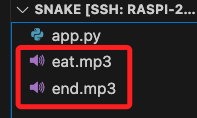

# 加入音效

<br>

## 步驟

1. 將音效檔案加入專案資料夾中，暫且放在根目錄即可。

    

<br>

2. 導入庫：可使用 `subprocess.Pope` 來非阻塞地播放音效。

    ```python
    import subprocess
    ```

<br>

3. 在 `Game` 中加入播放音效的函數 `play_sound` 。

    ```python
    def play_sound(self, sound_file):
        subprocess.Popen(
            ['mpg123', sound_file], 
            stdout=subprocess.DEVNULL, 
            stderr=subprocess.DEVNULL
    )
    ```

<br>

4. 在吃到食物的片段 `if self.snake.head.distance(self.food.food) < 20` 播放音效。

```python
# 其他程式碼 ...

# 吞食蛇吃到食物
if self.snake.head.distance(self.food.food) < 20:
    # 播放吃食物音效
    self.play_sound('eat.mp3')  
    
    # 其他程式碼 ...
```

<br>

5. 在撞牆的片段 `if abs(self.snake.head.xcor()) > 290 or abs(self.snake.head.ycor()) > 290` 播放音效。

```python
# 檢查撞牆
    if abs(self.snake.head.xcor()) > 290 or abs(self.snake.head.ycor()) > 290:
        # 播放撞牆音效
        self.play_sound('wall_crash_sound.mp3')  
```

<br>

6. 在自撞的片段 `if segment.distance(self.snake.head) < 20` 播放音效。

```python
# 檢查自撞
if segment.distance(self.snake.head) < 20:
    # 播放自撞音效
    self.play_sound('self_crash_sound.mp3')  
```

