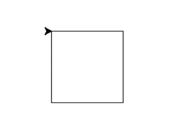
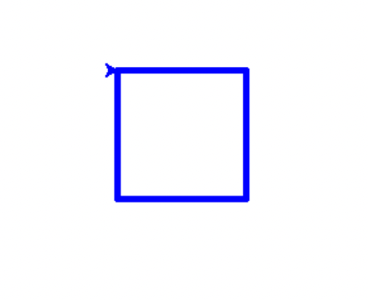
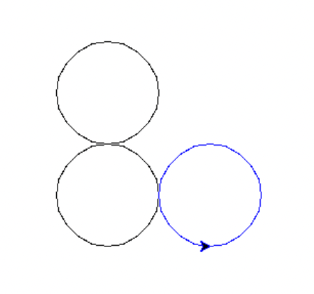
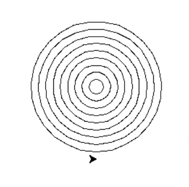
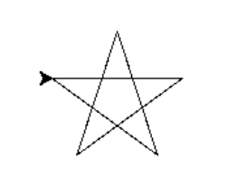
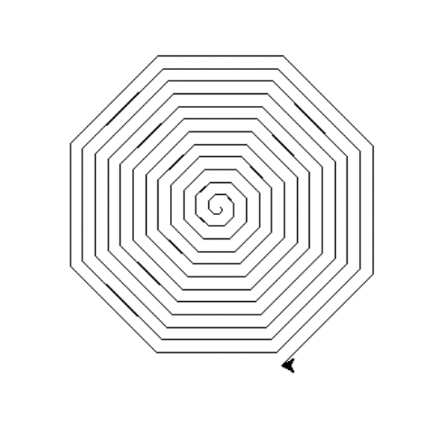
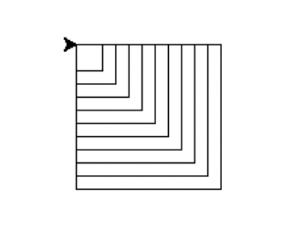
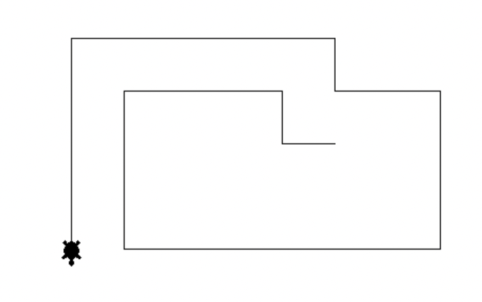
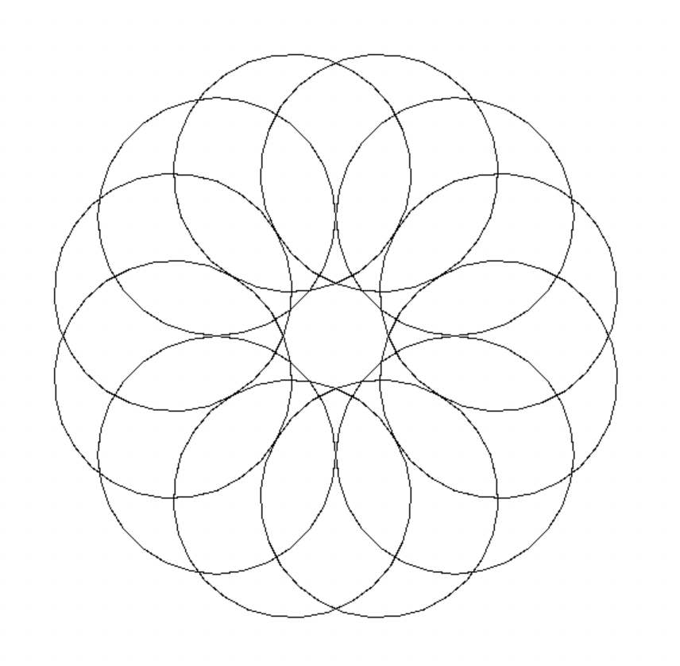
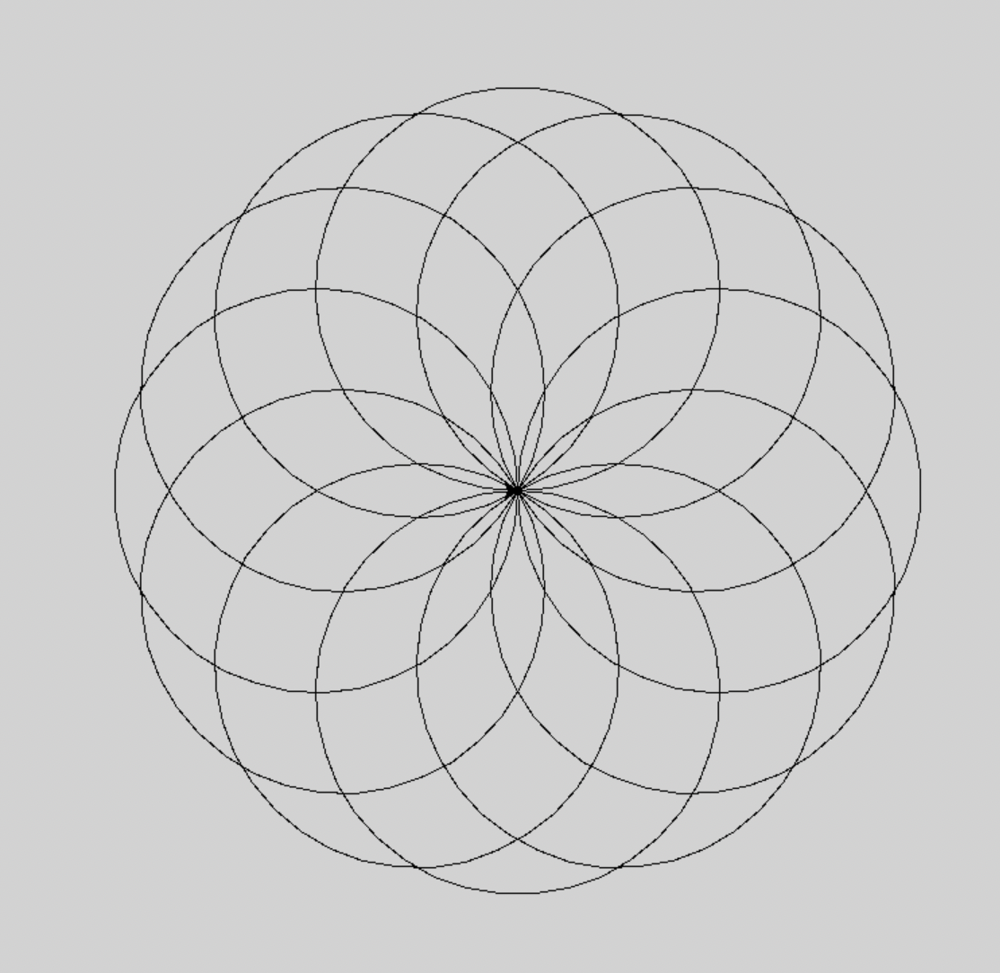

# 基礎繪圖

_N個附圖的基本繪圖腳本，註解都寫在腳本中_

<br>

## 範例

1. 畫一個完整正方形

    

    ```python
    '''
    畫一個完整正方形
    '''
    # 說明標準函式庫 turtle
    import turtle

    # 設定畫筆
    pen = turtle.Turtle()

    # 畫一個正方形
    for _ in range(4):
        # 前進 100 單位
        pen.forward(100) 
        # 右轉 90 度
        pen.right(90)
        # 重複這個動作四次就會畫出一個正方形    

    # 結束繪圖，保持視窗開啟
    turtle.done()
    ```

<br>

2. 添加筆觸及顏色

    

    ```python
    '''
    繪製一個藍色的正方形
    '''

    import turtle

    pen = turtle.Turtle()
    # 畫筆顏色
    pen.color("blue")
    # 畫筆筆粗
    pen.pensize(5)

    for _ in range(4):
        # 重複四次畫正方形
        pen.forward(100)
        pen.right(90)

    # 完成
    turtle.done()
    ```

<br>

3. 畫圓形

    

    ```python
    '''
    繪製一個圓形
    '''
    import turtle

    pen = turtle.Turtle()
    # 半徑 50 單位，逆時針畫一個圓
    pen.circle(50)

    # 逆時針畫一個圓，半徑 50
    pen.circle(-50)

    # 提起畫筆
    pen.penup()
    # 移動到 (100, -100)
    pen.goto(100, -100)
    # 放下畫筆
    pen.pendown()
    # 畫一個藍色的半徑 50 的圓
    pen.pencolor('blue')
    pen.circle(50)

    # 結束繪圖，保持視窗開啟
    turtle.done()
    ```

<br>

4. 同心圓

    

    ```python
    '''
    繪製多個同心圓
    '''
    import turtle
    # 畫筆
    pen = turtle.Turtle()

    # 重複 10 次
    for i in range(10):
        # 同心圓
        pen.circle(10*i)
        # 提起畫筆
        pen.up()
        # -Y 往下移動
        pen.sety((10*i)*-1)
        # 放下畫筆
        pen.down()

    # 結束繪圖，保持視窗開啟
    turtle.done()
    ```

<br>

5. 畫一個線條星星

    

    ```python
    '''
    繪製一個星形
    '''
    import turtle

    pen = turtle.Turtle()

    for _ in range(5):
        # 向前畫100像素
        pen.forward(100)
        # 然後向右轉 144 度
        pen.right(144)

    # 結束繪製
    turtle.done()
    ```

<br>

6. 繪製螺旋


    

    ```python
    '''
    繪製螺旋圖案
    '''
    import turtle

    pen = turtle.Turtle()

    for i in range(100):
        # 向前 i 個像素，會越來越多
        pen.forward(i)
        # 向右轉 45 度    
        pen.right(45)

    turtle.done()
    ```

<br>

7. 嵌套正方形

    

    ```python
    '''
    繪製一組嵌套正方形
    '''
    import turtle
    # 畫筆
    pen = turtle.Turtle()
    # 設置初始正方形的邊長
    size = 20
    # 總共繪製 10 個嵌套的正方形
    for _ in range(10):
        # 每個正方形由 4 條邊組成
        for _ in range(4):
            # 向前移動畫筆，繪製一條邊
            pen.forward(size)
            # 向右轉 90 度準備畫下一條邊
            pen.right(90)
        # 完成一個正方形後，增加邊長，為繪製下一個更大的正方形做準備
        size += 10
    # 完成繪圖後保持視窗開啟
    turtle.done()
    ```

<br>

8. 鍵盤監聽

    

    ```python
    '''
    使用鍵盤動態繪製
    使用 turtle.Screen() 創建螢幕對象是一種明確定義繪圖環境的方法。
    在簡單的 turtle 程序中不需要顯式創建螢幕對象，因為 turtle 模組會自動管理這些細節。
    如需要處理鍵盤或鼠標事件時，則需要創建螢幕對象來監聽和處理這些事件。
    '''
    import turtle
    # 四個方向繪製的函數
    def move_forward():
        turtle.forward(50)

    def move_backward():
        turtle.backward(50)

    def turn_left():
        turtle.left(90)

    def turn_right():
        turtle.right(90)

    # 設置螢幕
    screen = turtle.Screen()

    # 設置 turtle 形狀，就是一隻龜
    turtle.shape('turtle')

    # 透過 screen.onkey 鍵盤綁定
    screen.onkey(move_forward, 'Up')
    screen.onkey(move_backward, 'Down')
    screen.onkey(turn_left, 'Left')
    screen.onkey(turn_right, 'Right')

    # 監聽鍵盤事件
    screen.listen()

    # 保持視窗開啟
    screen.mainloop()
    ```

<br>

9. 幾何圓
    
    

    ```python
    import turtle

    def draw_pattern():
        # 畫筆
        t = turtle.Turtle()
        # 最快速
        t.speed(0)  

        # 半徑
        main_radius = 100  

        # 繪製一個小圓圈然後將海龜重新定位回中心的函數
        def draw_small_circle(turtle, radius):
            turtle.up()
            turtle.forward(radius)
            turtle.down()
            turtle.circle(radius)
            turtle.up()
            turtle.backward(radius)
            turtle.down()


        # 原本直徑的一半
        small_radius = main_radius / 2 
        for _ in range(12):
            draw_small_circle(t, main_radius)
            # 將烏龜轉向下一圈
            t.right(30)  

        # 隱藏海龜指針並完成
        t.hideturtle()
        turtle.done()

    # 運行圖案繪製功能
    draw_pattern()
    ```
<br>

10. 幾何圓陣列之二

    

    ```python
    '''
    幾何圖片
    '''
    # 
    import turtle

    def draw_pattern():
        
        # 設定畫布
        screen = turtle.Screen()
        # 背景色
        screen.bgcolor("lightgray")

        # 建立 turtle 物件
        t = turtle.Turtle()
        # 製圖速度
        t.speed(0)

        # 繪製：物件、直徑、重複次數
        def draw_circle_with_repeats(turtle, radius, repeats):
            # 重複次數
            for _ in range(repeats):
                # 直徑
                turtle.circle(radius)
                # 旋轉角度
                turtle.right(360 / repeats)

        # 整個圖的直徑
        main_radius = 300

        # 開始繪圖
        # 設定小圓直徑
        small_radius = main_radius / 2
        repeats = 12
        turn = 360 / repeats
        for _ in range(repeats):
            draw_circle_with_repeats(t, small_radius, repeats)  # Draw the small circles

        # 保持在畫面上
        screen.mainloop()

    # 調用主程式
    draw_pattern()
    ```
<br>

---

_END_