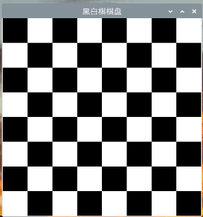
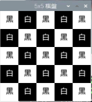

# Tkinter  黑白棋

_tkinter 非常適合物件導向的 Paragiam，以下範例要在樹莓派上運行才能正常顯示。_

<br>

## 範例

1. 以函數式編程建立 8x8 黑白棋盤範例。

   

   ```python
   import tkinter as tk
   # 建立棋盤
   def create_othello_board(root):
       for i in range(8):
           for j in range(8):
               cell = tk.Frame(root, bg='black' if (i + j) % 2 == 0 else 'white', width=50, height=50)
               cell.grid(row=i, column=j)
               cell.pack_propagate(False)

   def main():
       root = tk.Tk()
       root.title("黑白棋棋盘")
       create_othello_board(root)
       root.mainloop()

   if __name__ == "__main__":
       main()
   ```

<br>

2. 以物件導向方式建構 5x5 黑白棋盤附帶文字範例。

   

   ```python
   import tkinter as tk

   # 棋子
   class ChessPiece:
       def __init__(self, color, text):
           self.color = color
           self.text = text

   # 白色棋子
   class WhitePiece(ChessPiece):
       def __init__(self):
           super().__init__('white', '白')

   # 黑色棋子
   class BlackPiece(ChessPiece):
       def __init__(self):
           super().__init__('black', '黑')

   # 棋盤
   class ChessBoard(tk.Tk):
       # 初始化棋盤
       def __init__(self):
           super().__init__()
           self.title("5x5 棋盤")
           self.geometry("250x250")

           # 不可調整大小
           self.resizable(False, False)

           # 建立 5x5 黑白棋盤
           for row in range(5):
               for col in range(5):
                   color = "white" if (row + col) % 2 == 0 else "black"
                   # 每一格都是一個 frame
                   frame = tk.Frame(self, width=50, height=50, bg=color)
                   # 把每個 frame 依照網格方式佈局
                   frame.grid(row=row, column=col)
                   # 防止框架調整大小
                   frame.grid_propagate(False)

                   # 以下是在黑白棋盤中加入黑白棋子
                   # 白色放黑棋子、黑色放白棋子
                   piece = WhitePiece() if color == 'black' else BlackPiece()
                   label = tk.Label(frame, text=piece.text, fg=piece.color, bg=color, font=("Helvetica", 16))
                   # 把文字標籤放置在每一格的中央
                   label.place(relx=0.5, rely=0.5, anchor='c')

   if __name__ == "__main__":
       app = ChessBoard()
       app.mainloop()
   ```

<br>

2. 透過私有性的設定來優化物件導向

   ```python
   # 透過這個範例來理解私有性
   import tkinter as tk

   class App:
       def __init__(self, root):
           # 將root標記為私有屬性
           self._root = root
           self._set_window()
           self._create_top()
           self._create_body()
           self._create_bottom()

       def _set_window(self):  # 將方法標記為私有方法
           self._root.title("測試")
           self._root.resizable(False, False)

       def _create_top(self):  # 將方法標記為私有方法
           self._label = tk.Label(self._root, text="Top")
           self._label.pack()

       def _create_body(self):  # 將方法標記為私有方法
           self._input = tk.StringVar()
           self._entry = tk.Entry(self._root, textvariable=self._input)
           self._entry.pack()

       def _create_bottom(self):  # 將方法標記為私有方法
           self._button = tk.Button(self._root, text="Bottom", command=self._on_click)
           self._button.pack()

       def _on_click(self):  # 將方法標記為私有方法
           self.change_label_text(self._input.get())
           print(self._input.get())

       def change_label_text(self, new_text):
           self._label.config(text=new_text)

   if __name__ == "__main__":
       root = tk.Tk()
       app = App(root)  # 將app實例存為變量，以便於未來可能的使用
       root.mainloop()
   ```

<br>

---

_END_
