# 計算機

_簡易的計算機實作範例指引_

<br>

## 完成示意圖

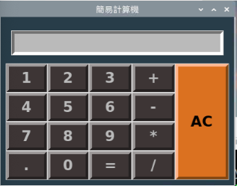

<br>

## 特別說明事項

1. _程序在運行是由上而下，所以變數及函數的撰寫要在物件生成之前_，可參考這個編排順序。

    ```python
    '''導入函數'''
    # import ...

    '''全局變數'''
    # 變數 ...

    '''實作函數'''
    # 函數 ...

    '''建立物件'''
    # 物件 ...
    ```

<br>

## 基本 UI 配置

1. 建立一個基礎的 Tkinter 視窗，特別注意，務必確保 `mainloop()` 函數要 `保持` 在最後一行。

    ```python
    # 導入 tkinter
    from tkinter import *
    # 初始化Tkinter視窗
    tk_calc = Tk()
    # 設定背景顏色和邊界寬度
    tk_calc.configure(bg="#293C4A", bd=10)  
    # 設定標題
    tk_calc.title("簡易計算機")  
    # 無限循環
    tk_calc.mainloop()
    ```

    _顯示_

    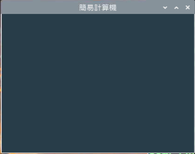

<br>

2. 建立一個全局變數：設定按鍵樣式參數的字典。

    ```python
    # 設定按鍵樣式
    button_params_main = {
        'bd': 5,        # boader 邊界
        'fg': '#000',   # frontground 前景色
        'bg': '#BBB',   # background 背景色
        'font': ('sans-serif', 20, 'bold')  # 字體
    }
    ```

<br>

3. 建立物件：`0-9` 的數字鍵，並且套用前一步驟所設定的顏色等參數，特別注意，程序的索引 `index` 都是以 `0` 作為起始，但以下腳本中的 `row` 是從 `1` 開始，這代表程序保留了 `row 0`，而這正是要給計算機的 `結果顯示欄位` 使用。

    ```python
    # 創建數字按鈕
    for i in range(9):
        Button(
            # 父容器
            tk_calc,
            # 樣式參數 
            button_params_main, 
            # 顯示的內容，依序由 1~9
            text=str(i + 1),
            # 註冊函數
            command=lambda num=i + 1: button_click(str(num))).grid(
            # 從第一個 row 開始
            row=(i // 3) + 1, 
            # 縱向的 column，由左至右每個 row 有三個
            column=i % 3, 
            # 這個元件 widget 會向四個方向（北N、南S、東E、西W）拓展
            sticky="nsew"
        )
    ```

    _顯示_
    
    

<br>

4. 建立物件：使用 grid 佈局，依據加入加減乘除四顆按鈕，參數 text 依序為 `+-*/`，`row` 則依序為 `1~4`。

    ```python
    # 加 +
    Button(
        # 父容器
        tk_calc, 
        button_params_main, 
        text='+', 
        # 直接傳一個字串加號 '+' 給函數 button_click()
        command=lambda: button_click('+')).grid(
            row=1, 
            column=3, 
            sticky="nsew"
        )
    # 減 -
    Button(
        tk_calc, 
        button_params_main, 
        text='-', 
        command=lambda: button_click('-')).grid(
            row=2,
            column=3, 
            sticky="nsew"
        )
    # 乘 *
    Button(
        tk_calc, 
        button_params_main, 
        text='*', 
        command=lambda: button_click('*')).grid(
            row=3, 
            column=3, 
            sticky="nsew"
        )
    # 除 /
    Button(
        tk_calc, 
        button_params_main, 
        text='/', 
        command=lambda: button_click('/')).grid(
            row=4, 
            column=3, 
            sticky="nsew"
        )
    ```

    _顯示_
    
    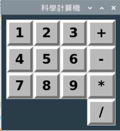

<br>

5. 建立物件：在左下角加入一個小數點 `.` 的按鍵。

    ```python
    # 創建小數點按鈕
    Button(
        tk_calc, 
        button_params_main, 
        text='.', 
        command=lambda: button_click('.')
    ).grid(
        row=4, 
        column=0, 
        sticky="nsew"
    )
    ```

    _顯示_
    
    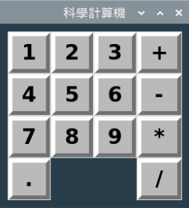

<br>

6. 建立 `等號 =` 按鍵。

    ```python
    # 創建等於按鈕
    Button(
        tk_calc, 
        button_params_main, 
        text='=', 
        # 跟其他部件不同，等號要調用另一個專用的函數
        command=button_equal
    ).grid(
        row=4, 
        column=2, 
        sticky="nsew"
    )
    ```

<br>

7. 注意，這時若直接去運行，會出現找不到 `button_equal` 這個函數，因為這個函數還沒寫。

    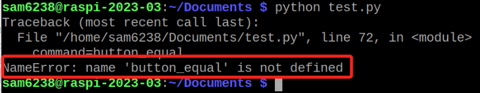

<br>

8. 這裡注意，雖然 `等號` 的函數 `button_equal` 沒實作會造成程序崩潰，但其他按鍵的 `Lambda` 函數 `button_click` 沒實作卻不會出錯，可參考下方 `補充說明` 詳解。

    

<br>

9. 先建立一個函數，內容先空著無妨。

   ```python
   # 自定義函數
   def button_equal():
       pass
   ```

<br>

10. 運行看看，每個按鈕也可以按按看。

    _顯示_
    
    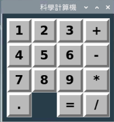

<br>

11. 最後來補上按鍵 `0` 。

    ```python
    Button(
        tk_calc, 
        button_params_main, 
        text='0', 
        command=lambda: button_click('0')
    ).grid(
        row=4, 
        column=1, 
        sticky="nsew"
    )
    ```
    _顯示_
    
    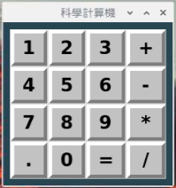

<br>

12. 假如想要更改色系，可以直接調整 `button_params_main` 的值，這裡提供一個暗色系的設置。

    ```python
    {
        'bd': 5, 
        'fg': '#BBB', 
        'bg': '#3C3636', 
        'font': ('sans-serif', 20, 'bold')
    }
    ```
    _顯示_
    
    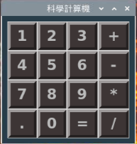

<br>

13. 接著加入結果顯示框，這裡有個重點要注意，在結果運算部分會使用到參數 textvariable 來綁定 UI 元件，這個機制可實現計算結果的 `動態更新`，相關細節詳見下方補充說明；另外，跟函數設置一樣，若不設置會報錯。

    ```python
    # 設定輸入框
    Entry(
        tk_calc, 
        font=('sans-serif', 20, 'bold'), 
        textvariable=text_input,
        bd=5, 
        insertwidth=5, 
        bg='#BBB', 
        justify='right'
    ).grid(
        row=0,
        column=0,
        columnspan=4, 
        padx=10, 
        pady=15
    )
    ```

<br>

14. 在 tk 物件建立之後的區塊，添加一個 StringVar 類型的變數，然後運行看看。_特別注意_，因為這類型的物件必須在 Tkinter 的主循環和內部機制來運作，所以一定要在物件建立之後才可進行建立，跟一般的變數建立時機有所不同。

    ```python
    # 創建一個 StringVar 類型的字串變數來存儲結果運算框的文本
    text_input = StringVar() 
    ```
    _結果_
    
    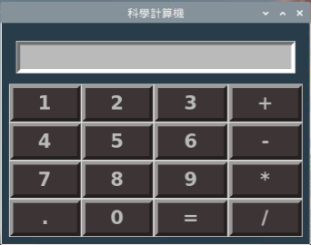

<br>

15. 做到這裡才發現忘記做 `AC` 鍵，首先建立一個 AC 按鍵，顏色稍微跟其他數字鍵不一樣。

    ```python
    # AC
    Button(
        tk_calc, 
        bd=5, 
        fg='#000', 
        bg='#db701f', 
        font=('sans-serif', 20, 'bold'),
        text='AC', 
        command=button_clear_all
    ).grid(
        row=1, 
        column=4,
        sticky="nsew"
    )
    ```
    _結果_
    
    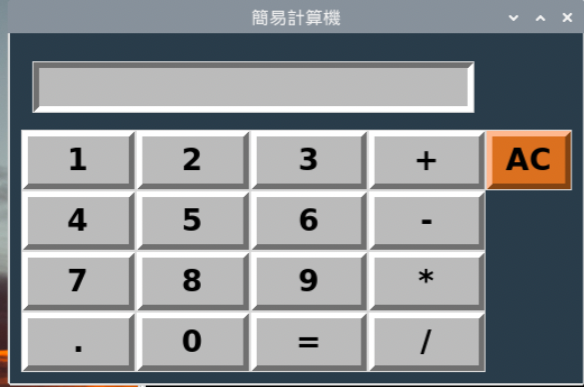

<br>

16. 因為要上下展開四個 `row` 的高度，所以要設置 `rowspan=4` 。

    ```python
    # AC
    Button(
        tk_calc, 
        bd=5, 
        fg='#000', 
        bg='#db701f', 
        font=('sans-serif', 20, 'bold'),
        text='AC', 
        command=button_clear_all
    ).grid(
        row=1, 
        column=4, 
        rowspan=4,
        sticky="nsew"
    )
    ```
    _結果_
    
    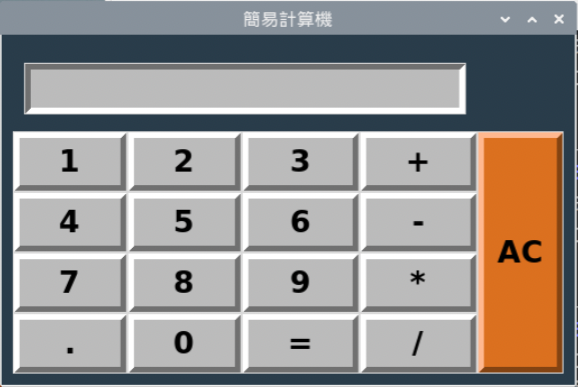

<br>

17. 因為添加了一個欄位 `column`，假如先前程式碼中有設定 Column 的部分要進行檢查，這裡在結果屏幕有設置一個 `columnspan=4`，但展開的時候是設定一個最小值，現在大於最小值 `4` 所以會撐開而不受影響，假如設定4但下方僅有3欄位，在對齊的時候因為保留了一個欄位應該就會偏掉了。

    
   
<br>
 
18. 為提升程式碼的易讀性，建議還是改為 5 為佳。

    ```python
    # 設定輸入框
    Entry(
        tk_calc, 
        font=('sans-serif', 20, 'bold'), 
        textvariable=text_input,
        bd=5, 
        insertwidth=5, 
        bg='#BBB', 
        justify='right'
    ).grid(
        row=0, 
        column=0,
        columnspan=5,
        padx=10, 
        pady=15
    )
    ```

<br>

19. 假如要將其中的樣式與其他按鍵相同設為參數形式傳入，可去 `全局變數` 的區塊添加一個 `AC` Button 的顏色參數 `button_params_AC`，並設置內容如下，記得原本的等號要改寫為字典形式的冒號，參數名稱要改寫為用引號標注的字串，而不再是直接寫成變數。

    ```python
    button_params_AC = {
        'bd': 5, 
        'fg': '#000', 
        'bg': '#db701f', 
        'font': ('sans-serif', 20, 'bold')
    }
    ```

<br>

20. 接著再去改寫 AC Button，將參數以字典變數傳入即可。

    ```python
    # AC
    Button(
        tk_calc, 
        button_params_AC,
        text='AC', 
        command=button_clear_all
    ).grid(
        row=1, 
        column=4, 
        rowspan=4,
        sticky="nsew"
    )
    ```


<br>

_以上完成 UI 配置_

<br>

## 加入各按鍵的函數

1. 初始化一個全局的字串變數，這將用在顯示後續的計算結果上。

    ```python
    # 初始化計算符號為空字串
    calc_operator = ""  
    ```

<br>

2. 實作數字 `1-9` 的 `Lambda` 函數 `button_click`，在這個函數中，還會調用一個全局的變數 `calc_operator`。

    ```python
    # 按鈕點擊事件：將字符加入到結果顯示屏幕中
    def button_click(char):
        global calc_operator
        calc_operator += str(char)
        text_input.set(calc_operator)
    ```

<br>

3. 任意輸入數字後會顯示在計算機的結果屏幕上。

    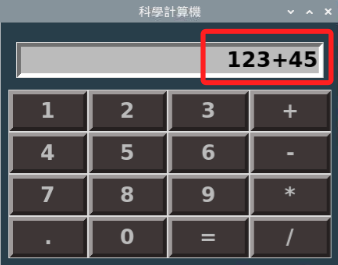

<br>

4. 加入清除鍵的函數。

    ```python
    # 清除顯示屏所有內容
    def button_clear_all():
        # 除了清除屏幕顯示內容，更要記得清除變數
        global calc_operator
        calc_operator = ""
        # 清除屏幕
        text_input.set("")
    ```

<br>

5. 實作之前以 `pass` 跳過的等號函數。特別注意，Python 中的 `eval` 函數可用於執行一個 `字符串表達式`，並返回表達式運算的結果，在這個範例中，eval 可計算用戶輸入的數學表達式的結果，也就是計算機操作的結果。

    ```python
    # 計算結果：等號
    def button_equal():
        # 同樣是要使用全局的運算結果變數
        global calc_operator
        try:
            # 透過評估運算式並返回結果
            calc_operator = str(eval(calc_operator))  
        # 處理除以零的錯誤
        except ZeroDivisionError:  
            calc_operator = "錯誤：除以零"
        # 處理其他所有錯誤
        except Exception:  
            calc_operator = "錯誤：無效輸入"
        text_input.set(calc_operator)
    ```

<br>

## 補充說明 Lambda 函數與一般函數的調用時機。

1. Labda 函數 `button_click` 未實現但不會導致崩潰。

    - 範例中 `button_click` 函數是通過 `lambda` 函數間接參考的，所以創建按鈕並將 `command` 參數設置為 `lambda: button_click('+')` 表達式時，實際上是在設置一個在按鈕被點擊時，才會去調用 `button_click` 的 `回調函數` 。

    - 由於 `lambda` 函數僅在按鈕被點擊時才被調用，所以就算 `button_click` 未實現或定義錯誤，在初始化界面的階段也不會出現錯誤，只有當按鈕被點擊並嘗試調用不存在的 `button_click` 函數時，才會出現錯誤，但這並不會造成崩潰，只會出現錯誤訊息。

    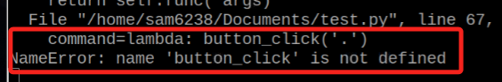

<br>

2. 一般函數 `button_equal` 未實現會導致崩潰。

    - 範例中將 `button_equal` 函數設置為按鈕的 `command` 參數 `command=button_equal`，這表示當 Tkinter 在設置按鈕時會立即尋找 `button_equal` 函數的引用。

    - 在初始化界面時，如果 `button_equal` 函數未被實現或定義錯誤，也就是 Tkinter 會訪問一個不存在或錯誤的函數，這就是為何初始化階段程序崩潰的原因。

<br>

## 補充說明 Tkinter 中的 `textvariable` 

1. 在 Tkinter 中，`textvariable` 是一種特殊的變數，用於實現 Tkinter界面元素(如標籤、按鈕、文本框等)和 Python 程式之間的數據綁定，透過使用 `textvariable` ，還可實現實現數據和視圖的分離的優點，更便於代碼的管理和維護。

<br>

2. 通過使用 `textvariable` 可以在不直接操作界面元素的情況下更新顯示的內容，當 `textvariable` 所綁定的數據變化時，相關的界面元素會自動更新其顯示內容。

<br>

3. `textvariable` 搭配 `StringVar` 可以用於 `Label`, `Entry`, `Button` 等多種 Tkinter 控件，除此 Tkinter 還提供了其他類型的變數，如 `IntVar`, `DoubleVar`, `BooleanVar` 等，用於存儲不同類型的數據，以下是個簡易的程式碼範例。


    ```python
    import tkinter as tk

    # 創建主視窗
    root = tk.Tk()
    root.title("textvariable 示範")

    # 創建一個 StringVar 實體
    text_var = tk.StringVar()

    # 設置 StringVar 的值
    text_var.set("初始文本")

    # 創建一個標籤 Label，textvariable 則指向前面創建的 StringVar 類型的變數 text_var
    label = tk.Label(root, textvariable=text_var)
    label.pack()

    # 更改 StringVar 的值，標籤的文本也會跟著更改
    def update_text():
        text_var.set("文本已更改")
    # 重置 StringVar 的值為初始狀態
    def reset_text():
        text_var.set("初始文本")
    # 創建一個按鈕，點擊後會調用 update_text 函數
    button = tk.Button(root, text="更改文本", command=update_text)
    button.pack()
    # 創建另一個按鈕，點擊後會調用 reset_text 函數
    reset_button = tk.Button(root, text="重置文本", command=reset_text)
    reset_button.pack()

    # 運行主循環
    root.mainloop()
    ```

<br>

4. 成果示意圖

    


<br>

---

_END_