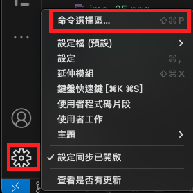
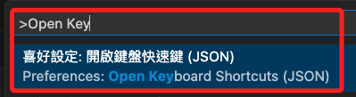
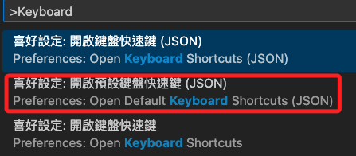
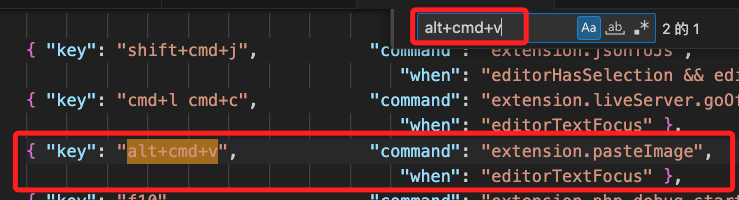
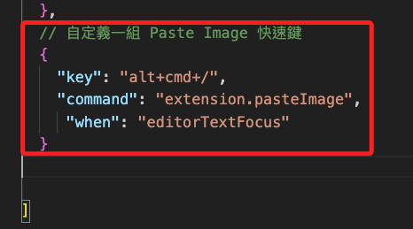

# 自訂快速鍵

_預設快速鍵不可更改，但可以既有或新的功能添加新的快速鍵_

<br>

## 步驟

1. 開啟 `命令選擇區` 。

    

<br>

2. 輸入 `Open Keyboard Shortcuts` 可自訂快速鍵。

    

<br>

3. 若要查看預設快速鍵，可選擇 `Open Default Keyboard Shortcuts` ，這部分是不允許更改的。

    


<br>

4. 其中這個插件的快速鍵也寫在預設值內，特別注意， Mac 系統的 `option` 是表示為 `alt`，位置與 Windows 系統相同。

    

<br>

5. 確認沒有衝突，即可增加定義一組快速鍵為 `alt+cmd+/` 。

    

<br>

6. 設定值如下，快速鍵可自行修改。

    ```json
    // 自定義一組 Paste Image 快速鍵
    {
        "key": "alt+cmd+/", 
        "command": "extension.pasteImage",
        "when": "editorTextFocus"
    }
    ```

<br>

---

_END_