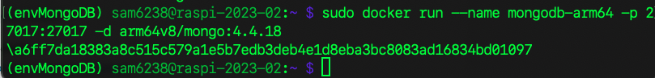
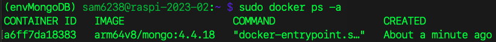
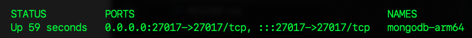

# 安裝 Mongodb Server

_在前一小節已經完成容器的啟動，這裡補充說明 Docker 的查詢與其他操作。_

<br>


## 查詢倉庫

1. 可查看 [倉庫] (https://hub.docker.com/r/arm64v8/mongo/) 相關資訊與基本說明。

<br>

2. 下載適用的映像檔案。

    ```bash
    sudo docker pull arm64v8/mongo:4.4.18
    ``` 

<br>

3. 運行容器。

    ```bash
    sudo docker run --name mongodb-arm64 -p 27017:27017 -d arm64v8/mongo:4.4.18
    ```

    

<br>

## 容器相關操作


1. 查看容器，因輸出結果比較寬，我將結果截圖為左右兩半。

    ```bash
    # 查看所有容器，包括停止的容器
    sudo docker ps -a
    # 查看運行中的容器
    docker ps
    # 查看詳細的容器信息
    docker inspect <容器 ID>
    # 查看容器實時的資源使用情況
    docker stats
    ```

    

    

<br>

2. 查看容器的日誌，可使用容器名稱或容器 ID。

    ```bash
    # 容器名稱
    sudo docker logs mongodb-arm64
    # 容器 ID
    sudo docker logs <容器 ID>
    ```

<br>

3. 刪除容器。

    ```bash
    sudo docker rm mongodb-arm64
    ```

<br>

4. 刪除映像檔案。

    ```bash
    sudo docker rmi arm64v8/mongo:4.4
    ```

<br>

8. 啟動服務。

    ```bash
    sudo docker start mongodb-arm64
    ```

<br>

9. 開機啟動服務。

    ```bash
    sudo docker update --restart always mongodb-arm64
    ```

<br>

10. 確保 Docker 的服務在重啟之後會自動啟動。

    ```bash
    systemctl is-enabled docker
    ```

<br>

11. 假如是 Disable，則執行以下指令來設置 Docker 為開機自動啟動。

    ```bash
    sudo systemctl enable docker
    ```

<br>

---

_END_