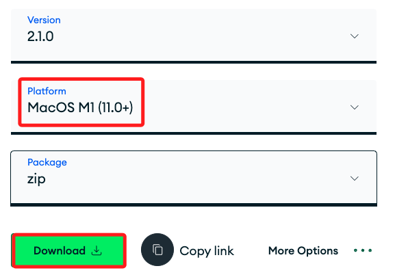
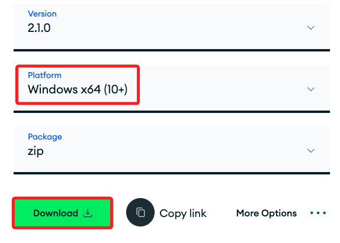
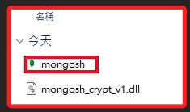
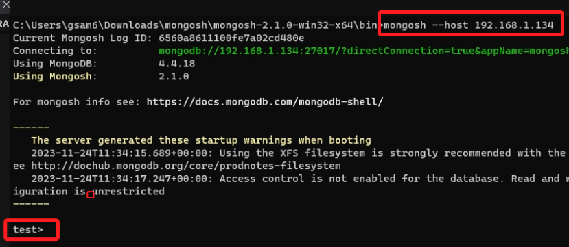

# MongoDB Shell

_這裡僅示範如何安裝，但課程中並未使用到_

<br>

## 說明

1. mongo 和 mongosh 都能用來連接 MongoDB 服務器，其中 mongo 是舊版使用的命令列工具，它在 MongoDB 4.4 版本之前是標準的命令行界面，而 mongosh 在 MongoDB 4.4.1 之後引入，已成為標準的令命列工具。

<br>

2. 參考 [官網](https://www.mongodb.com/try/download/shell) 的安裝指南。

<br>

3. 選擇適用於作業系統的版本。

    

    

<br>

## MacOS

_除了使用下載的腳本以外，還可以自行安裝，MacOS 部分將示範自行安裝。_

<br>

1. 安裝 Homebrew 。

    ```bash
    /bin/bash -c "$(curl -fsSL https://raw.githubusercontent.com/Homebrew/install/HEAD/install.sh)"
    ```

<br>

2. 假如僅需安裝 MongoDB 的客戶端工具。

    ```bash
    brew install mongodb/brew/mongodb-community-shell
    ```

<br>

3. 假如想安裝完整的 MongoDB Community，可依 [官網指引](https://www.mongodb.com/docs/manual/tutorial/install-mongodb-on-os-x/) 進行安裝。

    ```bash
    brew install mongodb-community@7.0
    ```

<br>

4. 如果遇到 `ChecksumMismatchError`，運行以下指令重新安裝。

    ```bash
    brew untap mongodb/brew && brew tap mongodb/brew
    ```

<br>

5. 連線時，使用 mongo 或 mongosh 皆可，但會遇到不同的訊息提示，只是能連線皆可無視。

    ```bash
    mongosh --host <樹莓派網址>:27017
    ```

<br>

## Windows 系統

1. 在官網進行 [下載](https://www.mongodb.com/try/download/shell) 。

<br>

2. 解壓縮後進入到 `bin` 資料夾就可以看到執行檔案。

    

<br>

3. 使用相同指令

    ```bash
    mongosh --host <樹莓派網址>:27017
    ```
    或是
    ```bash
    mongosh --host <樹莓派網址>
    ```
    


<br>

---

_END_