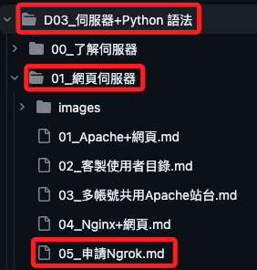
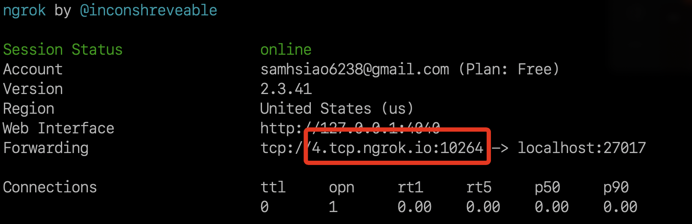
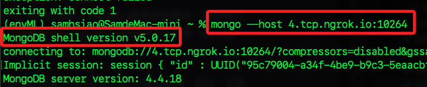
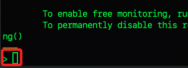
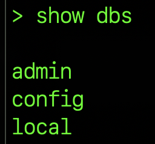

# 連線

<br>

## 使用 Ngrok 

1. 參考 [安裝與申請 Ngrok](https://github.com/samhsiao6238/RaspberryPi_20231015/blob/b9a8af5c212fc8c7cc3dee699a0eebff7e984477/D03_%E4%BC%BA%E6%9C%8D%E5%99%A8%2BPython%20%E8%AA%9E%E6%B3%95/01_%E7%B6%B2%E9%A0%81%E4%BC%BA%E6%9C%8D%E5%99%A8/05_%E7%94%B3%E8%AB%8B%20Ngrok.md) 。

    

<br>

2. 授權 ngrok

    ```bash
    ./ngrok authtoken <Ngrok 的 Authtoken>
    ```

<br>

3. 啟動 ngrok 使用 TCP 轉發 MongoDB 端口 27017

    ```bash
    ./ngrok tcp 27017
    ```

<br>

4. 紀錄下來這個地址。

    

<br>

5. 在遠端的電腦連線數莓派的 MongoDB。

    ```bash
    mongo --host 4.tcp.ngrok.io:10264
    ```

    

<br>

6. 完成啟動會看到這樣的符號。

    


<br>

## 簡單指令進行操作

_使用 MongoDB Shell 基本命令進行資料庫操作_

<br>

1. 列出所有資料庫。

    ```js
    show dbs
    ```

    

<br>

2. 切換到指定資料庫，如果資料庫不存在，MongoDB 會在第一次寫入數據時創建它。

    ```js
    use myDatabase
    ```

    

<br>

3. 在集合中插入文件，如果集合不存在會自動創建。

    ```js
    db.myCollection.insertOne({name: "Sam", age: 30})
    ```

    

<br>

4. 在當前資料庫中顯示所有集合。

    ```js
    show collections
    ```

    


<br>

5. 查詢集合中的文件。

    ```js
    db.myCollection.find()
    ```

    


<br>

6. 更新集合中的文件。

    ```js
    db.myCollection.updateOne({name: "Sam"}, {$set: {age: 31}})
    ```

    

<br>

7. 刪除集合中的文件。

    ```js
    db.myCollection.deleteOne({name: "Sam"})
    ```

    

<br>

8. 創建索引：以下的回應提到已成功為 myCollection 集合中的 name 創建一個索引，而且在創建索引的過程中沒有新建集合，這是因為集合已經存在，所以索引的數量從一個增加到了兩個。

    ```js
    db.myCollection.createIndex({name: 1})
    ```

    


<br>


## 補充：索引

<br>

### 優點

_在資料庫管理系統中，尤其是是 MongoDB 類型的 NoSQL 資料庫中，建立索引是提高查詢效率的關鍵操作，說明如下。_

<br>

1. 資料庫提高查詢效率資料庫。
   
   索引支持資料庫的快速查詢，如果沒有索引，MongoDB 必須執行全集合掃描，即掃描集合中的每一個文件，以找到匹配查詢條件的文件，當一個集合包含大量文件時，全集合掃描會非常耗時，而索引可以顯著減少查詢需要檢查的數據量。

<br>

2. 資料庫排序資料庫。

   索引可讓排序操作更加高效，因為它提供一個已經排序的數據結構，這可以直接用於排序操作，避免了排序時的額外計算成本。

<br>

3. 資料庫支持唯一性約束資料庫。

   某些索引可強制字段值的唯一性，比如 `_id` 字段的默認索引，這對於防止重複資料非常有用。

<br>

4. 資料庫改善寫操作效率資料庫。

   對於一些更新和刪除操作，索引可以幫助資料庫更快地定位到文件。

<br>

5. 資料庫支持複合查詢資料庫。

   通過對多個字段建立複合索引，可以提高多個查詢條件組合時的性能。

<br>

6. 資料庫支持聚合操作資料庫。
   
   在聚合管道中，索引可以用來加速對文件的訪問，特別是當進行分組、排序或篩選操作時。

<br>

### 缺點和代價

1. 資料庫佔用額外空間資料庫。

   每個索引都需要在硬碟上佔用空間。

<br>

2. 資料庫寫操作性能影響資料庫。

   每當新增、更新或刪除文件時，MongoDB 都需要更新相關的索引，如果有許多索引，這些操作可能會更耗時。

<br>

---

_END_