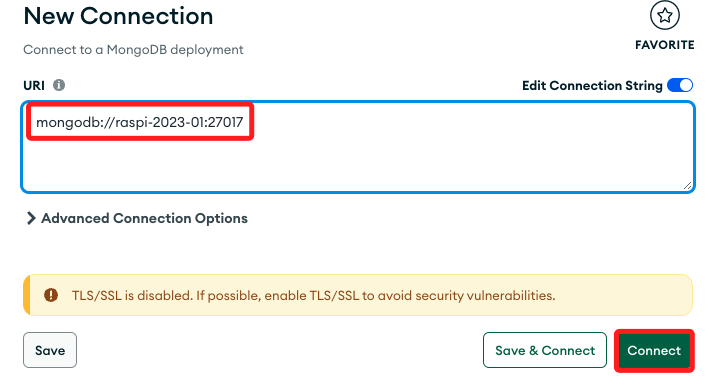
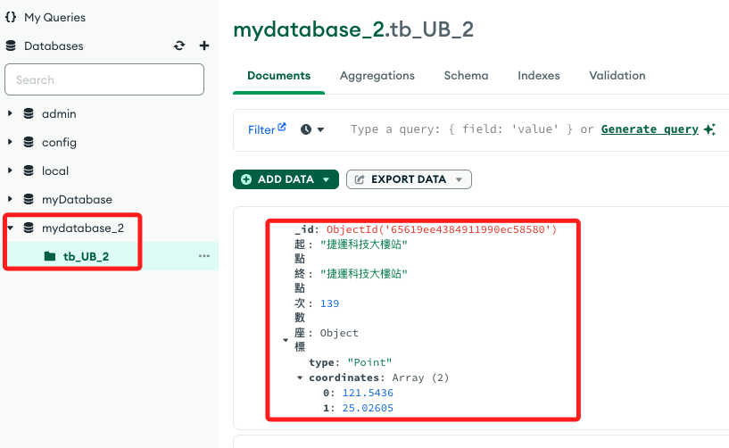

# Python 腳本

_以下範例在講解完 MariaDB 再回來完成_

<br>

## 說明

1. 成果圖。

    

<br>

2. 安裝庫

    ```bash
    pip install pymongo requests pandas
    ```

<br>

## 取得資料並存入資料庫

1. 同樣使用 YouBike 的資料庫。

<br>

2. 程式碼。

    ```python
    # 導入庫
    import requests
    import pandas as pd
    from pymongo import MongoClient
    import sys

    # 下載數據
    url = "https://data.taipei/api/dataset/c7dbdb7c-6bbd-495a-bd23-49b22defd83e/resource/38212e6b-125a-4346-8982-3319da6c79e2/download"
    response = requests.get(url)
    data = response.json()

    # 使用 'features' 這個 key 來建立 DataFrame
    df = pd.json_normalize(data['features'])

    # 選取特定的欄位並重命名
    selected_columns = {
        'properties.on_stop': '起點',
        'properties.off_stop': '終點',
        'properties.sum_of_txn_times': '次數',
        'geometry.coordinates': '座標'
    }
    # DataFrame
    df_selected = df[selected_columns.keys()].rename(columns=selected_columns)
    df_selected['座標'] = df_selected['座標'].apply(lambda x: {'type': 'Point', 'coordinates': x[0]})

    # 建立 MongoDB 連接
    try:
        client = MongoClient("mongodb://localhost:27017/")
        db = client["mydatabase_2"]
        collection = db["tb_UB_2"]
    except Exception as e:
        print(f"連線 MongoDB 發生錯誤：{e}")
        sys.exit(1)

    # 插入數據到 MongoDB
    try:
        collection.insert_many(df_selected.to_dict('records'))
    except Exception as e:
        print(f"插入數據到 MongoDB 發生錯誤：{e}")

    # 讀取並輸出資料
    try:
        for doc in collection.find():
            print(doc)
    except Exception as e:
        print(f"從 MongoDB 讀取數據發生錯誤：{e}")

    # 關閉連接
    client.close()
    ```

<br>

3. 使用 Compass 連線樹莓派的 MongoDB 資料庫。

    

<br>

4. 可查看資料。

    

<br>


## 讀取資料庫

1. 程式碼。

    ```python
    # 導入庫
    import requests
    import pandas as pd
    from pymongo import MongoClient
    import sys

    # 建立 MongoDB 連接
    try:
        client = MongoClient("mongodb://localhost:27017/")
        # 確保這裡的資料庫名稱與您之前用來儲存數據的名稱相匹配
        db = client["mydatabase_2"]  
        # 同樣，確保集合名稱正確
        collection = db["tb_UB_2"]   
    except Exception as e:
        print(f"連線 MongoDB 發生錯誤：{e}")
        sys.exit(1)

    # 讀取並輸出前 10 筆資料
    try:
        for doc in collection.find().limit(10):
            print(doc)
    except Exception as e:
        print(f"從 MongoDB 讀取數據發生錯誤：{e}")

    # 關閉連接
    client.close()
    ```

2. 結果

    ```json
    {'_id': ObjectId('65619ee4384911990ec58580'), '起點': '捷運科技大樓站', '終點': '捷運科技大樓站', '次數': 139, '座標': {'type': 'Point', 'coordinates': [121.5436, 25.02605]}}
    {'_id': ObjectId('65619ee4384911990ec58581'), '起點': '捷運科技大樓站', '終點': '復興南路二段273號前', '次數': 47, '座標': {'type': 'Point', 'coordinates': [121.5436, 25.02605]}}
    {'_id': ObjectId('65619ee4384911990ec58582'), '起點': '捷運科技大樓站', '終點': '國北教大實小東側門', '次數': 24, '座標': {'type': 'Point', 'coordinates': [121.5436, 25.02605]}}
    {'_id': ObjectId('65619ee4384911990ec58583'), '起點': '捷運科技大樓站', '終點': '和平公園東側', '次數': 121, '座標': {'type': 'Point', 'coordinates': [121.5436, 25.02605]}}
    {'_id': ObjectId('65619ee4384911990ec58584'), '起點': '捷運科技大樓站', '終點': '辛亥復興路口西北側', '次數': 185, '座標': {'type': 'Point', 'coordinates': [121.5436, 25.02605]}}
    // 以下省略 ...
    ```

<br>

## 使用 PyDeck 呈現

1. 安裝庫。

    ```bash
    pip install streamlit
    ```

<br>

2. 程式碼。

    ```python
    # 導入庫
    import streamlit as st
    import pandas as pd
    import pydeck as pdk
    from pymongo import MongoClient
    import sys

    # 設置 Streamlit 頁面標題
    st.title('YouBike 借還次數分佈地圖')

    # 建立 MongoDB 連接
    try:
        # 這是連接本機上的資料庫
        client = MongoClient("mongodb://localhost:27017/")
        # 確保這是正確的資料庫名稱
        db = client["mydatabase_2"]  
        # 確保這是正確的集合名稱
        collection = db["tb_UB_2"]   
    # 捕捉例外
    except Exception as e:
        st.error(f"連接 MongoDB 錯誤: {e}")
        # 發生錯誤，透過 sys 調用退出函數
        sys.exit(1)

    # 從 MongoDB 取得數據
    try:
        # 讀取資料
        rows = collection.find()
        # 轉換為列表
        data_list = list(rows)

        # 預處理數據
        processed_data = []
        # 遍歷列表
        for doc in data_list:
            if isinstance(doc, dict):
                # 檢查並處理座標數據
                # 檢查 '座標' 鍵是否存在於文件中、coordinates 是否在 座標 中，而且是否包含兩個數據
                if '座標' in doc and 'coordinates' in doc['座標'] and len(doc['座標']['coordinates']) == 2:
                    # 取出經緯度
                    doc['lon'] = doc['座標']['coordinates'][0]
                    doc['lat'] = doc['座標']['coordinates'][1]
                else:
                    # 沒通過檢查，將數據替換為 None
                    doc['lon'] = None
                    doc['lat'] = None
                # 刪除不需要的 MongoDB ID
                doc.pop('_id', None)
                # 添加到處理後的數據列表
                processed_data.append(doc)
            else:
                st.error(f"文件不是字典格式：{doc}")
                sys.exit(1)

        # 將處理後的數據轉換為 pandas DataFrame
        df = pd.DataFrame(processed_data)
        # 如果 df['次數'] 中有任何缺失值如 NaN，則將這些值轉換為 float
        # 因為在 pandas 中，NaN 是一種浮點數值，無法直接轉換為整數類型
        # 如果嘗試將包含 NaN 的列轉換為整數會引發錯誤
        df['次數'] = df['次數'].astype(float)

        # 使用 pydeck 定義地圖的初始視圖狀態
        view_state = pdk.ViewState(
            latitude=df['lat'].mean(),
            longitude=df['lon'].mean(),
            zoom=11,
            pitch=50
        )

        # 建立六角圖層 HexagonLayer
        hexagon_layer = pdk.Layer(
            'HexagonLayer',
            data=df,
            get_position='[lon, lat]',
            get_elevation='次數',
            elevation_scale=4,
            elevation_range=[0, 1000],
            radius=200,
            pickable=True,
            extruded=True,
        )
        
        # 特別說明，若使用多行引號，會變成註解放在網頁中，所以這裡採單行註解
        # 可以加入兩個圖層，這個範例先加入一個
        # 建立散點圖層 ScatterplotLayer 
        # scatter_layer = pdk.Layer(
        #     'ScatterplotLayer',
        #     data=df,
        #     get_position='[lon, lat]',
        #     get_color='[200, 30, 0, 160]',
        #     get_radius=100,
        # )
        
        # 通過 pydeck 渲染地圖並顯示在 Streamlit 上
        # 圖層列表可以加入兩個圖層，這裡僅加入一個
        st.pydeck_chart(pdk.Deck(
            layers=[hexagon_layer], 
            initial_view_state=view_state
        ))
    # 捕捉例外
    except Exception as e:
        st.error(f"從 MongoDB 取得數據錯誤: {e}")

    # 關閉 MongoDB 連接
    client.close()
    ```

<br>

## 補充說明 Pandas 的 NaN

_說明為何將次數轉換為浮點數，而非現實中較為合理的整數。_

<br>

1. NaN 代表 `Not a Number`，即 `非數值`，在 pandas 中被視為浮點數。

2. 在 pandas 中，NaN 是按照 IEEE 浮點數標準定義的，用於表示某些未定義或不可表示的結果，如 0/0 或 ∞/∞。

3. 因為標準的整數類型無法表示 NaN，轉換操作無法處理這些 NaN 值而引發錯誤，這就是為什麼將包含 NaN 的列保留為浮點數類型而非整數的原因。

<br>


## 補充說明程式語言中的空值


---

_END_