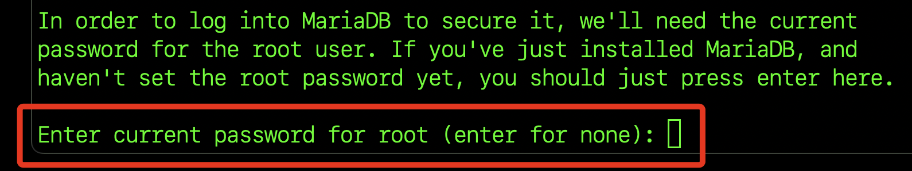
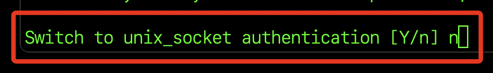
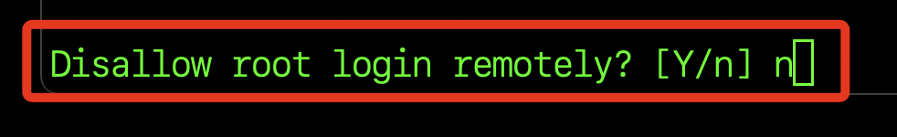
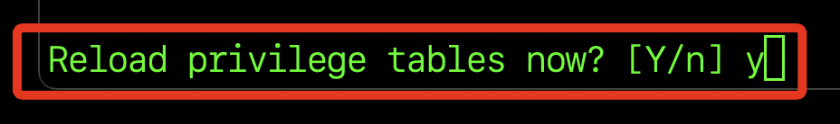
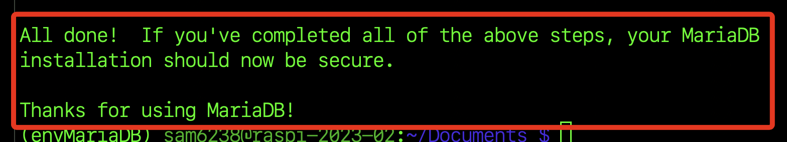
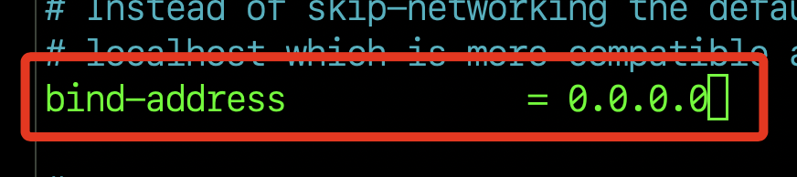
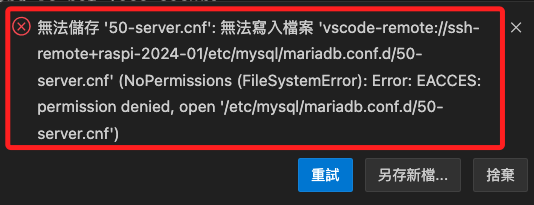
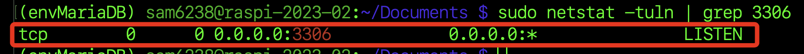

# 設定

_初次安裝 MySQL 之後執行_

<br>

## 步驟

1. 執行安全設置腳本。

    ```bash
    sudo mysql_secure_installation
    ```

<br>

2. 如同前述，這裡無需輸入密碼，按下 `ENTER` 即可。

    

<br>

3. 詢問是否改用其他驗證方式：N。

    

<br>

4. 是否更改 root 密碼：N (維持不用密碼即可)。

    

<br>

5. 是否移除匿名用戶：N（先保留著無妨）。

    

<br>

6. 是否拒絕（不同意）遠端透過 root 連線：N（先設定允許遠端透過 root 連線）。

    

<br>

7. 是否移除測試用資料庫：N（保留著無妨）。

    

<br>

8. 詢問是否重新載入以上權限設置：Y。

    

<br>

9. 至此完成設定。

    

<br>

10. 可以再檢查一下服務狀態。

    ```bash
    sudo systemctl status mariadb
    ```

<br>

11. 假如沒有運作可以啟動服務。

    ```bash
    sudo systemctl start mariadb
    ```

<br>

## 設定檔案

1. 開啟設定檔案。

    ```bash
    sudo nano /etc/mysql/mariadb.conf.d/50-server.cnf
    ```

<br>

2. 找到 `bind-address` 設定並確保值為 `0.0.0.0` 以允許外部訪問，預設為 localhost 的 `127.0.0.1` 。

    

<br>

3. 若使用 `VSCode` 會因為權限無法編輯。

    

<br>

4. 改變文件的所有權，另外，也可更改文件權限，但更改所有權相對來說更直觀。

    ```bash
    # 要替換自己的樹莓派帳號
    sudo chown <使用自己的樹莓派帳號> /etc/mysql/mariadb.conf.d/50-server.cnf
    # 如下
    sudo chown sam6238 /etc/mysql/mariadb.conf.d/50-server.cnf
    # 若要改回
    sudo chown root:root /etc/mysql/mariadb.conf.d/50-server.cnf
    ```

<br>

<br>

5. 再次檢查服務狀態，因為下一步驟要進行重啟，所以務必確保重啟之前是啟動的狀態，否則也無法重啟。

    ```bash
    sudo systemctl status mariadb
    ```

<br>

6. 重啟資料庫服務。

    ```bash
    sudo systemctl restart mariadb
    ```

<br>

7. 透過指令查詢樹莓派 `3306` 端口是否正常運行。

    ```bash
    sudo netstat -tuln | grep 3306
    ```

<br>

8. 確認正常監聽中。

    

<br>

___

_END_