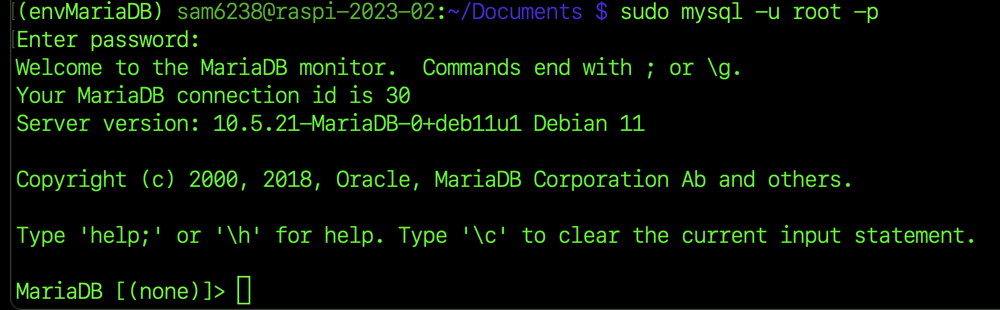
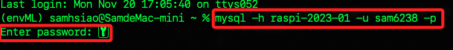
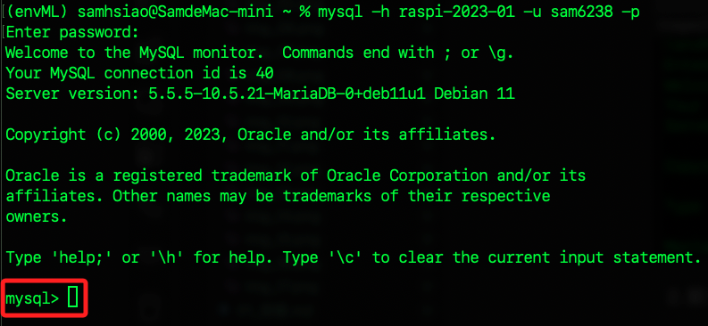
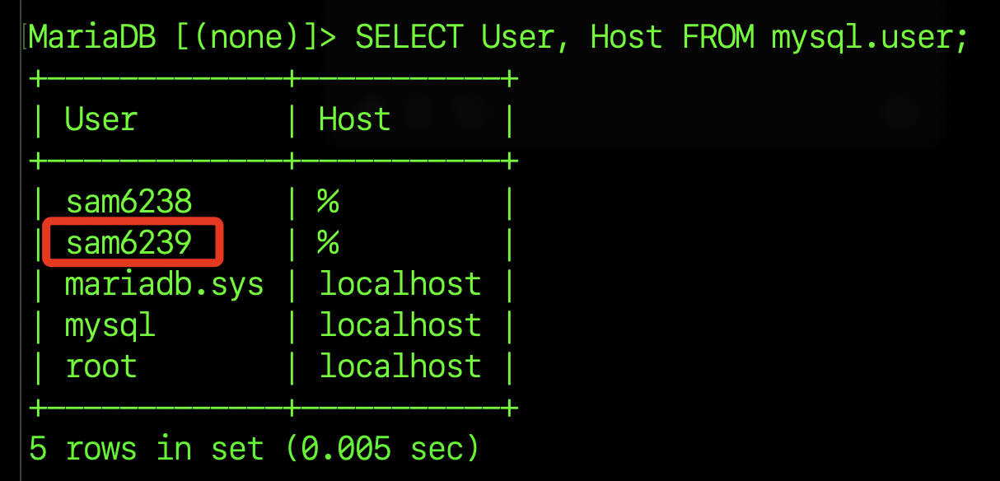
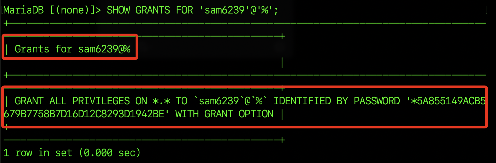
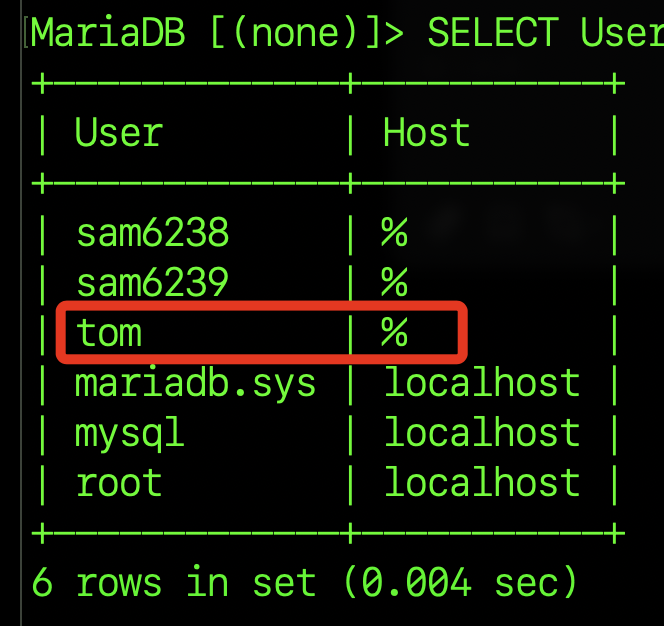
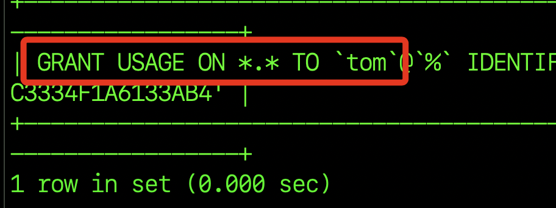

# 使用者

<br>

## 安裝 MySQL 客戶端

_遠程連接 MySQL 服務器，需要在電腦上安裝 MySQL 客戶端。_

<br>

## MacOS

1. 安裝 Homebrew。

   ```bash
   /bin/bash -c "$(curl -fsSL https://raw.githubusercontent.com/Homebrew/install/HEAD/install.sh)"
   ```

<br>

2. 安裝 MySQL 客戶端。

   ```bash
   brew install mysql-client
   ```

<br>

3. 查詢安裝資訊。

   ```bash
   brew info mysql-client
   ```

<br>

4. 加入環境參數。

   ```bash
   echo 'export PATH="/opt/homebrew/opt/mysql-client/bin:$PATH"' >> ~/.zshrc
   ```

   _也就是在環境參數中加入了以下路徑。_

   ```bash
   export PATH="/opt/homebrew/opt/mysql-client/bin:$PATH"
   ```

<br>

5. 載入設定。

   ```bash
   source ~/.zshrc
   ```

<br>

## Windows

1. 安裝：在 [MySQL](https://dev.mysql.com/downloads/installer/)
2. [ 官網](https://dev.mysql.com/downloads/installer/)

<br>

## 步驟

1. 在樹莓派連線本機的資料庫，直接按下 `ENTER` 免密碼。

   ```bash
   sudo mysql -u root -p
   ```

   

<br>

2. 賦予用戶權限，同學請務必自行設定帳號、密碼 `自己的帳號 / 自己的密碼` 。

   ```bash
   GRANT ALL PRIVILEGES ON *.* TO '自己的帳號'@'%' IDENTIFIED BY '自己的密碼' WITH GRANT OPTION;
   ```

   

<br>

3. 從區網其他設備透過 IP 或是 Hostname 進行訪問，務必替換為自己的 IP 或是 Hostname。

   ```bash
   mysql -h 192.168.1.218 -u sam6238 -p
   ```

   或是

   ```bash
   mysql -h raspi-2023-01 -u sam6238 -p
   ```

   

<br>

4. 成功連線直接進入資料庫命令行畫面。

   

<br>

5. 在命令行中透過指令再建立一個使用者帳號。

   ```bash
   CREATE USER 'sam6239'@'%' IDENTIFIED BY '112233';
   ```

   

<br>

6. 查看有哪些使用者。

   ```bash
   SELECT User, Host FROM mysql.user;
   ```

   

<br>

7. 授權資料庫使用者，這裡的對象是 `sam6239`，請務必替換自己的帳號。

   ```bash
   GRANT ALL PRIVILEGES ON *.* TO 'sam6239'@'%' WITH GRANT OPTION;
   ```

<br>

8. 授權後刷新權限設定，很重要。

   ```bash
   FLUSH PRIVILEGES;
   ```

<br>

9. 顯示使用者權限資訊。

   ```bash
   SHOW GRANTS FOR 'sam6239'@'%';
   ```

   

<br>

10. 若建立一個使用者 `tom` 來觀察權限設置。

    

<br>

11. 並未賦予權限並進行尋查詢。

    

<br>

---

_END_
