# Workbench

_圖形化介面的客戶端_

 

## 說明

1. 電腦若要遠程訪問 MySQL 服務器，需要在電腦上安裝 MySQL 客戶端。

 

2. 在 [MySQL](https://dev.mysql.com/downloads/installer/) 官網下載，或在課程的  [Google 共享資料夾](https://drive.google.com/drive/folders/1mNUYleyox6JGOwGVHj_RCsyw2s64likf?usp=drive_link) 下載。

 

## 步驟

1. 添加連線。

   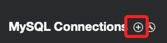

 

2. 自訂連線名稱。

   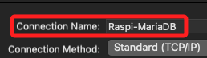

 

3. 輸入主機名稱或 IP，然後輸入自己的帳號，端口使用預設的 `3306` 不用變更。

   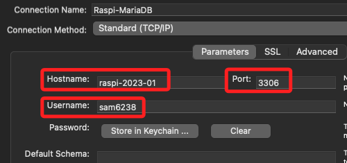

 

4. 接著點擊鑰匙圈 `Keychain`。

   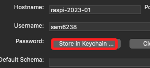

 

5. 在跳出的視窗中輸入自己的密碼之後點 `OK`。

   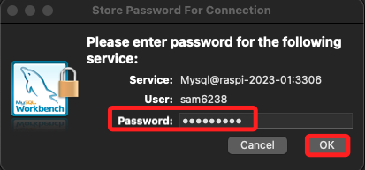

 

6. 接著先點擊右下角的測試連線，確認設置都正確。

   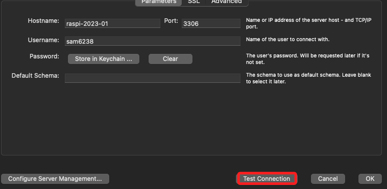

 

7. 點擊繼續。

   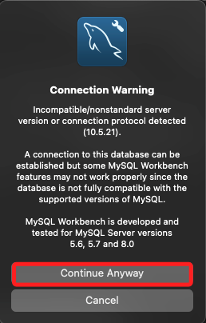

 

8. 顯示成功之後就 `OK` 。

   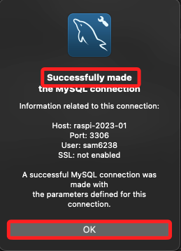

 

9. 按下右下角的 `OK` 回到主窗。

   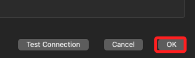

 

10. 在主視窗選取剛剛建立的連線。

   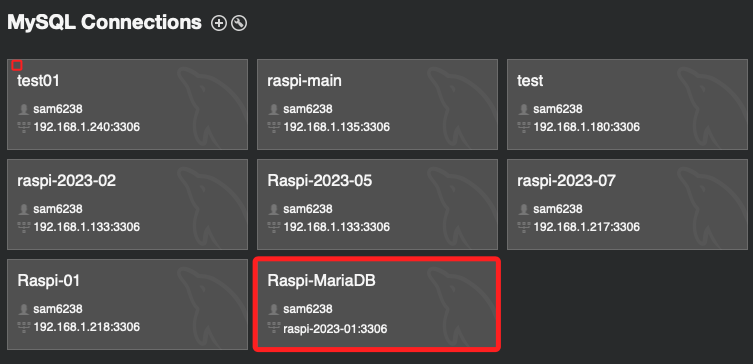

 

11. 接著進入這個畫面就完成連線了，這部分操作先到這。

   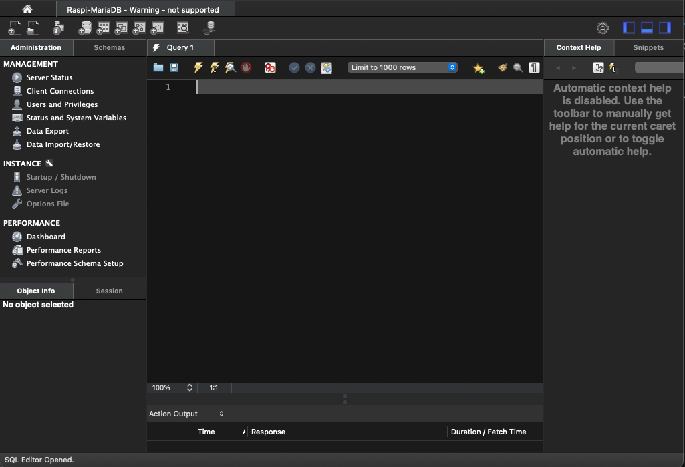

 

___

_END_
