# MySQL Shell

_以下就 MacOS 與 Windows 系統分開說明_

<br>

## 說明

1. 電腦若要遠程訪問 MySQL 服務器，需要在電腦上安裝 MySQL 客戶端工具。

<br>

2. 除了 Workbench 這類型的圖形化介面工具外，也可以使命令列工具 MySQL Shell。

<br>

3. 同學若使用樹莓派相互連線，可以不用安裝這個命令列或是終端機工具。

<br>

## MacOS

1. 安裝 Homebrew。

   ```bash
   /bin/bash -c "$(curl -fsSL https://raw.githubusercontent.com/Homebrew/install/HEAD/install.sh)"
   ```

<br>

2. 安裝 MySQL 客戶端。

   ```bash
   brew install mysql-client
   ```

<br>

3. 查詢安裝資訊。

   ```bash
   brew info mysql-client
   ```

<br>

4. 加入環境參數。

   ```bash
   echo 'export PATH="/opt/homebrew/opt/mysql-client/bin:$PATH"' >> ~/.zshrc
   ```

   _也就是在環境參數中加入了以下路徑。_

   ```bash
   export PATH="/opt/homebrew/opt/mysql-client/bin:$PATH"
   ```

<br>

5. 載入設定。

   ```bash
   source ~/.zshrc
   ```

<br>

## Windows

1. 在 [MySQL](https://dev.mysql.com/downloads/installer/) 官網下載，或在課程的  [Google 共享資料夾](https://drive.google.com/drive/folders/1mNUYleyox6JGOwGVHj_RCsyw2s64likf?usp=drive_link) 下載。

<br>

2. 下載後點擊安裝。

   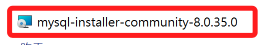

<br>

3. 選取 `Custom` 。

   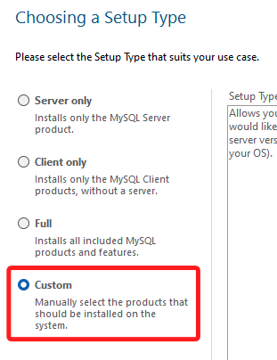

<br>

4. 選取 `Workbench` 以及 `Shell`，這裡暫時用不到 `Server`，可不用安裝。

   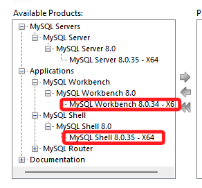

<br>

5. 選到右邊之後 `Next` 。

   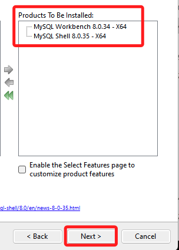

<br>

6. 執行 `Excute` 。

   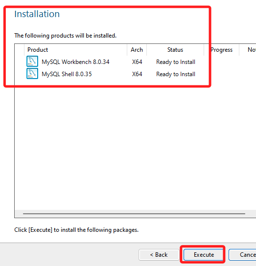

<br>

7. 安裝完成會看到這兩個產品，因為我有安裝 Server，同學可不用安裝。

   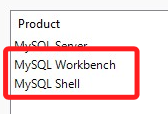

<br>

8. 可以在 `C:\Program Files` 找到 `Shell` ，將絕對路徑複製下來。

   ```bash
   C:\Program Files\MySQL\MySQL Shell 8.0\bin
   ```

   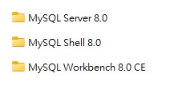

<br>

9. 開啟 `編輯系統環境參數` 。

   

<br>

10. 將 `Shell` 的絕對路徑加入 `PATH` 。

   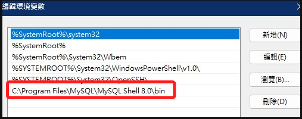

<br>

11. 完成後，開啟終端機進行連線測試，預設通訊埠 `3306` 不用更改。

   ```bash
      mysqlsh --sql -u <使用者帳號> -h <主機名稱> -P 3306
   ```

   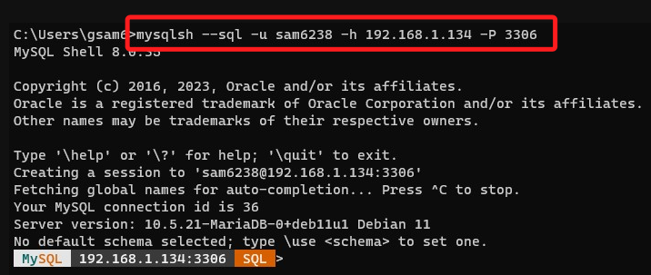

<br>

12. 顯示資料庫，記得結尾要加上分號 `;` 。

   ```bash
      show databases;
   ```

   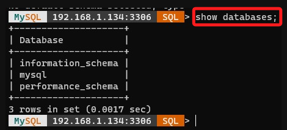

<br>

13. 顯示資料表 mysql.user。

   ```bash
      select User, Host from mysql.user;
   ```

   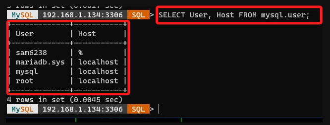

<br>

___

_END_
