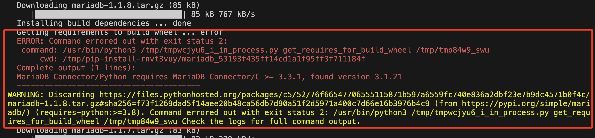
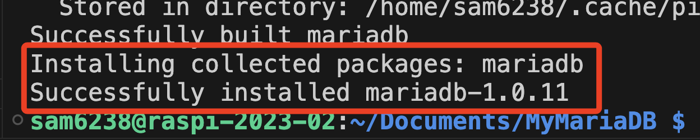

# 連接 MariaDB

_在樹莓派上使用 Python 連接 MariaDB 做應用，有多個套件可以選擇，以下將介紹其中三個。_

<br>

## 簡介

1. `MariaDB` 是一個 `開源的` 關係型資料庫管理系統，由 `MySQL` 的原始開發者創建，以保持 MySQL 的開源性並進一步發展。

<br>

2. `MariaDB` 提供了高性能、可靠性和可擴展性，並且與 `MySQL` 兼容，使得從 `MySQL` 遷移到 `MariaDB` 非常簡單。

<br>

3. `MariaDB` 添加了許多新功能和優化，如先進的查詢優化器、更豐富的存儲引擎支持和增強的安全性，使其成為開發者和企業用戶的熱門選擇。

<br>

## 📌 pymysql

1. 開發與維護：由 `Python 社區` 開發和維護的一個獨立項目。

<br>

2. 實現方式：使用 `純 Python` 實現的。

<br>

3. 特色：主要用於 `MySQL` 和 `MariaDB`，能夠與多個 Python 版本兼容；效能不如使用 `C 擴展` 的套件，但不需要編譯 `C 擴展`，因此 `跨平台` 兼容性好，安裝過程簡單，適合需要快速部署的環境。

<br>

4. 套件安裝。

    ```bash
    pip install pymysql
    ```

<br>

5. 範例。

    ```python
    import pymysql

    # 資料庫連接資訊
    host = 'localhost'
    user = '自己的帳號'
    password = '自己的密碼'
    db_name = 'database_01'
    your_table = 'table_01'

    # 建立資料庫連接，但暫時不指定特定的資料庫
    conn = pymysql.connect(
        host=host,
        user=user,
        password=password,
        charset='utf8mb4'
    )

    try:
        cursor = conn.cursor()
        # 檢查資料庫是否存在
        cursor.execute(f"SELECT SCHEMA_NAME FROM INFORMATION_SCHEMA.SCHEMATA WHERE SCHEMA_NAME = '{db_name}'")
        result = cursor.fetchone()
        if not result:
            # 如果資料庫不存在，則建立它
            cursor.execute(f"CREATE DATABASE {db_name}")
            print(f"資料庫 {db_name} 建立成功。")
        else:
            print(f"資料庫 {db_name} 已經存在。")
        
        # 關閉游標和連接
        cursor.close()
        conn.close()

        # 重新建立連接到新建或已存在的資料庫
        conn = pymysql.connect(host=host, user=user, password=password, db=db_name, charset='utf8mb4')
        
        cursor = conn.cursor()
        # 檢查表是否存在
        cursor.execute(f"SHOW TABLES LIKE '{your_table}'")
        result = cursor.fetchone()
        if not result:
            # 如果表不存在，則建立它
            # 這裡需要根據您的需求來定義表的結構
            create_table_sql = f"CREATE TABLE {your_table} (id INT AUTO_INCREMENT PRIMARY KEY, name VARCHAR(255), age INT)"
            cursor.execute(create_table_sql)
            print(f"表 {your_table} 建立成功。")
        else:
            print(f"表 {your_table} 已經存在。")

        # 執行您原本的操作
        sql = f"SELECT * FROM {your_table}"
        cursor.execute(sql)
        result = cursor.fetchall()
        for row in result:
            print(row)

    finally:
        # 確保最後關閉連接
        if conn:
            conn.close()
    ```

<br>

6. 以上腳本會先檢查資料庫是否存在，假如沒有檢查，當資料庫不存在時，會出現 `OperationalError: (1049, "Unknown database 'XXXX'")` 錯誤。

<br>

7. 可前往樹莓派資料庫查詢是否確實建立。

    ```bash
    show databases;
    ```

<br>

## 📌 mysql-connector-python

1. 開發與維護：由 `Oracle 官方` 提供的項目，文檔齊全、功能完備，且具備良好的支持保障。

<br>

2. 實現方式：完全用 `Python` 寫的，不依賴於 `C 擴展`，使得更易於安裝和分發。

<br>

3. 特色：官方提供的 `MySQL` 連接器，與 `MySQL` 和 `MariaDB` 完全兼容，支持多個 Python 版本。

<br>

4. 套件安裝

    ```bash
    pip install mysql-connector-python
    ```

<br>

5. 範例。

    ```python
    import mysql.connector

    # 資料庫配置，請輸入自己的設定資訊
    config = {
        'user': 'your_username',
        'password': 'your_password',
        'host': 'localhost',
        'database': 'your_database',
        'port': 3306
    }

    # 自定義資料表名稱
    TABLE_NAME = 'your_table'

    conn = mysql.connector.connect(**config)
    cursor = conn.cursor()

    # 檢查資料表是否存在
    cursor.execute(f"SHOW TABLES LIKE '{TABLE_NAME}'")
    result = cursor.fetchone()

    if result:
        print("Table already exists.")
    else:
        # 建立資料表
        cursor.execute(f"""
        CREATE TABLE {TABLE_NAME} (
            id INT AUTO_INCREMENT PRIMARY KEY,
            column1 VARCHAR(255),
            column2 VARCHAR(255)
        )
        """)
        print("Table created.")

        # 向資料表插入一筆資料
        cursor.execute(f"INSERT INTO {TABLE_NAME} (column1, column2) VALUES (%s, %s)", ('value1', 'value2'))
        conn.commit()
        print("Inserted one row into {TABLE_NAME}.")

    # 檢索資料表的內容
    cursor.execute(f"SELECT * FROM {TABLE_NAME}")
    for row in cursor:
        print(row)

    cursor.close()
    conn.close()    
    ```

<br>

## 📌 mariadb

_後續將以這個套件為主，這裡直接安裝會出錯，因為少了一些依賴_

<br>

1. 開發與維護：`MariaDB` 是 `MySQL` 的一個分支，是 `MariaDB 官方` 推薦的 `Python` 連接器。

<br>

2. 實現方式：使用了 `C 擴展` 來實現更高效的資料庫操作。

<br>

3. 特色：專注於 `MariaDB`，效能佳。

<br>

4. 套件安裝。

    ```bash
    sudo apt-get install libmariadb-dev
    pip install mariadb
    ```

<br>

5. 安裝過程會出現多次類似以下的錯誤與警告訊息，錯誤訊息顯示 MariaDB Connector/Python 需要 MariaDB Connector/C 的版本至少為 3.3.1 或 3.2.4，但是系統中安裝的版本是 3.1.21，這導致 pip 多次嘗試降級安裝舊版本的 MariaDB Python 庫失敗。

    

<br>

6. 最後 pip 成功安裝 mariadb 庫的 1.0.11 版本，可能是因為這個版本的 mariadb 庫與安裝在系統上的 MariaDB Connector/C 版本 3.1.21 相容。

    

<br>

7. 範例。

    ```python
    import mariadb

    config = {
        'user': 'your_username',
        'password': 'your_password',
        'host': 'localhost',
        'database': 'your_database',
        'port': 3306
    }

    # 連接資料庫
    conn = mariadb.connect(**config)
    cursor = conn.cursor()

    # 查詢
    cursor.execute("SELECT * FROM your_table")
    for row in cursor:
        print(row)

    # 關閉連線
    cursor.close()
    conn.close()
    ```

<br>

___

_END_