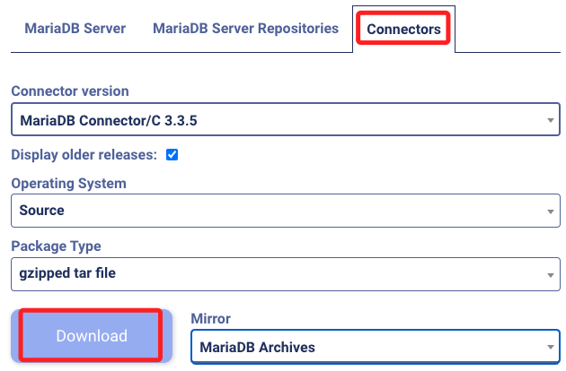
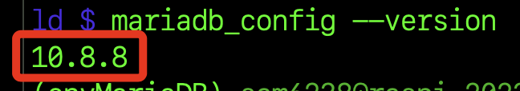
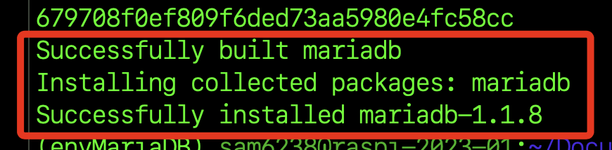

# 使用 mariadb 庫

_基於前述的版本問題，系統顯示需要 MariaDB Connector/C 的版本至少為 `3.3.1` 或 `3.2.4`，以下嘗試安裝 `3.3.5` 進行排除。_

<br>

## 安裝

1. 先到 MariaDB Connector/C [下載頁面](https://mariadb.org/download/?o=true&p=connector-c&r=3.3.5&os=source&pkg=tar_gz&t=connector) ，下載後可以查看 [官方文件](https://mariadb.com/kb/en/connectors/) 。

    

<br>

2. 下載後複製到樹莓派的 `Documents`，可透過 MacOS 的終端機或 Windows 的 PowerShell 運行以下指令。

    ```bash
    scp mariadb-connector-c-3.3.5-src.tar.gz sam6238@raspi-2023-01:~/Documents
    ```

<br>

3. 解壓縮。

    ```bash
    sudo tar -xzf mariadb-connector-c-3.3.5-src.tar.gz
    ```

<br>

4. 進入壓縮後的資料夾。

    ```bash
    cd mariadb-connector-c-3.3.5-src
    ```

<br>

5. 建立並進入編譯資料夾。

    ```bash
    sudo mkdir build && cd build
    ```

<br>

6. 更新並安裝 cmake。

    ```bash
    sudo apt update
    sudo apt install cmake
    ```

<br>

7. 進行配置，使用 `..` 告訴 CMake 在上層目錄可以找到源代碼跟 `CMakeLists.txt`。

    ```bash
    sudo cmake ..
    ```

<br>

8. 編譯。

    ```bash
    sudo make
    ```

<br>

9. 安裝。

    ```bash
    sudo make install
    ```

<br>

10. 更新 Shared Library Cache。

    ```bash
    sudo ldconfig
    ```

<br>

11. 查詢版本。

    ```bash
    mariadb_config --version
    ```

    

<br>

12. 安裝 mariadb。

    ```bash
    pip install mariadb
    ```

    

<br>

## 透過腳本連線

1. 先在樹莓派上連線資料庫。

    ```bash
    sudo mysql -u root -p
    ```

<br>

2. 建立一個數據庫＆表。

    ```bash
    CREATE DATABASE mydatabase;
    USE mydatabase;
    CREATE TABLE users (
        id INT AUTO_INCREMENT PRIMARY KEY,
        name VARCHAR(255) NOT NULL,
        email VARCHAR(255) NOT NULL
    );

    ```

<br>

3. 添加數據。

    ```bash
    INSERT INTO users (name, email) VALUES ('John Doe', 'johndoe@example.com');
    ```

<br>

4. 查詢資料。

    ```bash
    SELECT * FROM users;
    ```

<br>

5. 指定條件查詢。

    ```bash
    SELECT * FROM users WHERE name = 'John Doe';
    ```

<br>

6. 撰寫 Python 腳本進行查詢。

    ```bash
    import mariadb

    # 數據庫連接配置
    config = {
        'user': '資料庫使用者帳號',
        'password': '上列帳號的密碼',
        'host': 'localhost',
        'database': 'mydatabase',
        'port': 3306
    }

    # 建立連接資料庫（mydatabase）
    # 以關鍵字參數方式將 config 傳入
    conn = mariadb.connect(**config)
    cursor = conn.cursor()

    # 執行 SQL 查詢
    cursor.execute("SELECT * FROM users")

    # 遍歷
    for (id, name, email) in cursor:
        print(f"ID: {id}, Name: {name}, Email: {email}")

    # 關閉
    cursor.close()
    conn.close()
    ```

<br>

7. 結果。

    ```bash
    ID: 1, Name: John Doe, Email: johndoe@example.com
    ```

<br>

---

_END_

