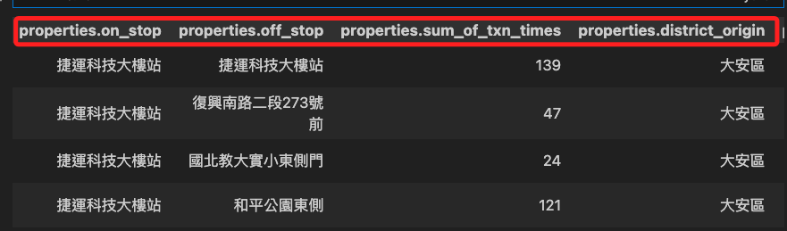

## 步驟

1. 使用 Google 搜尋 `政府資料開放平臺` 並進入 [官網](https://data.gov.tw/) 。

2. 舉例說以 `UBike` 作為關鍵字查詢。


3. 奇怪，竟然找不到。


4. 原來印象中的 `UBike` 不是 `UBike` ，而是 `YouBike` 。


5. 重新使用 `YouBike` 進行查詢。

6. 後續就使用這個資料集作為示範，點擊進入。


## 查看資料

1. 查看資料時，先別急著查詢載點，先看看資料集有哪些欄位等等的內容。


2. 點擊 `檢視資料` 。


3. 下方會有資料展示，可比對一下欄位與內容。


4. 複製這個網址，就是程式碼中要使用的連結。

    ```txt
	https://data.taipei/api/dataset/c7dbdb7c-6bbd-495a-bd23-49b22defd83e/resource/19ec7355-6e07-4a3c-9ee7-d1119a68d3f6/download
    ```


<br>

## 建立環境

1. 建立虛擬環境 `envUBike` 。
```bash
python -m venv envUBike
```

2. 筆記本找不到虛擬環境。


3. 任意建立一個臨時用的 `.py` 檔案。


4. 點擊右下角選擇解釋器。


5. 手動選擇。


6. 尋找。


7. 依序選取。


8. 確認右下角的解釋器已經正確選取。


9. 回到筆記本就會看到這個解釋器了。


10. 選取後出現在右上角的解釋器欄位內，就完成選擇。


11. 稍後在第一次運行時還會出現以下對話框，點擊 `安裝` 即可。


<br>

## 撰寫腳本

1. 安裝套件，以下將依各階段寫入的程式碼片段來安裝所需套件。
```bash
pip install requests pandas
```

2. 編輯腳本
```python
# 導入庫
import requests

# 下載數據
url = "https://data.taipei/api/dataset/c7dbdb7c-6bbd-495a-bd23-49b22defd83e/resource/38212e6b-125a-4346-8982-3319da6c79e2/download"
# 讀取
response = requests.get(url)
# 讀取 json
data = response.json()
# 暫時輸出查看
data
```

3. 經查看，可知資料存在 `features` 。


4. 使用 key 鍵 `features` 進行索引。
```bash
data['features']
```


5. 導入函式庫 `pandas`，透過 `json_normalize` 函數將資料轉換為資料表格式。
_安裝庫_
```bash
pip install pandas
```
_添加程式碼_
```python
# 導入函式庫
import pandas as pd

# 其他不變 ... 

# 使用 'features' 這個 key 取值，再透過 pandas 來創建 DataFrame
df = pd.json_normalize(data['features'])
# 可觀察一下前十筆結果
df[:10]
```


6. 想從其下 `properties` 的值之中取出其中四個 `on_stop` `sum_of_txn_times` `district_origin` `district_destination`，並分別改名為可識別的鍵。



7. 透過 `rename` 函數修改欄位名稱，特別注意，這並非唯一修改的方式。
```python
# 選取特定的欄位並重命名
selected_columns = {
    'properties.on_stop': '站名',
    'properties.sum_of_txn_times': '數量',
    'properties.district_origin': '起點',
    'properties.district_destination': '終點'
}
# 篩選欄位
df_selected = df[selected_columns.keys()].rename(columns=selected_columns)
# 查看
df_selected[:10]
```
8. 結果顯示如下，接下來要將資料寫入資料庫。


## 寫入資料庫

1. 在新的虛擬環境中，無需安裝系統應用，但必須安裝 Python 套件。
```bash
pip install mariadb
```

2. 導入函式庫並連接資料庫

```python
# 導入函式庫
import mariadb

# 其他不變 ...

# 連接到 MariaDB
try:
    conn = mariadb.connect(
        user="sam6238",          # 資料庫用戶名
        password="sam112233",    # 資料庫密碼
        host="localhost",        # 資料庫主機地址
        port=3306,               # 資料庫端口
        database="mydatabase"    # 資料庫名稱
    )
# 捕捉例外
except mariadb.Error as e:
    print(f"連線 MariaDB 發生錯誤：{e}")
    # 退出程序
    sys.exit(1)
```

3. 同學若看到以下訊息可暫時不予處理，這是通知 MariaDB Connector/Python 版本是用不同版本的 MariaDB Connector/C 構建的，有出現問題在處理即可。
```txt
RuntimeWarning: MariaDB Connector/Python was build with MariaDB Connector/C version 3.3.5 but loaded Connector/C library has version 10.5.21
```

4. 取得連線對象並建立表格。

```python
# 透過連線物件取得 cursor 對象
cur = conn.cursor()

# 透過 cursor 對象創建表格
try:
    cur.execute("""
        CREATE TABLE IF NOT EXISTS tb_UBike (
            站名 VARCHAR(255),
            數量 VARCHAR(255),
            起點 VARCHAR(255),
            終點 VARCHAR(255)
        )
    """)
# 捕捉例外
except mariadb.Error as e:
    print(f"建立表格發生錯誤：{e}")
```

5. 插入數據並進行提交。

```python
# 插入數據
# 透過 iterrows 函數遍歷 df_selected
for index, row in df_selected.iterrows():
    try:
        # 使用參數化查詢，這是在資料庫操作時比較建議的語法
        cur.execute("""
            INSERT INTO tb_UBike (站名, 數量, 起點, 終點) 
            VALUES (%s, %s, %s, %s)
        """, (row['站名'], row['數量'], row['起點'], row['終點']))
    except mariadb.Error as e:
        print(f"插入資料發生錯誤：{e}")

# 提交事務
conn.commit()
```

6. 讀取並輸出資料，資料有點多，需要一點時間。
```python
# 讀取並輸出資料
try:
    cur.execute("SELECT * FROM tb_UBike")
    for row in cur:
        print(row)
except mariadb.Error as e:
    print(f"請求資料發生錯誤：{e}")

# 關閉連接
conn.close()
```