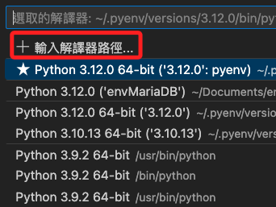

## 步驟

1. 使用 Google 搜尋 `政府資料開放平臺` 並進入 [官網](https://data.gov.tw/) 。

2. 舉例說以 `UBike` 作為關鍵字查詢。


3. 奇怪，竟然找不到。


4. 原來印象中的 `UBike` 不是 `UBike` ，而是 `YouBike` 。


5. 重新使用 `YouBike` 進行查詢。

6. 後續就使用這個資料集作為示範，點擊進入。


## 查看資料

1. 查看資料時，先別急著查詢載點，先看看資料集有哪些欄位等等的內容。


2. 點擊 `檢視資料` 。


3. 下方會有資料展示，可比對一下欄位與內容。


4. 複製這個網址，就是程式碼中要使用的連結。

    ```txt
	https://data.taipei/api/dataset/c7dbdb7c-6bbd-495a-bd23-49b22defd83e/resource/19ec7355-6e07-4a3c-9ee7-d1119a68d3f6/download
    ```


<br>

## 建立環境

1. 建立虛擬環境 `envUBike` 。
```bash
python -m venv envUBike
```

2. 筆記本找不到虛擬環境。


3. 任意建立一個臨時用的 `.py` 檔案。


4. 點擊右下角選擇解釋器。


5. 手動選擇。



6. 尋找。


7. 依序選取。


8. 確認右下角的解釋器已經正確選取。


9. 回到筆記本就會看到這個解釋器了。


10. 選取後出現在右上角的解釋器欄位內，就完成選擇。


11. 稍後在第一次運行時還會出現以下對話框，點擊 `安裝` 即可。


<br>

## 撰寫腳本

1. 安裝套件，以下將依各階段寫入的程式碼片段來安裝所需套件。
```bash
pip install requests pandas
```

2. 編輯腳本
```python
# 導入庫
import requests

# 下載數據
url = "https://data.taipei/api/dataset/c7dbdb7c-6bbd-495a-bd23-49b22defd83e/resource/38212e6b-125a-4346-8982-3319da6c79e2/download"
# 讀取
response = requests.get(url)
# 讀取 json
data = response.json()
# 暫時輸出查看
data
```

3. 經查看，可知資料存在 `features` 。


4. 使用 key 鍵 `features` 進行索引。


