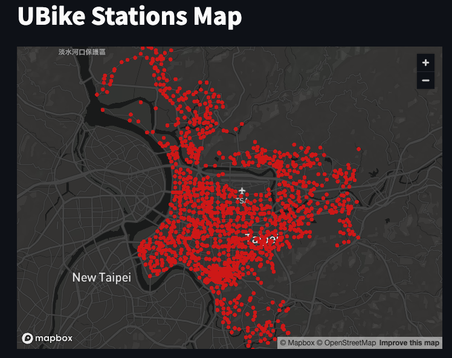

# 使用 Streamlit 顯示

<br>

## 腳本

1. 成果展示

    

<br>

2. 程式碼，使用 `streamlit run` 運行。

    ```python
    import streamlit as st
    import pandas as pd
    import mariadb
    import sys

    # 設置 Streamlit 標題
    st.title('UBike Stations Map')

    # 建立資料庫連接
    try:
        conn = mariadb.connect(
            user="sam6238",
            password="sam112233",
            host="localhost",
            port=3306,
            database="mydatabase"
        )
    except mariadb.Error as e:
        st.error(f"Error connecting to MariaDB: {e}")
        sys.exit(1)

    # 獲取 cursor 對象
    cur = conn.cursor()

    # 執行查詢以獲取座標數據
    try:
        cur.execute("SELECT 起點, 終點, 次數, ST_X(座標) as longitude, ST_Y(座標) as latitude FROM tb_UB_2;")
        
        # 將結果轉換為 pd
        rows = cur.fetchall()
        # 確保有數據被取回
        if rows:
            df = pd.DataFrame(rows, columns=['起點', '終點', '次數', 'lon', 'lat'])
            # 顯示地圖
            st.map(df)
        else:
            st.write("No data available to display on the map.")
    except mariadb.Error as e:
        st.error(f"Error fetching data: {e}")

    # 關閉連線
    conn.close()
    ```

<br>

## 優化腳本

1. 在 Streamlit 的 `st.map` 函數中，預設沒有參數可直接調整地圖上點的大小，但可使用 `st.pydeck_chart` 函數來建立更為複雜的地圖，這個函數允許自訂點的大小和其他屬性。


<br>

2. 成果圖。

    

<br>

3. 程式碼，使用 `streamlit run` 運行。

    ```python
    import streamlit as st
    import pandas as pd
    import pydeck as pdk
    import mariadb
    import sys

    # 設置 Streamlit 頁面
    st.title('UBike Stations Map')

    # 嘗試建立資料庫連接
    try:
        conn = mariadb.connect(
            user="sam6238",
            password="sam112233",
            host="localhost",
            port=3306,
            database="mydatabase"
        )
    except mariadb.Error as e:
        st.error(f"Error connecting to MariaDB: {e}")
        sys.exit(1)

    # 獲取 cursor 對象
    cur = conn.cursor()

    # 執行查詢以取得坐標數據
    try:
        cur.execute("SELECT 起點, 終點, 次數, ST_X(座標) as longitude, ST_Y(座標) as latitude FROM tb_UB_2;")
        
        # 將結果轉換為 pandas DataFrame
        rows = cur.fetchall()
        # 確保有取回數據
        if rows:
            df = pd.DataFrame(rows, columns=['起點', '終點', '次數', 'lon', 'lat'])
            # 使用 pydeck 定義地圖
            view_state = pdk.ViewState(
                latitude=df['lat'].mean(),
                longitude=df['lon'].mean(),
                zoom=11,
                pitch=0
            )

            # 創建地圖圖層
            layer = pdk.Layer(
                'ScatterplotLayer',
                data=df,
                get_position='[lon, lat]',
                # 設置點的大小
                get_radius=30,
                # 點的顏色  
                get_color=[255, 0, 0],  
                pickable=True
            )

            # 渲染地圖
            st.pydeck_chart(pdk.Deck(layers=[layer], initial_view_state=view_state))
        else:
            st.write("No data available to display on the map.")
    except mariadb.Error as e:
        st.error(f"Error fetching data: {e}")

    # 關閉連線
    conn.close()
    ```

<br>

---

_END_