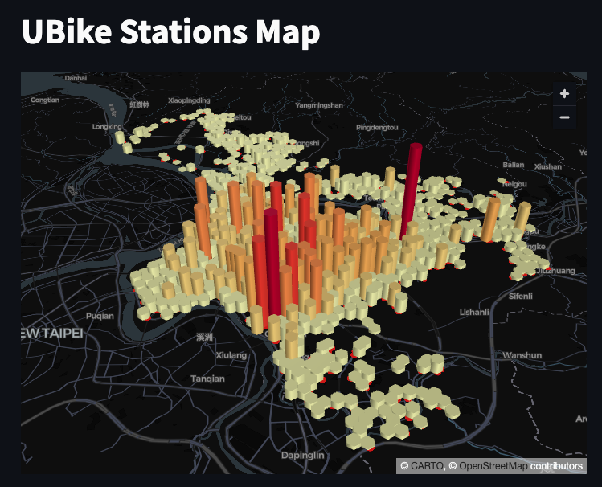

# Streamlit PyDeck

<br>

## 範例

1. 延續之前的資料庫，將 `次數` 作為空間維度改寫腳本。

<br>

2. 成果圖。

    

<br>

3. 程式碼，使用 `streamlit run` 運行。 

    ```python
    import streamlit as st
    import pandas as pd
    import pydeck as pdk
    import mariadb
    import sys

    # 設置 Streamlit 頁面標題
    st.title('UBike Stations Map')

    # 嘗試建立資料庫連接
    try:
        conn = mariadb.connect(
            user="sam6238",
            password="sam112233",
            host="localhost",
            port=3306,
            database="mydatabase"
        )
    except mariadb.Error as e:
        st.error(f"連接 MariaDB 錯誤: {e}")
        sys.exit(1)

    # 獲取 cursor 對象
    cur = conn.cursor()

    # 執行查詢以獲取座標數據
    try:
        cur.execute("SELECT 起點, 終點, 次數, ST_X(座標) as longitude, ST_Y(座標) as latitude FROM tb_UB_2;")
        
        # 將結果轉換為 pandas DataFrame
        rows = cur.fetchall()
        # 確保有數據被取回
        if rows:
            df = pd.DataFrame(rows, columns=['起點', '終點', '次數', 'lon', 'lat'])
            # 使用 pydeck 定義地圖的初始視圖狀態
            view_state = pdk.ViewState(
                latitude=df['lat'].mean(),
                longitude=df['lon'].mean(),
                zoom=11,
                pitch=50
            )

            # 創建 HexagonLayer 圖層，使用「次數」作為高度
            hexagon_layer = pdk.Layer(
                'HexagonLayer',
                data=df,
                get_position='[lon, lat]',
                # 使用「次數」欄位數據作為高度
                get_elevation='次數',  
                elevation_scale=4,
                elevation_range=[0, 1000],
                radius=200,
                pickable=True,
                extruded=True,
            )

            # 創建 ScatterplotLayer 圖層
            scatter_layer = pdk.Layer(
                'ScatterplotLayer',
                data=df,
                get_position='[lon, lat]',
                get_color='[200, 30, 0, 160]',
                get_radius=100,
            )

            # 通過 pydeck 渲染地圖並顯示在 Streamlit 上
            st.pydeck_chart(pdk.Deck(layers=[hexagon_layer, scatter_layer], initial_view_state=view_state))
        else:
            st.write("無可顯示的數據。")
    except mariadb.Error as e:
        st.error(f"獲取數據錯誤: {e}")

    # 關閉資料庫連接
    conn.close()
    ```


<br>

---

_END_