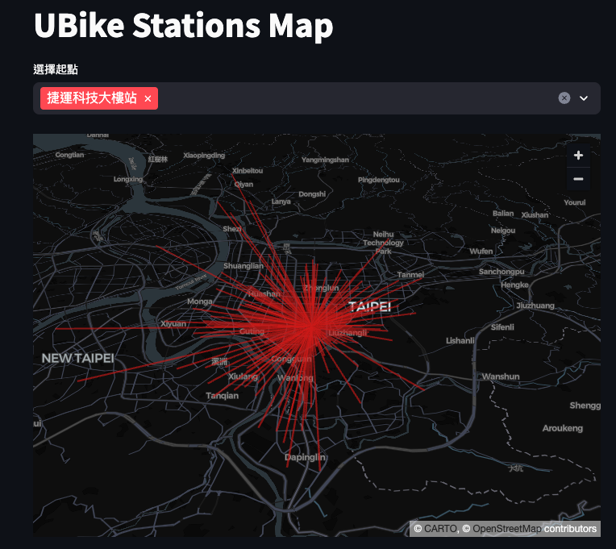
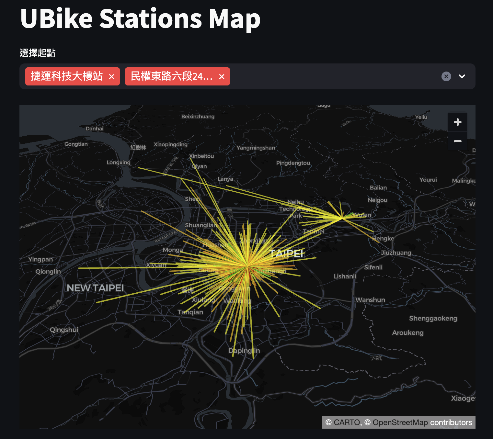
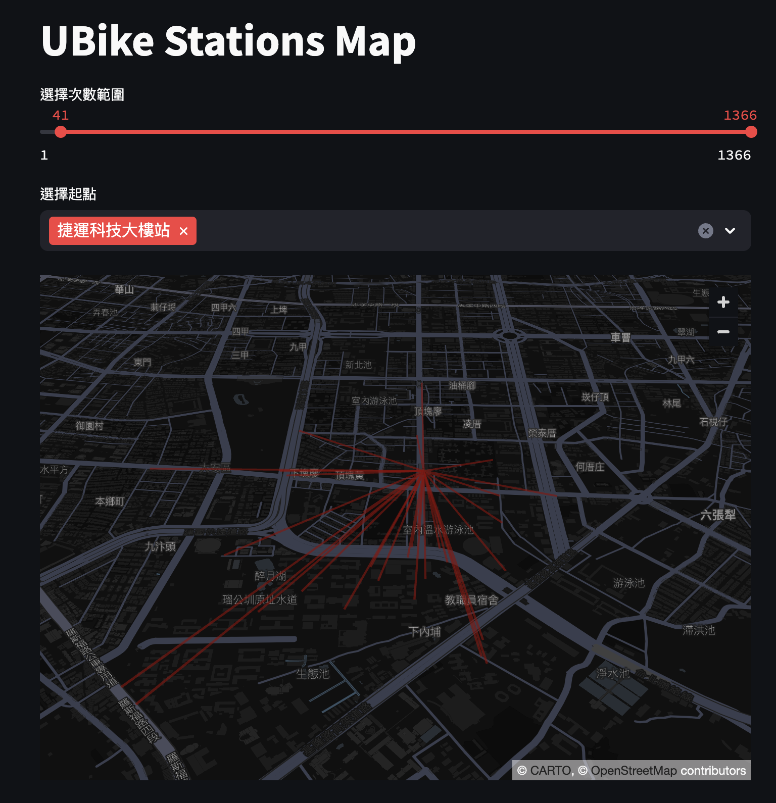

# 數據科學的雛形

_透過下拉選單選取租借起點，透過終點的直線分佈觀察租借使用狀況_


<br>

## 範例

1. 透過下拉選單選取可複選的租借起點，並將終點作為另一端點繪製紅色線條。

<br>

2. 成果圖。

    

<br>

3. 完整程式碼，請注意，腳本是基於樹莓派的 MariaDB 服務，務必確保服務已啟動。

    ```python
    import streamlit as st
    import pandas as pd
    import pydeck as pdk
    import requests

    # 下載數據
    url = "https://data.taipei/api/dataset/c7dbdb7c-6bbd-495a-bd23-49b22defd83e/resource/38212e6b-125a-4346-8982-3319da6c79e2/download"
    response = requests.get(url)
    data = response.json()

    # 使用 'features' 這個 key 來創建 DataFrame
    df = pd.json_normalize(data['features'])

    # 選取特定的列並重命名
    selected_columns = {
        'properties.on_stop': '起點',
        'properties.off_stop': '終點',
        'properties.sum_of_txn_times': '次數',
        'geometry.coordinates': '座標'
    }
    df_selected = df[selected_columns.keys()].rename(columns=selected_columns)

    # 座標部分分別取出第一個和第二個座標
    df_selected['起點座標'] = df_selected['座標'].apply(lambda x: x[0])
    df_selected['終點座標'] = df_selected['座標'].apply(lambda x: x[1])

    # 刪除原始的座標列
    df_selected.drop(columns=['座標'], inplace=True)

    # 設置 Streamlit 頁面標題
    st.title('UBike Stations Map')

    # 創建下拉復選選單
    selected_starts = st.multiselect('選擇起點', df_selected['起點'].unique())

    # 根據選中的起點篩選數據
    filtered_data = df_selected[df_selected['起點'].isin(selected_starts)]

    # 定義地圖的初始視圖狀態
    view_state = pdk.ViewState(
        # 預設為台北市的緯度
        latitude=25.02605,  
        # 預設為台北市的經度
        longitude=121.5436,  
        zoom=11,
        pitch=50
    )

    # 創建 LineLayer 圖層
    line_layer = pdk.Layer(
        "LineLayer",
        data=filtered_data,
        get_source_position='起點座標',
        get_target_position='終點座標',
        get_color='[200, 30, 0, 160]',
        get_width=2,
        pickable=True
    )

    # 通過 pydeck 渲染地圖並顯示在 Streamlit 上
    st.pydeck_chart(
        pdk.Deck(
            layers=[line_layer], 
            initial_view_state=view_state
        )
    )
    ```

<br>

## 進階

1. 加入次數分佈的顏色深淺。

<br>

2. 成果圖。

    

<br>

3. 在程序開始前的區塊，添加一個顏色等級的函數 `color_scale` 。
    
    ```python
    def color_scale(value):
        """
        根據次數定義顏色。
        黃色: 少量次數
        綠色: 中等次數
        紅色: 多次數
        顏色的深淺根據次數多寡決定。
        """
        if value < 2:
            return [255, 255, 0, 160]  # 淺黃色
        elif value < 5:
            return [255, 204, 0, 160]  # 黃色
        elif value < 10:
            return [255, 153, 0, 160]  # 深黃色
        elif value < 15:
            return [102, 255, 0, 160]  # 淺綠色
        elif value < 20:
            return [51, 204, 0, 160]   # 綠色
        elif value < 25:
            return [0, 153, 0, 160]    # 深綠色
        elif value < 30:
            return [255, 0, 0, 160]    # 淺紅色
        elif value < 35:
            return [204, 0, 0, 160]    # 紅色
        else:
            return [153, 0, 0, 160]    # 深紅色
    ```

<br>

4. 在數據集建立之後，為數據集添加顏色的欄位

    ```python
    # 為數據集添加顏色欄位
    filtered_data['color'] = filtered_data['次數'].apply(color_scale)
    ```

<br>

5. 在 LineLayer 的顏色參數中，將值改為欄位名稱 `color` 。

    ```python
    # 創建 LineLayer 圖層
    line_layer = pdk.Layer(
        "LineLayer",
        data=filtered_data,
        get_source_position='起點座標',
        get_target_position='終點座標',
        get_color='color',
        get_width=2,
        pickable=True
    )
    ```

<br>

6. 完整程式碼。

    ```python
    import streamlit as st
    import pandas as pd
    import pydeck as pdk
    import requests

    def color_scale(value):
        """
        根據次數定義顏色。
        黃色: 少量次數
        綠色: 中等次數
        紅色: 多次數
        顏色的深淺根據次數多寡決定。
        """
        if value < 2:
            return [255, 255, 0, 160]  # 淺黃色
        elif value < 5:
            return [255, 204, 0, 160]  # 黃色
        elif value < 10:
            return [255, 153, 0, 160]  # 深黃色
        elif value < 15:
            return [102, 255, 0, 160]  # 淺綠色
        elif value < 20:
            return [51, 204, 0, 160]   # 綠色
        elif value < 25:
            return [0, 153, 0, 160]    # 深綠色
        elif value < 30:
            return [255, 0, 0, 160]    # 淺紅色
        elif value < 35:
            return [204, 0, 0, 160]    # 紅色
        else:
            return [153, 0, 0, 160]    # 深紅色

    # 下載數據
    url = "https://data.taipei/api/dataset/c7dbdb7c-6bbd-495a-bd23-49b22defd83e/resource/38212e6b-125a-4346-8982-3319da6c79e2/download"
    response = requests.get(url)
    data = response.json()

    # 使用 'features' 這個 key 來創建 DataFrame
    df = pd.json_normalize(data['features'])

    # 選取特定的列並重命名
    selected_columns = {
        'properties.on_stop': '起點',
        'properties.off_stop': '終點',
        'properties.sum_of_txn_times': '次數',
        'geometry.coordinates': '座標'
    }
    df_selected = df[selected_columns.keys()].rename(columns=selected_columns)

    # 座標部分分別取出第一個和第二個座標
    df_selected['起點座標'] = df_selected['座標'].apply(lambda x: x[0])
    df_selected['終點座標'] = df_selected['座標'].apply(lambda x: x[1])

    # 刪除原始的座標列
    df_selected.drop(columns=['座標'], inplace=True)

    # 設置 Streamlit 頁面標題
    st.title('UBike Stations Map')

    # 創建下拉復選選單
    selected_starts = st.multiselect('選擇起點', df_selected['起點'].unique())

    # 根據選中的起點篩選數據
    filtered_data = df_selected[df_selected['起點'].isin(selected_starts)]

    # 為數據集添加顏色欄位
    filtered_data['color'] = filtered_data['次數'].apply(color_scale)

    # 定義地圖的初始視圖狀態
    view_state = pdk.ViewState(
        latitude=25.02605,  # 可以設置為台北市的緯度
        longitude=121.5436,  # 可以設置為台北市的經度
        zoom=11,
        pitch=50
    )

    # 創建 LineLayer 圖層
    line_layer = pdk.Layer(
        "LineLayer",
        data=filtered_data,
        get_source_position='起點座標',
        get_target_position='終點座標',
        get_color='color',
        get_width=2,
        pickable=True
    )

    # 通過 pydeck 渲染地圖並顯示在 Streamlit 上
    st.pydeck_chart(pdk.Deck(layers=[line_layer], initial_view_state=view_state))
    ```

<br>

## 添加次數篩選

1. 加入一個 `slider` 部件用以篩選次數。

<br>

2. 成果圖。

    

<br>

3. 加入

    ```python
    # 創建次數篩選滑動條
    min_times, max_times = int(df_selected['次數'].min()), int(df_selected['次數'].max())
    selected_times = st.slider('選擇次數範圍', min_times, max_times, (min_times, max_times))
    ```

<br>

4. 下拉選單建立之後的程式碼區塊中加入

    ```python
    # 根據選中的起點和次數篩選數據
    filtered_data = df_selected[
        (df_selected['起點'].isin(selected_starts)) & 
        (df_selected['次數'] >= selected_times[0]) & 
        (df_selected['次數'] <= selected_times[1])
    ]
    ```

<br>


5. 完整程式碼。

    ```python
    import streamlit as st
    import pandas as pd
    import pydeck as pdk
    import requests

    # 定義顏色映射函數
    def color_scale(value):
        """
        根據次數定義顏色。
        黃色: 少量次數
        綠色: 中等次數
        紅色: 多次數
        顏色的深淺根據次數多寡決定。
        """
        if value < 2:
            return [255, 255, 0, 160]  # 淺黃色
        elif value < 5:
            return [255, 204, 0, 160]  # 黃色
        elif value < 10:
            return [255, 153, 0, 160]  # 深黃色
        elif value < 15:
            return [102, 255, 0, 160]  # 淺綠色
        elif value < 20:
            return [51, 204, 0, 160]   # 綠色
        elif value < 25:
            return [0, 153, 0, 160]    # 深綠色
        elif value < 30:
            return [255, 0, 0, 160]    # 淺紅色
        elif value < 35:
            return [204, 0, 0, 160]    # 紅色
        else:
            return [153, 0, 0, 160]    # 深紅色


    # 下載數據
    url = "https://data.taipei/api/dataset/c7dbdb7c-6bbd-495a-bd23-49b22defd83e/resource/38212e6b-125a-4346-8982-3319da6c79e2/download"
    response = requests.get(url)
    data = response.json()

    # 使用 'features' 這個 key 來創建 DataFrame
    df = pd.json_normalize(data['features'])

    # 選取特定的列並重命名
    selected_columns = {
        'properties.on_stop': '起點',
        'properties.off_stop': '終點',
        'properties.sum_of_txn_times': '次數',
        'geometry.coordinates': '座標'
    }
    df_selected = df[selected_columns.keys()].rename(columns=selected_columns)

    # 座標部分分別取出第一個和第二個座標
    df_selected['起點座標'] = df_selected['座標'].apply(lambda x: x[0])
    df_selected['終點座標'] = df_selected['座標'].apply(lambda x: x[1])

    # 刪除原始的座標列
    df_selected.drop(columns=['座標'], inplace=True)

    # 設置 Streamlit 頁面標題
    st.title('UBike Stations Map')

    # 創建次數篩選滑動條
    min_times, max_times = int(df_selected['次數'].min()), int(df_selected['次數'].max())
    selected_times = st.slider('選擇次數範圍', min_times, max_times, (min_times, max_times))

    # 創建下拉復選選單
    selected_starts = st.multiselect('選擇起點', df_selected['起點'].unique())

    # 根據選中的起點和次數篩選數據
    filtered_data = df_selected[
        (df_selected['起點'].isin(selected_starts)) & 
        (df_selected['次數'] >= selected_times[0]) & 
        (df_selected['次數'] <= selected_times[1])
    ]

    # 為數據集添加顏色欄位
    filtered_data['color'] = filtered_data['次數'].apply(color_scale)

    # 定義地圖的初始視圖狀態
    view_state = pdk.ViewState(
        latitude=25.02605,  # 可以設置為台北市的緯度
        longitude=121.5436,  # 可以設置為台北市的經度
        zoom=11,
        pitch=50
    )

    # 創建 LineLayer 圖層
    line_layer = pdk.Layer(
        "LineLayer",
        data=filtered_data,
        get_source_position='起點座標',
        get_target_position='終點座標',
        get_color='color',
        get_width=2,
        pickable=True
    )

    # 通過 pydeck 渲染地圖並顯示在 Streamlit 上
    st.pydeck_chart(pdk.Deck(layers=[line_layer], initial_view_state=view_state))
    ```

<br>


# 使用 Stramlit 快取

1. 依據 [官網說明](https://docs.streamlit.io/library/advanced-features/caching#minimal-example) ，在函數加上裝飾字 `@st.cache_data` 。

<br>

2. 依循官網說明修正腳本如下，其餘不變。可進行實測感受一下是否有差異。

```python
# 使用 Streamlit 的快取功能來加載數據
@st.cache_data
def load_data(url):
    response = requests.get(url)
    data = response.json()
    return data
```

<br>

---

_END