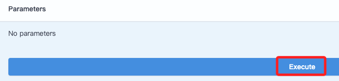

# 台灣證券交易所 API

<br>

## 步驟

1. 搜尋 `台灣證券交易所 API` 。

    

<br>

2. 滑動到 `證券交易` 。

    

<br>

3. 這裡示範使用 `上市個股日成交資訊` ，點擊 `Try it out`。

    

<br>

4. 點擊 `Execute` 進行執行。

    

<br>

5. 複製超連結網址，後續程式碼會使用。

    ```bash
    https://openapi.twse.com.tw/v1/exchangeReport/STOCK_DAY_ALL
    ```
    

<br>

## 範例

1. 程式碼。

    ```python
    # 導入庫
    #  HTTP 客戶端庫，用於發送 HTTP 請求
    import requests
    # 數據分析和處理庫，可用於輸出表格
    import pandas as pd

    # 自訂一個取得數據的函數
    def fetch_stock_data():
        # API 網址
        url = "https://openapi.twse.com.tw/v1/exchangeReport/STOCK_DAY_ALL"
        # 取得
        response = requests.get(url)
        # 假如連線成功會返回 200
        if response.status_code == 200:
            # 成功就將文本轉換為 JSON 傳回 
            return response.json()
        else:
            # 手動觸發例外
            raise Exception(f"發生錯誤：Status code {response.status_code}")

    # 自訂儲存資料為 csv 格式的函數
    def save_to_csv(data, filename):
        # 將 JSON 數據轉換為 pandas DataFrame
        df = pd.DataFrame(data)

        # 將 DataFrame 保存為 CSV 文件
        df.to_csv(filename, index=False)
        print(f"Data saved to {filename}")

    # 調用自訂義的函數
    try:
        # 取得數據
        data = fetch_stock_data()
        # 保存數據
        save_to_csv(data, "stock_data.csv")
    except Exception as e:
        print(e)
    ```

<br>

2. 儲存為 `.csv` 。

    

<br>

___

_END_