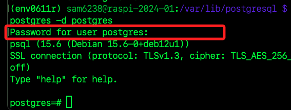
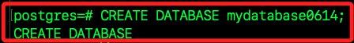
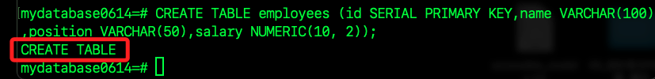
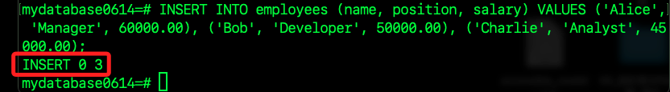
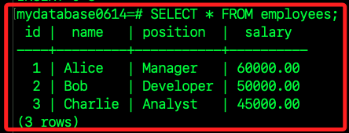
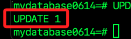
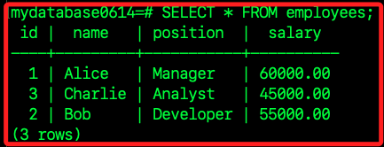
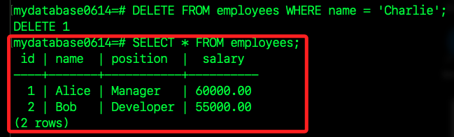

# 實作範例

_嘗試創建數據庫、表格並插入一些數據_

<br>

## 連接 PostgreSQL 伺服器

1. 確保已經連接到 PostgreSQL 伺服器。

    ```bash
    psql -h <樹莓派 IP 或 Hostname> -U postgres -d postgres
    # 實作
    psql -h raspi-2024-01 -U postgres -d postgres
    ```

<br>

2. 以上指令輸入後會要求輸入密碼，輸入密碼時看不到輸入內容，成功後連接到 `postgres` 數據庫。

    

<br>

## 創建新數據庫

1. 創建一個名為 `mydatabase0614` 的新數據庫。

    ```sql
    CREATE DATABASE mydatabase0614;
    ```

    

<br>

2. 使用 `\c` 命令切換到新創建的數據庫。

    ```sql
    \c mydatabase0614
    ```

    

<br>

## 創建新表

1. 創建一個名為 `employees` 的表，輸入以下 SQL 命令會創建一個包含 `id`、`name`、`position` 和 `salary` 四個欄位的表；`id` 欄位使用 `SERIAL` 類型，自動生成唯一的主鍵。

    ```sql
    CREATE TABLE employees (id SERIAL PRIMARY KEY,name VARCHAR(100),position VARCHAR(50),salary NUMERIC(10, 2));
    ```

    

<br>

## 插入數據

1. 使用 `INSERT` 命令插入一些數據到 `employees` 表中。

    ```sql
    INSERT INTO employees (name, position, salary) VALUES ('Alice', 'Manager', 60000.00), ('Bob', 'Developer', 50000.00), ('Charlie', 'Analyst', 45000.00);
    ```

    

<br>

## 查詢數據

1. 查詢所有數據：使用 `SELECT` 命令查詢 `employees` 表中的所有數據。

    ```sql
    SELECT * FROM employees;
    ```

    

<br>

## 更新和刪除數據

1. 更新數據：更新 `Bob` 的薪水。

    ```sql
    UPDATE employees SET salary = 55000.00 WHERE name = 'Bob';
    ```

    

<br>

2. 更新後進行查詢。

    

3. 刪除數據：刪除 `Charlie` 的記錄。

    ```sql
    DELETE FROM employees WHERE name = 'Charlie';
    ```

<br>

4. 成功刪除數據後會看到 `DELETE 1`，並可透過指令查詢。

    

<br>

## 結束連接

1. 退出 `psql`。

    ```sql
    \q
    ```

<br>

___

_END_