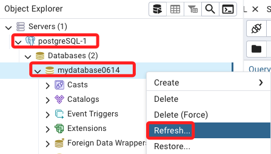
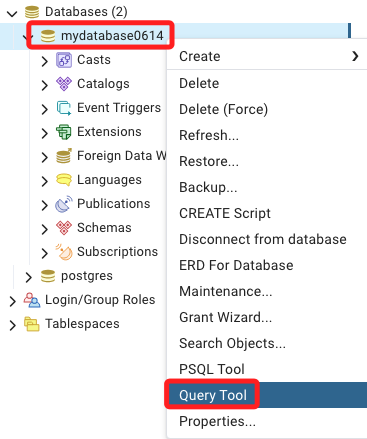
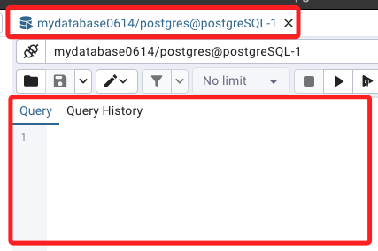
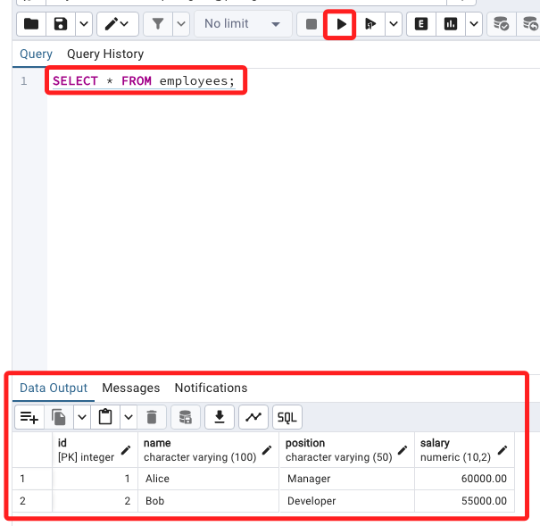
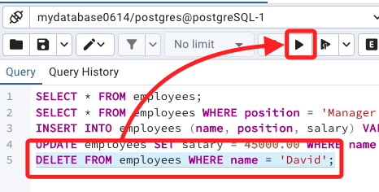

# pgAdmin 4 簡易操作

<br>

## 開始使用

1. 啟動 pgAdmin 4 應用程式，並確保已經連接到目標 PostgreSQL 伺服器。

<br>

## 連接到數據庫

1. 選擇伺服器：在左側的伺服器樹中，找到並展開你的 PostgreSQL 伺服器。

<br>

2. 展開數據庫：點擊並展開 `Databases`，然後選擇你想要執行查詢的數據庫。

<br>

### 步驟 3: 開啟查詢工具

1. 右鍵選擇數據庫，可先進行刷新。

    

<br>

2. 在彈出的右鍵選單中，選擇 `Query Tool`。

    

<br>

3. 右側會出現語法視窗。

    

<br>

## 輸入查詢語句

1. 使用之前建立的內容，輸入查詢語句。

    ```sql
    SELECT * FROM employees;
    ```

<br>

2. 點擊右上方的 `Excute script` 或 `F5` 執行語法，這個查詢將會從 `employees` 表中選取所有的記錄。

    

<br>

## 常用查詢語法

1. 按條件篩選記錄。

    ```sql
    SELECT * FROM employees WHERE position = 'Manager';
    ```

<br>

2. 插入新的記錄，人名是 `David`。

    ```sql
    INSERT INTO employees (name, position, salary) VALUES ('David', 'Tester', 40000.00);
    ```

<br>

3. 更新記錄。

    ```sql
    UPDATE employees SET salary = 45000.00 WHERE name = 'David';
    ```

<br>

4. 刪除記錄。

    ```sql
    DELETE FROM employees WHERE name = 'David';
    ```

<br>

5. 再多行語法中若要執行指定行時，先反白選取指定範圍，然後再點擊 `Excute script`。

    

<br>

___

_END_