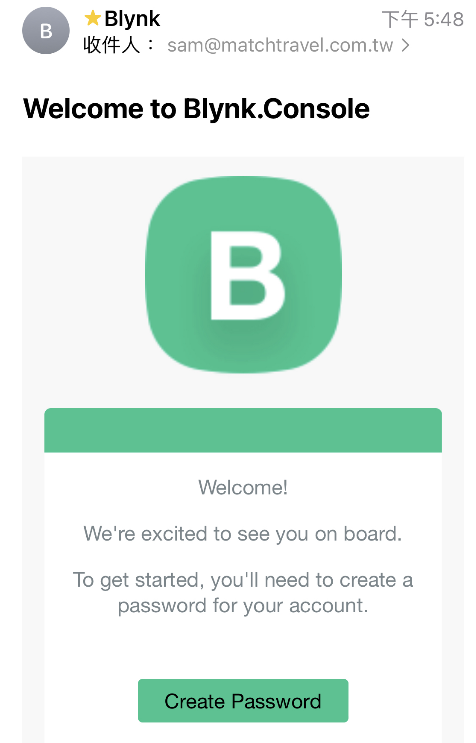
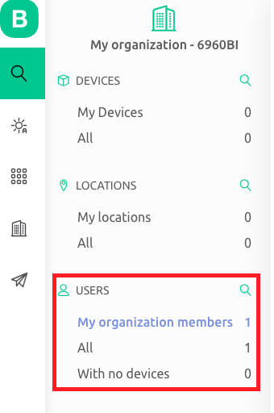

*實作課程，未完*

# blynk

- [blynk 官網](https://blynk.io/)
- 使用 blynk 服務建立樹莓派、

 

## 註冊

- [註冊新帳號](https://blynk.cloud/dashboard/register)

1. 需要驗證電子郵件

   
2. 驗證時要建立密碼

   

 

## 登入

1. 選取個人專案

   
2. 初次進入，什麼都沒有，就只有一個「USER」

   

 

---

*待續*
