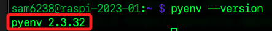

# 多版本 Python

_這裡示範的是使用 pyenv 進行多版本安裝全記錄_

<br>

##  前置作業

1. 進行更新

    ```bash
    sudo apt-get update
    ```

<br>

2. 運氣不錯，一開始就遇到問題。

    

<br>

3. 處理到麻木了，不管啥原因，直接註解更新列表，先切換到管理資料夾。

    ```bash
    cd /etc/apt/sources.list.d/ 
    ```

<br>

4. 透過指令 `ls -al` 查詢，只有一個 `.list` 檔案，這好辦。

    

<br>

5. 進行編輯。

    ```bash
    sudo nano raspi.list
    ```

<br>

6. 註解起來就對了。

    

<br>

7. 在更新一次，順利完成。

    

<br>

## 安裝 pyenv

1. 後續會以編譯的方式安裝 Python，而 Python 的某些標準函式庫需要這些庫的支援才能正常運作，所以先安裝以下套件，以下有些已經內建在新版作業系統中，重複執行並不衝突。

    ```bash
    sudo apt install -y build-essential tk-dev libncurses5-dev libncursesw5-dev libreadline6-dev libdb5.3-dev libgdbm-dev libsqlite3-dev libssl-dev libbz2-dev libexpat1-dev liblzma-dev zlib1g-dev libffi-dev
    ```

<br>

2. 下載與執行

    ```bash
    curl https://pyenv.run | bash
    ```

<br>

3. 編輯環境參數

    ```ini
    export PATH="$HOME/.pyenv/bin:$PATH"
    eval "$(pyenv init --path)"
    eval "$(pyenv init -)"
    ```

    

<br>

4. 重新載入設定

    ```bash
    source ~/.bashrc
    ```

<br>

5. 查詢 pyenv 版本

    ```bash
    pyenv --version
    ```

    

<br>

## 安裝指定版本 Python

1. 進入 [Python 官網](https://www.python.org/)


<br>


2. 點擊下載進入下一個畫面。

    


<br>

3. 選擇查看有哪些版本。

    

<br>

4. 這裡安裝 `3.10.13`，這需要相當時間。

    ```bash
    pyenv install 3.10.13
    ```

    

<br>

## 驗證安裝

1. 查詢當前版本

    ```bash
    python --version
    ```

    

<br>

2. 查詢路徑

    ```bash
    which python
    ```

    

<br>

3. 查詢有哪些版本

    ```bash
    whereis python
    ```

<br>

4. 結果
    
    ```bash
    python: 
    /usr/bin/python 
    /usr/bin/python3.9-config 
    /usr/bin/python3.9 
    /usr/lib/python2.7 
    /usr/lib/python3.9 
    /etc/python3.9 
    /usr/local/lib/python3.9 
    /usr/include/python3.9m 
    /usr/include/python3.9 
    /home/sam6238/.pyenv/shims/python3.10-config 
    /home/sam6238/.pyenv/shims/python 
    /home/sam6238/.pyenv/shims/python3.10 
    /usr/share/man/man1/python.1.gz
    ```

<br>

5. 接下來就特別留意了，pyenv 看似將 Python 安裝在了 `/home/sam6238/.pyenv/shims` 資料夾內，實際進入查看可以發現，pyenv 是通過 shims 機制來管理不同版本的 Python，而非將 Python 安裝於此。

    

<br>

6. 分別透過以下指令查詢版本並觀察結果。
    
    ```bash
    /home/sam6238/.pyenv/shims/python --version
    ```
    結果
    ```bash
    Python 3.9.2
    ```
    
    <br>

    ```bash
    /home/sam6238/.pyenv/shims/python3 --version
    ```
    結果
    ```bash
    Python 3.9.2
    ```

    <br>

    或是
    ```bash
    /home/sam6238/.pyenv/shims/python3.10 --version
    ```
    結果
    ```bash
    pyenv: python3.10: command not found

    The `python3.10' command exists in these Python versions:
    3.10.13

    Note: See 'pyenv help global' for tips on allowing both
        python2 and python3 to be found.
    ```

<br>

7. 可以查看 pyenv 當前管理的 Python 版本。

    ```python
    pyenv versions
    ```

<br>

## _究竟在哪裡？_

1. 實際路徑在 `/home/sam6238/.pyenv/versions/3.10.13/bin` 。

    

<br>

2. 再次查詢

    ```bash
    /home/sam6238/.pyenv/versions/3.10.13/bin/python --version
    ```

<br>

3. 回到 `~/Documents` 建立虛擬環境

    ```bash
    /home/sam6238/.pyenv/versions/3.10.13/bin/python -m venv env3.10.13
    ```

<br>

4. 編輯 `~/.bashrc`

    ```txt
    source /home/sam6238/Documents/env3.10.13/bin/activate
    ```

<br>

5. 啟動

    ```bash
    source ~/.bashrc
    ```

<br>

6. 查詢虛擬環境的 Python 版本。

    

<br>

## 再裝一版

1. 安裝指定版本的 Python。

    ```bash
    pyenv install 3.12.0
    ```

<br>

2. 其餘步驟省略，查看最後結果。

    

<br>

3. 目前安裝了哪些版本。

    ```bash
    pyenv versions
    ```

    

<br>

---

_END：多玩幾次就熟悉了_