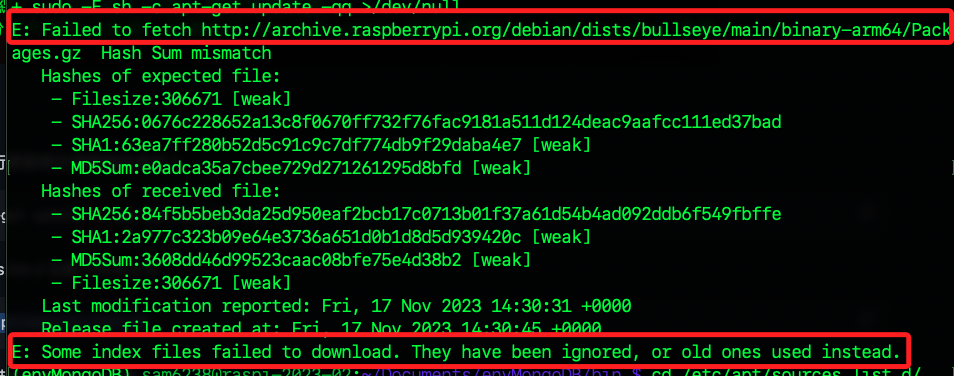
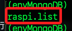
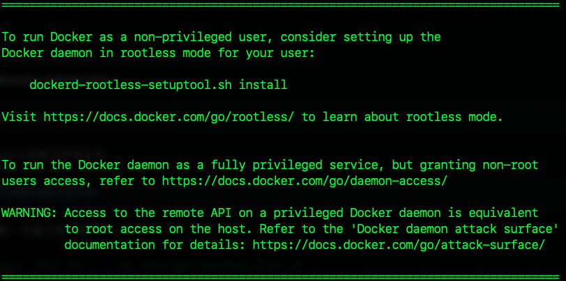

# 在樹梅派架設 MongoDB Server

<br>

## 先安裝並設置 Docker

1. 下載並安裝 Docker

    ```bash
    curl -sSL https://get.docker.com | sh
    ```

<br>

2. 我在安裝時發生錯誤。

    

<br>

3. 切換到資源列表資料夾

    ```bash
    cd /etc/apt/sources.list.d/
    ```

<br>

4. 透過 `ls` 指令查詢僅有一個列表檔案。
   
    

<br>

5. 進行編輯。

    ```bash
    sudo nano raspi.list
    ```

<br>

6. 別想太多，註解掉可確認出錯的來源或是索性全部註解都無妨。

    

<br>

7. 再次安裝。

    ```bash
    curl -sSL https://get.docker.com | sh」
    ```

<br>

8. 完成後會顯示。

    

<br>

9. 說明了有關 Docker 安裝後如何配置和使用 Docker。

    ```txt
    To run Docker as a non-privileged user, consider setting up the
    Docker daemon in rootless mode for your user:

        dockerd-rootless-setuptool.sh install

    Visit https://docs.docker.com/go/rootless/ to learn about rootless mode.


    To run the Docker daemon as a fully privileged service, but granting non-root
    users access, refer to https://docs.docker.com/go/daemon-access/

    WARNING: Access to the remote API on a privileged Docker daemon is equivalent
            to root access on the host. Refer to the 'Docker daemon attack surface'
            documentation for details: https://docs.docker.com/go/attack-surface/
    ```

<br>

10. 授權：將用戶添加到 docker 群組。

    ```bash
    sudo usermod -aG docker sam6238
    ```

<br>

11. 查詢用戶是否加入群組。

    ```bash
    groups sam6238
    ```

    

<br>

12. 重啟終端讓授權生效。

<br>

13. 若修改了 Docker 服務的配置需要重啟 Docker。
    ```bash
    sudo systemctl restart docker
    ```

<br>

---

_END_