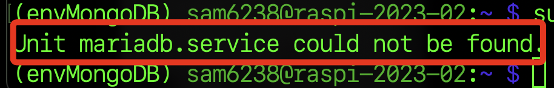
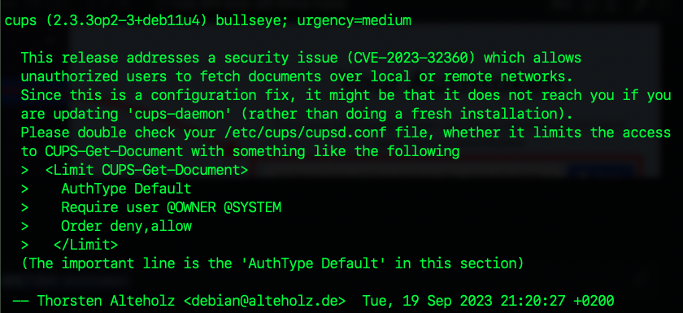

# 數莓派安裝 MariaDB


<br>

## 檢查是否已安裝

1. 連線數莓派後，檢查是否有 MariaDB 服務。

    ```bash
    sudo systemctl status mariadb
    ```

<br>

2. 樹莓派系統預設是沒有安裝的。

    

<br>

3. 也可透過指令進行查詢是否有跟 mariadb 相關的安裝包，假如沒有不會顯示任何任容。

    ```bash
    dpkg -l | grep mariadb
    ```

<br>

## 進行安裝

1. 更新

    ```bash
    sudo apt update && sudo apt upgrade -y
    ```

<br>

2. 假如出現類似畫面不用擔心，只是說明關於更新的內容，按下 `q` 可退出說明完成更新。

    

<br>

3. 安裝 `MariaDB` 伺服器（約 15 秒完成）。

    ```bash
    sudo apt-get install mariadb-server
    ```

<br>

4. 再次檢查服務狀態，會顯示 `active` 。

    ```bash
    sudo systemctl status mariadb
    ```


    

<br>

5. 登入測試，預設沒有密碼，直接按下 `ENTER` 或任意輸入皆可登入。

    ```bash
    sudo mysql -u root -p
    ```

<br>

6. 成功登入會顯示資料庫命令行畫面。

    

<br>

7. 輸入指令 `exit;` 可以退出回到終端機中，切記資料庫指令需加上分號 `;` 。

    ```bash
    exit;
    ```


<br>

---

_END_