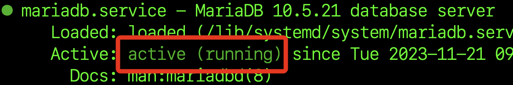

# 數莓派安裝 MariaDB


## 檢查是否已安裝

1. 連線數莓派後，檢查是否有 MariaDB 服務。

```bash
sudo systemctl status mariadb
```

2. 樹莓派系統預設是沒有安裝的。


3. 也可透過指令進行查詢是否有跟 mariadb 相關的安裝包，假如沒有不會顯示任何任容。

```bash
dpkg -l | grep mariadb
```

## 進行安裝

1. 更新

```bash
sudo apt update && sudo apt upgrade -y
```

2. 假如出現類似畫面不用擔心，只是說明關於更新的內容，按下 `q` 可退出說明完成更新。


3. 安裝 `MariaDB` 伺服器（約 15 秒完成）。

```bash
sudo apt-get install mariadb-server
```

4. 再次檢查服務狀態，會顯示 `active` 。

```bash
sudo systemctl status mariadb
```



5. 登入測試，預設沒有密碼，直接按下 `ENTER` 或任意輸入皆可登入。

```bash
sudo mysql -u root -p
```

6. 成功登入會顯示資料庫命令行畫面。


7. 輸入指令 `exit;` 可以退出回到終端機中，切記資料庫指令需加上分號 `;` 。

```bash
exit;
```