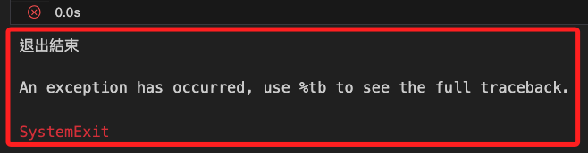
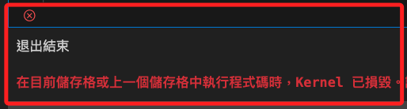
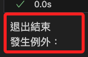
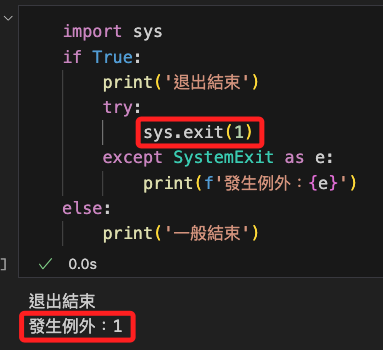
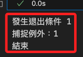

# 退出程序

_Python 中的 `exit()` 和 `sys.exit()`_

<br>

## 說明

1. 來源
   
   - `exit()` 是一個內建函數，可在 Python 解釋器中直接使用，常見於互動模式和腳本中。
   - `sys.exit()` 是 `sys` 模塊的一部分，需要先導入 `sys` 模塊才能使用。

<br>

2. 用途

   - `exit()` 主要用於互動模式，例如 Python shell 或 Jupyter notebooks，它是為了方便在這些環境中快速退出而設計的。
   - `sys.exit()` 用於在程序中結束程序執行，並可選擇性地返回一個給操作系統的退出代碼，適用於較大的 Python 程序和應用程序。

<br>

3. 退出代碼

   - 使用 `sys.exit()`, 可以指定一個退出代碼，用於告知操作系統程序是成功結束還是遇到錯誤，例如 `sys.exit(0)` 表示成功結束，而 `sys.exit(1)` 或其他非零值表示有錯誤發生，詳見下一個部分說明。
   - `exit()` 不支持退出代碼，通常只用於終止程序。

<br>

4. 異常處理

   - `exit()` 與 `sys.exit()` 都會引發 `SystemExit` 例外，這部分並無差異。

<br>

## 退出代碼

1. 無論是否發生錯誤皆可使用例外處理對退出代碼進行捕捉。

    ```python
    import sys

    try:
        # 程序邏輯
        # ...
        # 模擬一個錯誤情況
        sys.exit(1)  

    except SystemExit as e:
        print(f'捕捉到退出代碼: {e.code}')
        # 根據退出代碼進行相應處理
        if e.code != 0:
            print("程序遇到錯誤")
        else:
            print("程序正常結束")
    ```

<br>

## 實測

_在筆記本中運行_

<br>

1. 狀況一：使用 `exit()` 直接退出，確實退出結束，卻可能引發核心崩潰。

    ```python
    if True:
        print('退出結束')
        exit()
    else:
        print('一般結束')
    ```
    

<br>

2. 狀況二：改用 `sys.exit()` ，確實退出結束，傳出例外訊息 `SystemExit` 。

    ```python
    import sys
    if True:
        print('退出結束')
        sys.exit()
    else:
        print('一般結束')
    ```
    

<br>

3. 狀況三：`exit()` 未能捕捉到例外，可知核心在退出當下已經毀損。

    ```python
    if True:
        print('退出結束')
        try:
            exit()
        except SystemExit as e:
            print('發生例外')
    else:
        print('一般結束')
    ```

    

<br>

4. 狀況四：可捕捉 `sys.exit()` 的例外，但沒設定參數時無回傳值。

    ```python
    import sys
    if True:
        print('退出結束')
        try:
            sys.exit()
        except SystemExit as e:
            print(f'發生例外：{e}')
    else:
        print('一般結束')
    ```

    

<br>

5. 狀況五：在 `sys.exit()` 傳入參數作為例外捕捉。

    

6. 狀況六：可透過 `.code` 取出 `SystemExit` 的在不同例外狀況下的回傳值。

    ```python
    import sys

    def perform_task():
        condition = 1
        if condition == 1:
            print("發生退出條件 1")
            sys.exit(1)
        elif condition == 2: 
            print("發生退出條件 2")
            sys.exit(2)
        # 無例外
        print("無例外發生")

    try:
        perform_task()
    except SystemExit as e:
        if e.code == 1:
            print(f"捕捉例外：{e.code}")
        elif e.code == 2:
            print(f"捕捉例外：{e.code}")
        else:
            print(f"其他例外：{e.code}")
    finally:
        print(f"結束")
    ```
    
    

<br>

## 結論

1. 雖在互動環境如筆記本中撰寫程序時，可直接使用 `exit()` 快速進行調試，但退出時可能導致核心毀損而造成調適上的麻煩，至於正式的腳本或應用程序中，更要使用 `sys.exit()` 來避免應用崩潰，另外 `sys.exit()` 還提供了可控制退出邏輯參數。

<br>

2. 個人建議，這兩個函數並無其他使用代價問題，那就別再糾結兩者的差異，選擇更好的 `sys.exit()` 就對了。

<br>

---

_END_