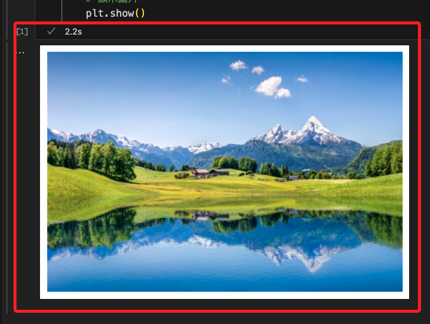

# 基本測試

<br>

## 準備工作

1. 任意下載一張相片，或在 `素材與模型` 資料夾中下載圖片檔案 `image01.jpg` 。

    

<br>

## 範例

1. 建立一個腳本，任意命名如 `app.py` 。

    ```bash
    touch app.py
    ```

<br>

2. 以下是一個基本功能的腳本，可用於顯示指定的圖片，要在樹莓派上運行。

    ```python
    # 導入函式庫
    import cv2
    # 讀取一張圖像
    image = cv2.imread('image01.jpg')
    # 顯示圖像
    cv2.imshow('Image', image)
    # 等待指定的時間或是任意鍵盤事件，然後才往下運行
    # 0 代表無限期等待，程序就會停留在上一個命令 imshow
    cv2.waitKey(0)
    # 關閉所有的視窗
    cv2.destroyAllWindows()

    ```

<br>

3. 在前一個腳本中，使用者可透過按下鍵盤的任意按鍵來觸發關閉視窗事件。假如使用者是按下視窗右上角的 `x` 來關閉視窗，此時視窗雖被關閉，並程序不會停止運行，所以要對此操作行為進行程序優化。在以下的腳本中，當使用者按下 `q` 或關閉視窗時會先結束程序再關閉視窗。

    ```python
    # 導入函式庫
    import cv2

    # 讀取一張圖像
    image = cv2.imread('image01.jpg')
    # 創建一個視窗，命名為 Image，這將用於後續程序對指定視窗進行狀態檢查時
    cv2.namedWindow('Image', cv2.WINDOW_NORMAL)
    # 顯示圖像
    cv2.imshow('Image', image)

    # 持續等待直到有按鍵事件，或者視窗被關閉
    while True:
        # 透過 getWindowProperty 取得視窗 Image 的狀態
        # 第二個參數 WND_PROP_VISIBLE 本身的代碼是 4
        # 關閉視窗後 getWindowProperty 會返回 0
        # 視窗已被關閉，透過 break 終止回圈
        if cv2.getWindowProperty('Image', cv2.WND_PROP_VISIBLE) < 1:
            break
        # 使用者按下了 'q' 鍵
        if cv2.waitKey(1) & 0xFF == ord('q'):
            break
    # 關閉視窗
    cv2.destroyAllWindows()
    ```

<br>

4. 若要在本地點腦 `運行筆記本`，要透過 `matplotlib` 進行製圖，首先安裝套件。

    ```bash
    pip install matplotlib
    ```

<br>

5. 在本地電腦上運行 `Jupyter Notebook` 程式碼，特別注意，這是在筆記本運行。

    ```python
    # 載入庫
    import matplotlib.pyplot as plt
    import cv2
    
    # 讀取圖片
    image = cv2.imread('image01.jpg')
    if image is None:
        print("發生錯誤：圖片載入錯誤，請檢查路徑。")
    else:
        # 轉換顏色空間從 BGR 到 RGB
        image = cv2.cvtColor(image, cv2.COLOR_BGR2RGB)
        plt.imshow(image)
        # 不顯示坐標軸
        plt.axis('off')
        # 顯示圖片
        plt.show()
    ```

    _結果_

    

<br>

---

_END_