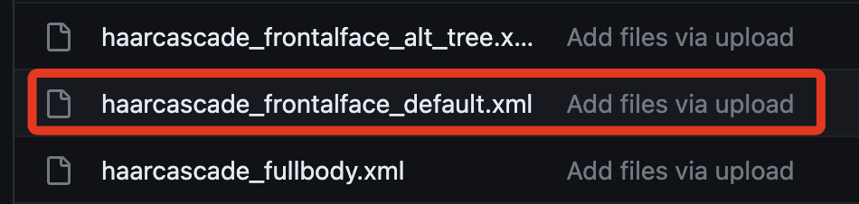
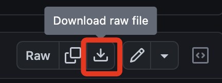
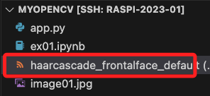
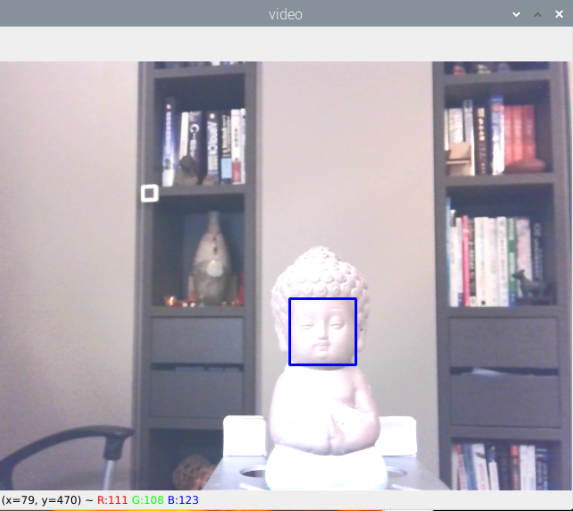
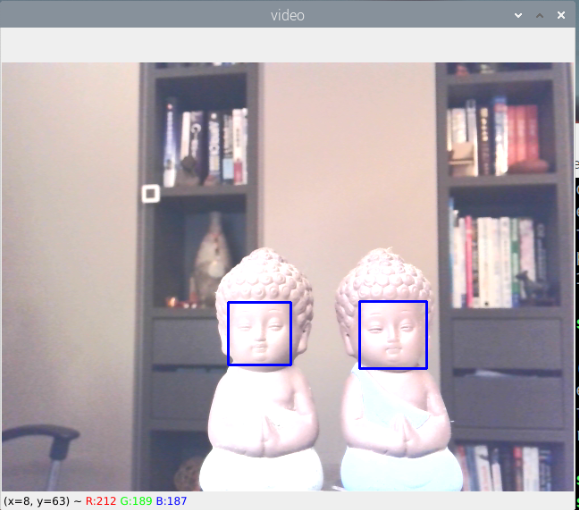
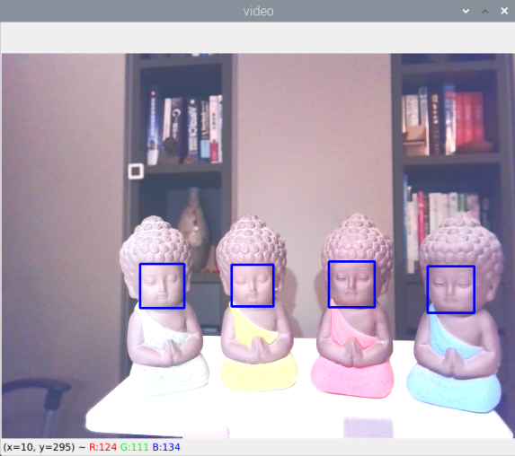

# 臉部偵測

_以下將使用 haarcascade 這個有相當歷史卻快速有效的人臉特徵分類器_

<br>

## 模型

1. [模型載點](https://github.com/anaustinbeing/haar-cascade-files/tree/master) ，依據要使用的模型檔案 `xml` 來下載模型。

    

<br>

2. 選取進入後，可點擊右上角下載圖標。

    

<br>

3. 拖曳進入樹莓派，暫時置於同層目錄即可。

    

<br>

## 重點說明

_說明腳本中幾個重點_

<br>

1. 這個腳本通過載入包含訓練數據在內的 XML 文件來初始化 OpenCV 的分類器函數 CascadeClassifier，若要進行其他類型辨識，則導入指定的模型文件檔案即可。

    ```python
    faceCascade = cv2.CascadeClassifier("haarcascade_frontalface_default.xml")
    ```

<br>

2. OpenCV 的預設影像是非鏡像的，也可以理解為水平旋轉，也就是自己舉起右手時，畫面中的影像是舉起觀察者（自己）左邊的那隻手，也就是被觀察者（自己）在影像中的右手。假如想要翻轉畫面可透過 `cv2.flip()` 進行設置。

    ```python  
    # 讀取影像，預設為非鏡像畫面
    img = cv2.imread('圖片.jpg')
    
    # 0 表示垂直翻轉，原始的非鏡像畫面垂直翻轉
    flipped_img = cv2.flip(img, 0)
    # 1 水平翻轉，成為鏡像
    flipped_img = cv2.flip(img, 1)
    # -1 垂直＋水平翻轉
    flipped_img = cv2.flip(img, -1)
    ```

<br>

3. 透過 `faceCascade.detectMultiScale()` 函數取得偵測到的人臉數據後傳給 `faces` ，再遍歷 `faces` 進行各種人臉的處理，在這個腳本中是使用藍色框將人臉進行標示。

    ```python
    faces = faceCascade.detectMultiScale(
        gray, scaleFactor=1.2, minNeighbors=5, minSize=(20, 20)
    )
    # 畫出每一個檢測到的臉部範圍
    for x, y, w, h in faces:
        cv2.rectangle(img, (x, y), (x + w, y + h), (255, 0, 0), 2)
        roi_gray = gray[y: y + h, x: x + w]
        roi_color = img[y: y + h, x: x + w]
    ```

<br>

## 範例

1. 這個臉部正面偵測腳本要在樹莓派中運行，按下鍵盤 `ESC` 、 `q` 鍵或視窗的關閉圖標 `x` 可以退出程序。

<br>

2. 完整程式碼。

    ```python
    # 載入庫
    import cv2

    # 讀入 Haar cascades 臉部檢測模型
    faceCascade = cv2.CascadeClassifier("haarcascade_frontalface_default.xml")
    # 開啟攝像頭
    cap = cv2.VideoCapture(0)
    # 設定影像寬度
    cap.set(3, 640)
    # 設定影像高度
    cap.set(4, 480)
    # 持續讀取攝像頭影像，直到 'ESC' 鍵被按下或程式被終止
    while True:
        ret, img = cap.read()
        # 翻轉影像，參數 1 為水平翻轉成為鏡像
        img = cv2.flip(img, 1)
        # 將彩色影像轉換為灰階，這是作為辨識使用，不是要顯示出來的
        gray = cv2.cvtColor(img, cv2.COLOR_BGR2GRAY)
        # 利用 Haar cascades 進行臉部檢測
        faces = faceCascade.detectMultiScale(
            gray, scaleFactor=1.2, minNeighbors=5, minSize=(20, 20)
        )
        # 畫出每一個檢測到的臉部範圍
        for x, y, w, h in faces:
            cv2.rectangle(img, (x, y), (x + w, y + h), (255, 0, 0), 2)
            roi_gray = gray[y: y + h, x: x + w]
            roi_color = img[y: y + h, x: x + w]
        # 顯示含有標出臉部的影像
        cv2.imshow("video", img)
        # 檢查是否有按下 'ESC' 或 'q' 鍵
        key = cv2.waitKey(1) & 0xFF
        if key == 27 or key == ord('q') or \
                cv2.getWindowProperty("video", cv2.WND_PROP_VISIBLE) < 1:
            break

    # 釋放攝像頭資源並關閉所有 OpenCV 視窗
    cap.release()
    cv2.destroyAllWindows()
    ```

<br>

3. 可嘗試導入自訂的鍵盤事件模組 `cv_utils` 。

    ```python
    # 載入庫
    import cv2
    # 導入自訂鍵盤事件模組
    from cv_utils import should_exit
    # 其餘省略 ...

    while True:
        # 其餘省略 ...

        cv2.imshow("video", img)
        # 導入自訂的模組取代原本的鍵盤監區塊
        # 檢查是否有按下 'ESC' 或 'q' 鍵
        if should_exit("video"):
            break

    # 釋放攝像頭資源並關閉所有 OpenCV 視窗
    cap.release()
    cv2.destroyAllWindows()
    ```

<br>

## 成果

1. 單人臉獨照。

    

<br>

2. 雙人臉合照。

    

<br>

3. 多人臉大合照。

    


<br>

---

_END_

